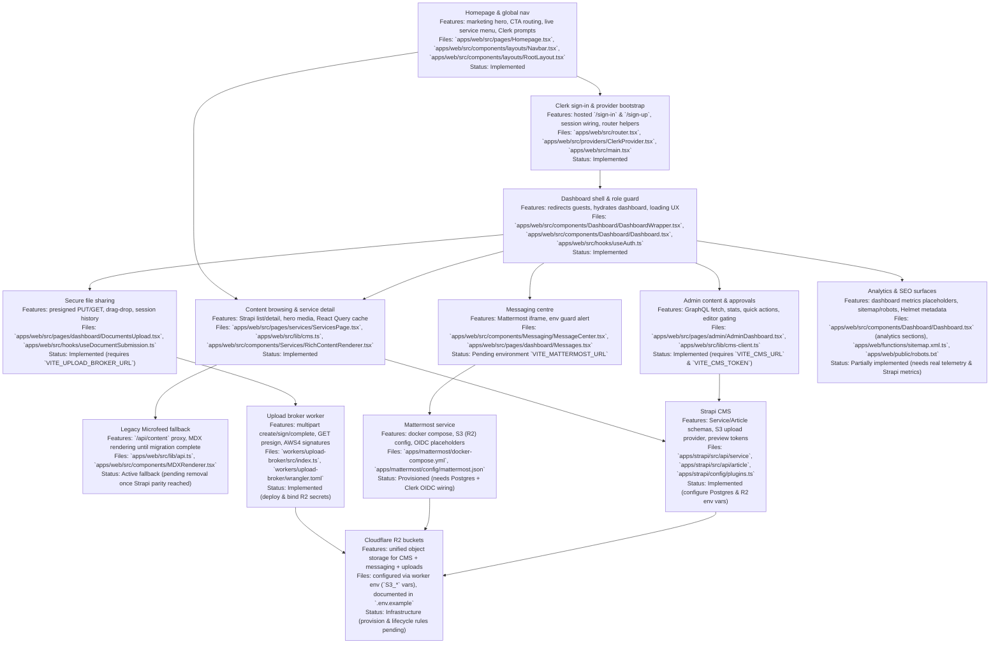

## Role & mandate

Act as a Staff+ full-stack engineer for the HandyWriterz monorepo. Implement every **🟡 partially implemented** and **⛔ pending** item in the Feature Checklist, aligned with the architecture and roadmap. Deliver production-ready code, tests, and docs that run locally and on Cloudflare, Strapi 5, Mattermost, R2, and Clerk. Treat the referenced intel and checklist as the source of truth for structure, paths, and flows.

## Stack & repo assumptions (do not deviate)

* Web SPA: React 18 + Vite 5 under `apps/web` (Router v6, React Query, Tailwind).
* CMS: Strapi 5 under `apps/strapi` (Postgres; S3 provider to R2).
* Messaging: Mattermost under `apps/mattermost` (S3 storage to R2; WebSocket).
* Workers: Cloudflare Workers under `workers/*` (upload broker, subpath router).
* Auth: Clerk (IdP) for SPA; plan OIDC bridging for Mattermost & Strapi Admin.
* Storage: Cloudflare R2 (objects + AV gating via `x-scan=clean`).
* Monorepo: pnpm workspaces.
  Use the file map, flows, and roadmap items exactly as documented.

## Primary objectives (implement all 🟡 / ⛔)

Target the following areas first; map your work to these Feature IDs and Roadmap items:

1. **Mattermost SSO & native client**

* F-092: Clerk ↔ Mattermost OIDC SSO handshake (worker/server route; session exchange). **⛔**
* F-091: Replace iframe with native REST/WS client in SPA (channels, posts, files, typing, receipts). **⛔**
* F-094: Support analytics (message volume, response times) surfaced in Admin. **⛔**
  Deliver OIDC config, token exchange flow, React client, hooks, error states, and analytics queries.

2. **Uploads & AV gating**

* F-093: Enforce AV gating end-to-end (R2 `ObjectCreated` → AV → set `x-scan=clean`; worker denies GET until clean). **🟡 → ✅**
* Roadmap Phase 2: Hook events, lifecycle rules, upload metadata API, and MM notifications on completed scans.
  Implement worker routes (`/s3/presign` checks), queue/consumer stubs, and UI states.

3. **Strapi content lifecycle**

* F-039: Draft preview tokens integrated into Admin + SPA preview route (secure, expiring). **🟡 → ✅**
* F-032: Webhooks → Cloudflare worker to purge cache on publish. **⛔ → ✅**
* F-033: Scheduled publishing UI + CRON verification. **🟡 → ✅**
* F-034: (If in scope) i18n enablement & fetchers. **⛔ → ✅**
  Follow the Services/Articles schemas and existing REST/GraphQL helpers.

4. **Content migration & legacy retirement**

* F-043: Import Microfeed JSON into Strapi via scripts in `apps/strapi/scripts`; verify mapping, then retire proxies. **⛔ → ✅**
* Update domain routes to prefer Strapi and remove fallback once coverage ≥ 95%.

5. **Editorial safety & rollback**

* F-045: Install versioning/compare plugin or custom snapshots; surface diff/rollback in Admin. **🟡 → ✅**
* F-085: Surface compliance checklist UI at publish time (modal/overlay). **🟡 → ✅**

6. **Security & reliability**

* F-128: Make AV enforcement real (tie to #2). **🟡 → ✅**
* F-129 (+ F-115 implied): Add rate limiting to worker presign routes. **🟡 → ✅**
* Sentry/APM instrumentation for SPA & workers (Observability “⛔”).
* Fix TypeScript errors; add CI for `tsc` + lint; automate smoke tests across content, uploads, messaging per roadmap.

## Deliverables & output format

Produce a **single multi-PR plan** (you can output as sections) with:

1. **Design notes** per objective (sequence diagrams / text flows acceptable).
2. **Concrete diffs** (unified-diff style) touching the correct files/paths:

   * `apps/web`: routes, pages, hooks, services (`/lib/*`), UI states, toasts.
   * `apps/strapi`: configs (`config/*.ts`), schemas, plugins, webhooks; `scripts/*` migration.
   * `apps/mattermost`: `config/mattermost.json` updates (S3/SSO), bootstrap SQL as needed.
   * `workers/upload-broker` (and new `workers/mm-auth` if created): handlers, env, tests.
3. **New files** fully written (no placeholders): workers, adapters, schema changes, migration scripts, test specs.
4. **Tests**:

   * Integration tests for: (a) create→publish→render, (b) upload→scan→download, (c) chat send/attach/receive.
   * Unit tests for token exchange, presign gating, AV metadata checks.
5. **Docs**:

   * Update `README.md` with Strapi/Mattermost/Workers one-shot dev run steps.
   * Add/refresh `docs/PLAN_FORWARD.md` and `.env.example` per new env keys.
6. **Observability**: Sentry init in SPA & workers; logging and basic alerts documented.

## Acceptance criteria (Definition of Done)

* **SSO**: Signing into the SPA automatically signs the user into Mattermost, opening a live WS session; refresh & logout are consistent. (F-092 ✅)
* **Native messaging**: Iframe removed; channels list, timeline, composer, uploads, typing indicators, and read receipts work via REST/WS. (F-091 ✅)
* **AV gating**: Attempting to GET a newly uploaded file before scan completion is denied; after scan marks `x-scan=clean`, presign GET works. (F-093 ✅; Roadmap 9–15)
* **Preview & publish**: Admin can copy a preview token, open preview in SPA (expiring, role-aware), then publish to trigger worker cache purge. (F-039, F-032 ✅)
* **Scheduling**: Editor can set `publishedAt` in the future; worker/CRON enforces; UI shows upcoming. (F-033 ✅)
* **Migration**: Microfeed content imported; ≥95% of services/articles fetched from Strapi; legacy proxy disabled. (F-043 ✅)
* **Rollback**: Prior versions visible with diff and one-click revert. (F-045 ✅)
* **Reliability**: `pnpm exec tsc -p apps/web/tsconfig.app.json --noEmit` passes; smoke tests green for content, uploads, messaging; Sentry receiving events.

## Implementation guidance & constraints

* **Auth bridging**: Build a lightweight `mm-auth` worker to exchange Clerk ID token for a Mattermost session. Use OIDC endpoints and store only short-lived MM tokens in HttpOnly cookies. Surface envs via Wrangler. (Map to F-092)
* **Native MM client**: Create `apps/web/src/lib/mm-client.ts` (REST) and `apps/web/src/lib/mm-ws.ts` (WS). Add React hooks: `useMMAuth`, `useChannels`, `useTimeline`, `useTyping`, `useUploads`. Replace iframe in `pages/dashboard/Messages.tsx`. (F-091)
* **Uploads worker**: Extend `workers/upload-broker` to (a) verify `x-scan=clean` on GET presign; (b) publish “scan complete” notifications to MM via bot token. (F-093)
* **Strapi**:

  * Add publish webhook to call a Cloudflare worker that purges affected paths. (F-032)
  * Add preview token support with Admin UI button and SPA `/preview` route that exchanges token for draft fetch. (F-039)
* **Migration scripts**: `apps/strapi/scripts/mf-import.ts` reading legacy JSON, mapping fields to `service`/`article`, handling media re-upload to R2, idempotent re-runs. (F-043)
* **Rate limiting**: Implement worker-level limiter (per IP + userId) for presign routes; document thresholds. (F-129 → F-115)
* **Observability**: Initialize Sentry in SPA and Workers, add structured logs for presign checks, OIDC exchange, and webhook purges; document dashboards.

## Testing plan (produce tests in your output)

* Integration tests covering: content create→publish→render; upload→scan→download; chat send/attach/receive.
* Add CI jobs: `tsc`, `eslint`, integration suite.
* Provide seed data & Docker recipes so `docker compose up` brings Mattermost + Postgres; boot Strapi; Workers via `wrangler dev`.

## Docs & DX

* Update `README.md` with one-command local start for Strapi, Mattermost, Workers, and SPA; add `.env.example` with new keys and descriptions.
* Add `docs/PLAN_FORWARD.md` and refresh the intel to reflect completed statuses and migration cutovers.

## Output now

Return:

1. A prioritized PR plan (by area),
2. Code diffs for each PR,
3. New/changed files in full,
4. Test suites,
5. Docs updates,
6. A final verification checklist reflecting the Acceptance criteria above.

# GitHub Copilot – House Rules & Execution Guide

## Mission
Use Copilot to implement and ship features across:
- Web (React 18 + Vite 5 + Router v6 + React Query + Tailwind)
- Strapi 5 (PostgreSQL, R2 S3 provider)
- Mattermost client (REST + WS) and SSO bridge
- Cloudflare Workers (upload broker, auth exchange, cache purge)
- Clerk for IdP
- Cloudflare R2 (object storage) with AV gating metadata (e.g., x-scan=clean)

Treat the Feature Checklist (IDs like F-091/F-092/…) and the Architecture Intel as the source of truth.

## Don’ts
- Don’t invent libraries, endpoints, env vars, or schemas.
- Don’t produce placeholders—return runnable code with tests.
- Don’t bypass AV gating or security measures in presign routes.

## Do’s
- Prefer minimal, typed adapters over monolithic utilities.
- Surface errors with human-readable messages and typed discriminated unions.
- Add integration tests where flows cross service boundaries.
- Keep vendor SDKs thin; isolate them behind `/lib/*` adapters.

## Acceptance Criteria (global)
- Typecheck clean (`tsc --noEmit`)
- Lint clean
- Integration tests green for:
  1) content create → publish → render
  2) upload → scan → download
  3) chat send/attach/receive
- SSO login in SPA transparently opens an authenticated MM WS session.
- GET presign is refused until object `x-scan=clean` is true.
- Sentry/observability initialized in SPA & Workers.

## Folder Contracts (enforced for prompts)
- apps/web/src/lib/mm-client.ts        # REST wrapper
- apps/web/src/lib/mm-ws.ts            # WS wrapper
- apps/web/src/hooks/*                  # React hooks for MM + uploads
- apps/web/src/pages/**                 # UI routes
- workers/upload-broker/src/**          # presign + gating
- workers/mm-auth/src/**                # Clerk ↔ MM session exchange
- apps/strapi/config/**, scripts/**     # webhooks, migrations, preview tokens
- docs/**                               # this file + playbooks
- .github/**                            # PR templates, CI

## Style & Patterns
- TypeScript strict mode everywhere.
- React Query for server state; Zustand or Context for local UI state.
- Zod schemas for request/response validation at boundaries.
- Feature flags via env or config, not code branches.
- Unit-test business logic; integration-test flows.

---
# Copilot Chat Recipes (copy/paste in Copilot Chat with file/dir selection)

### 1) Native Mattermost client (F-091)
Implement a native Mattermost client (REST + WS) for channels, posts, uploads, typing, read receipts.
Constraints:
- Use `apps/web/src/lib/mm-client.ts` for REST (typed, zod-validated).
- Use `apps/web/src/lib/mm-ws.ts` for WS (auto-reconnect, heartbeats, backoff).
- React hooks: `useMMAuth`, `useChannels`, `useTimeline`, `useTyping`, `useUploads`.
- Replace iframe usage in `pages/dashboard/Messages.tsx`.
- Add integration tests for send/attach/receive.

### 2) SSO bridge (F-092)
Create a Cloudflare Worker `workers/mm-auth` that exchanges a Clerk ID token for a Mattermost session:
- POST `/exchange` verifies Clerk token, creates MM session, sets HttpOnly cookie.
- Handle refresh + logout parity with SPA.
- Security: short-lived cookies, CSRF protection, strict CORS.

### 3) AV-gated uploads (F-093/F-128)
Extend `workers/upload-broker`:
- `/presign/put` allows upload; `/presign/get` denies until object metadata `x-scan=clean`.
- Publish “scan-complete” bot notification to Mattermost when AV marks clean.
- Rate limiting (per IP + userId) for presign routes.
- Tests: attempt GET before/after scan flag.

### 4) Strapi preview/publish/schedule (F-039/F-032/F-033)
- Preview tokens (expiring) + SPA `/preview` route that exchanges token.
- Strapi publish webhook → Worker cache purge for affected routes.
- Scheduled publishing verification (CRON/scheduler) + UI indicators.

### 5) Migration – Microfeed → Strapi (F-043)
- `apps/strapi/scripts/mf-import.ts` maps legacy JSON to `service`/`article`.
- Re-upload media to R2; idempotent re-runs.
- Cutover once >=95% coverage; remove legacy proxy.

### 6) Editorial safety & rollback (F-045/F-085)
- Versioning/compare view; one-click revert.
- Publish-time compliance checklist modal.

### 7) Observability & CI
- Initialize Sentry (SPA + Workers), structured logs.
- CI jobs for `tsc`, lint, tests; seed data for dockerized Strapi + Mattermost.

> For every recipe: return unified diffs, new files in full, and tests. Don’t handwave.

---
# Inline Prompting Snippets (paste at top of new files, then remove after generation)

/*
Copilot, generate PROD-READY code for:
- Purpose: <short description>
- Inputs/Outputs: <types>
- Env vars: <names, required/optional>
- Side-effects: <R2 put/get, MM REST/WS, Strapi webhook>
- Constraints: Type-safe, zod-validated, error handling with typed discriminants, no placeholders.
- Tests: add unit/integration tests in __tests__ matching edge cases.
*/

# Data Flows: Content · Files · Messaging (Strapi 5 + Mattermost + R2)

## Legend & shared concepts
- **IdP** = Clerk (OIDC)
- **CMS** = Strapi 5 (PostgreSQL)
- **Chat** = Mattermost (PostgreSQL)
- **OBJ** = Cloudflare R2 (S3‑compatible)
- **WK** = Cloudflare Worker (presign + AV + small glue)
- **FE** = Front‑end (Next.js on Pages/Workers)
- **AV** = ClamAV (scanner engine)

Shared identifiers
- `user_id` from Clerk `sub`
- `org_id` / `team_id` mapping to MM team
- Object keys: `cms-media/...` and `chat-uploads/...`

---

## Personas & primary journeys

1. **Editor / Content Author**
  - Authenticates with Clerk → Strapi Admin.
  - Creates or updates drafts, uploads assets to R2, requests editorial reviews.
  - Publishes content, triggering cache invalidation and front-end refresh flows.

2. **Reader / Customer**
  - Browses the public SPA or authenticated dashboard.
  - Requests domain pages → FE queries Strapi (GraphQL/REST). If content is still in the legacy Microfeed runtime, the FE transparently proxies to `/api/mf/*` until the Strapi migration is complete.
  - Receives optimized assets from R2/CDN with access checks enforced by Workers when required.

3. **Support Agent / Admin**
  - Uses the dashboard messaging shell embedded with Mattermost for conversations and approvals.
  - Shares and retrieves attachments (native Mattermost `/files` for chat, Worker-presigned URLs for CMS documents).

4. **End-user / Customer Support Requester**
  - Signs in with Clerk, joins assigned Mattermost channels, uploads screenshots or documents.
  - Receives responses, download links, and status updates through WebSocket events.

## 0) Access & authentication (Homepage → Clerk)

1. Visitor lands on the public homepage (`/`).
2. `Navbar` CTAs expose Clerk-hosted **Sign in** (`/sign-in`) and **Sign up** (`/sign-up`) flows alongside marketing content.
3. Successful authentication hands the session to the SPA via `ClerkProvider`, enabling `useAuth` and route guards to hydrate user metadata immediately.
4. Authenticated visitors are routed into the dashboard shell (`/dashboard`) while unauthenticated users may continue browsing public pages.
5. Downstream flows (Strapi content editing, Mattermost messaging, file uploads) all derive authorization from Clerk-issued claims (`sub`, roles, org/team IDs).

## User journey flow diagram (features · files · status)

