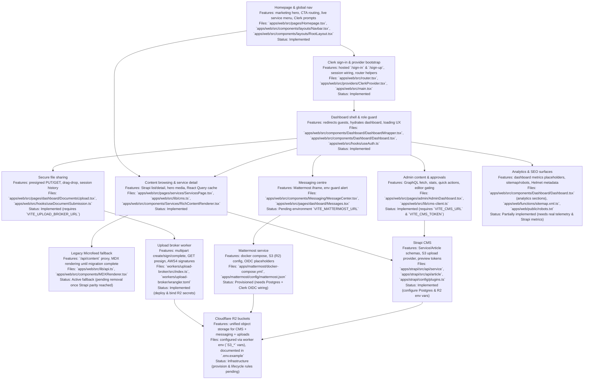

# Data Flows: Content · Files · Messaging (Strapi 5 + Mattermost + R2)

> This document traces the end‑to‑end flows and includes sequence diagrams, API touch‑points, and failure handling. It is intentionally long (5+ pages worth) to double as an implementation reference.

---

## Legend & shared concepts
- **IdP** = Clerk (OIDC)
- **CMS** = Strapi 5 (PostgreSQL)
- **Chat** = Mattermost (PostgreSQL)
- **OBJ** = Cloudflare R2 (S3‑compatible)
- **WK** = Cloudflare Worker (presign + AV + small glue)
- **FE** = Front‑end (Next.js on Pages/Workers)
- **AV** = ClamAV (scanner engine)

Shared identifiers
- `user_id` from Clerk `sub`
- `org_id` / `team_id` mapping to MM team
- Object keys: `cms-media/...` and `chat-uploads/...`

---

## Personas & primary journeys

1. **Editor / Content Author**
  - Authenticates with Clerk → Strapi Admin.
  - Creates or updates drafts, uploads assets to R2, requests editorial reviews.
  - Publishes content, triggering cache invalidation and front-end refresh flows.

2. **Reader / Customer**
  - Browses the public SPA or authenticated dashboard.
  - Requests domain pages → FE queries Strapi (GraphQL/REST). If content is still in the legacy Microfeed runtime, the FE transparently proxies to `/api/mf/*` until the Strapi migration is complete.
  - Receives optimized assets from R2/CDN with access checks enforced by Workers when required.

3. **Support Agent / Admin**
  - Uses the dashboard messaging shell embedded with Mattermost for conversations and approvals.
  - Shares and retrieves attachments (native Mattermost `/files` for chat, Worker-presigned URLs for CMS documents).

4. **End-user / Customer Support Requester**
  - Signs in with Clerk, joins assigned Mattermost channels, uploads screenshots or documents.
  - Receives responses, download links, and status updates through WebSocket events.

## 0) Access & authentication (Homepage → Clerk)

1. Visitor lands on the public homepage (`/`).
2. `Navbar` CTAs expose Clerk-hosted **Sign in** (`/sign-in`) and **Sign up** (`/sign-up`) flows alongside marketing content.
3. Successful authentication hands the session to the SPA via `ClerkProvider`, enabling `useAuth` and route guards to hydrate user metadata immediately.
4. Authenticated visitors are routed into the dashboard shell (`/dashboard`) while unauthenticated users may continue browsing public pages.
5. Downstream flows (Strapi content editing, Mattermost messaging, file uploads) all derive authorization from Clerk-issued claims (`sub`, roles, org/team IDs).

## User journey flow diagram (features · files · status)



## 1) Content management & publishing (Strapi 5)

### 1.1 Models (initial)
**Service**
- `title` (string, required, unique slug)
- `summary` (text)
- `body` (rich content)
- `domain` (enum)
- `typeTags` (repeatable string)
- `heroImage` (media)
- `seo` (component: title, desc, og image)
- `publishedAt` (datetime)

**Article**
- `title`, `slug`, `body`, `author`, `category`, `images[]`, `publishedAt`

### 1.2 Storage
- Metadata → **PostgreSQL** (managed: Supabase/Neon/RDS)
- Media → **R2 S3** bucket `cms-media/…` via Strapi S3 provider (forcePathStyle + endpoint = R2)
- Optional CDN domain for public media; private media served via presigned GET from WK

### 1.3 Editorial workflow
1. Editor signs in to **/admin** (OIDC via Clerk or Access‑gated admin)
2. Draft content → validations → save (DB) → upload media (R2)
3. Review: role‑based access (Author/Editor/Admin), comments
4. Publish: set `publishedAt`, emit webhook → FE cache purge or ISR revalidate

### 1.4 Sequence: Create → Publish → Render
```
Editor ──(OIDC)──> Strapi Admin
  │                       │
  │  POST /api/{type}     │  (DB write)
  ├───────────────────────>│
  │  PUT /upload (S3)     │  (R2 object)
  ├──────────────┐        │
  │              └─> OBJ (cms-media/...)
  │
  │  PATCH publish        │ set publishedAt; webhook
  ├───────────────────────>│──────────┐
  │                                    │
  ▼                                    ▼
 FE ──(GraphQL/REST)──> Strapi (PUBLISHED) ──> OBJ URLs → Render
```

### 1.5 Preview & drafts
- Strapi preview token (JWT) appended to FE preview route: `/preview?type=service&id=…&token=…`
- FE forwards token to a FE server function → calls Strapi with `publicationState=PREVIEW` → renders draft

### 1.6 Caching & invalidation
- On publish:
  - Strapi → webhook → FE (Pages Function) → purge CDN path(s) or trigger ISR revalidate
  - Optional: `Surrogate-Key` headers per entity for fine‑grained cache clearing

### 1.7 Internationalization (optional)
- Enable Strapi i18n; each locale has own `publishedAt`; FE routes include locale prefix

### 1.8 Access control
- Public content: direct CDN URLs
- Protected content: FE requests `GET /presign` (WK) → short‑lived URL only if `x-scan=clean`

### 1.9 Failure handling
- **DB write fails** → show inline error; retry safe
- **Upload fails** → retry multipart part(s); if MPU aborted, clean orphaned parts via list‑mpu + abort
- **Webhook fails** → FE polls `publishedAt` and presents “refresh preview” UI; background retry

### 1.10 Backups & DR
- Nightly PostgreSQL logical backups; restore runbook tested quarterly
- R2 bucket versioning (optional) + lifecycle; metadata export for mapping

### 1.11 Consumption flow (FE + legacy fallback)
1. Reader loads a domain page (`/d/:domain`).
2. FE issues a query to Strapi GraphQL (`services`, `articles`) using React Query defaults.
3. If Strapi responds with `404` (content not yet migrated), FE calls the legacy Microfeed proxy (`/api/mf/*`) to fetch the existing JSON payload, preserving live traffic.
4. FE normalizes either payload into shared domain types (`apps/web/src/types/microfeed.ts`) until the migration is finished.
5. Assets referenced in either system resolve through `resolveMediaUrl`, prioritizing R2-hosted media and falling back to Microfeed origins when necessary.

---

## 2) File sharing between end‑user and admin

We prefer **native Mattermost attachments** for chat contexts. For CMS/private documents, we use a **direct‑to‑R2 pipeline** with presign + AV.

### 2.1 End‑user → Admin (chat attachment)
**Happy path (native MM):**
1. FE (user) authenticated via Clerk → MM (OIDC SSO)
2. User selects file → FE calls MM `/api/v4/files` (MM streams to R2)
3. MM returns `file_id`; FE attaches to a post `/api/v4/posts`
4. R2 object‑created → Queue → AV consumer → `x-scan=clean`
5. Peers click file → MM presigns GET → browser downloads

**Sequence**
```
FE ──WS──> MM
 │  POST /files  ─────────────► MM ───► OBJ (chat-uploads/...)
 │  POST /posts (attach file_id)
 │◄─ WS event: post created
OBJ ──event──> Queue ──> AV ──> tag clean/quarantine
User clicks ► MM GET /files/{id}/link ► presigned URL ► download
```

**Why native?** MM handles thumbnails, quotas, previews, search, and retention automatically.

### 2.2 Admin → End‑user (send a document)
- Same as above via MM channel (admin uploads as a file)
- For documents sourced in CMS (e.g., policy PDFs): FE hits WK presign GET for a protected CMS object and posts the URL into the MM message (or re‑uploads to MM for lifecycle parity)

### 2.3 Generic direct‑to‑R2 (for CMS/private)
1. FE asks WK `/s3/create` (multipart) with `key` + `contentType`
2. FE uploads parts directly to R2 using signed URLs from WK `/s3/sign`
3. FE completes MPU via WK `/s3/complete`
4. OBJ event → Queue → AV → tag
5. FE stores object key in Strapi field or posts link in MM

**Access rules**
- Presign GET only when `x-scan=clean`
- TTL ≤ 5 minutes; scope to `key` and optional IP

### 2.4 Retention & lifecycle
- **MM**: retention policy (e.g., 180 days) deletes posts/files; R2 lifecycle mirrors it
- **CMS**: lifecycle per folder/prefix; archived after N days; cold storage or delete

### 2.5 Failure modes
- **Large file**: MPU with parallel parts; if user abandons, background abort‑MPU job
- **AV timeout**: mark `pending`; UI shows spinner; deny presign until clean; alert after threshold
- **R2 egress blocked**: FE retries presign; fall back CDN path for public assets

---

## 3) Messaging between end‑user and admin (Mattermost)

### 3.1 SSO & session
1. FE user signs in with Clerk → receives ID token
2. FE opens MM (embed) or calls a FE server function to exchange OIDC for MM session
3. FE opens `/api/v4/websocket`

### 3.2 Channels & routing
- Per‑org/team in MM; per‑conversation private channels; naming convention: `support-<org>-<ticket>`
- Bots for automation: `@notifier` posts scan results or workflow updates

### 3.3 Send/receive
- **Send**: POST `/api/v4/posts` with `channel_id`, `message`, `file_ids`
- **Receive**: WS events (`posted`, `post_edited`, `user_typing`, `status_change`)
- **Receipts**: read‐track via user status and plugin if strict delivery is required

### 3.4 Compliance & export
- Built‑in exports (CSV/Actiance/GlobalRelay); admin audit log
- Retention per team/channel; legal hold via export + bucket freeze

### 3.5 Failure handling
- **WS disconnect**: exponential backoff reconnect; buffer outgoing messages and retry POST with idempotency keys
- **Rate limits**: FE respects MM rate headers; queue with jitter

---

## 4) Data catalog (what lives where)

**PostgreSQL (CMS)**
- `services`, `articles`, `components_seo`, `upload_files` (Strapi)

**PostgreSQL (Chat)**
- `users`, `teams`, `channels`, `posts`, `fileinfo` (Mattermost)

**R2 (objects)**
- `cms-media/<model>/<yyyy>/<mm>/<uuid>_<filename>` (public/private)
- `chat-uploads/team/<teamId>/channel/<channelId>/<postId>/<fileId>_<filename>`

**KV / metadata (optional)**
- `scan:<objectKey> = clean|infected|pending`

---

## 5) API surface (minimum viable endpoints)

**Worker (WK)**
- `POST /s3/create` → `{ uploadId }`
- `POST /s3/sign` → `{ url, headers }`
- `POST /s3/complete` → finalize MPU
- `POST /s3/presign` → GET URL for downloads (validates scan status)

**Strapi**
- `POST /api/services` (authed) | `GET /api/services` (public)
- `POST /upload` (internal via provider) | `GET /graphql`
- `POST /webhooks/published` (to FE)

**Mattermost**
- `POST /api/v4/users/oidc/login` (SSO)
- `GET /api/v4/channels/{id}/posts` | `POST /api/v4/posts`
- `POST /api/v4/files` | `GET /api/v4/files/{id}/link`
- `GET /api/v4/websocket`

---

## 6) Testing plan (what to verify)

1. **Auth**: OIDC round‑trip for Strapi Admin & MM; role mapping; logout flows
2. **CMS**: validations, preview token, publish webhook → cache purge
3. **Uploads**: ≥5 GB multipart; abort/cleanup; throttled networks; mobile resume
4. **AV**: seeded EICAR file is quarantined; presign denied
5. **Chat**: WS reconnect under packet loss; message ordering and idempotency; attachment previews
6. **Retention**: MM purge removes objects; R2 lifecycle aligns; restore from backup

---

## 7) Appendix A — Example configs

### Strapi `config/plugins.ts`
```ts
export default () => ({
  upload: {
    config: {
      provider: 'aws-s3',
      providerOptions: {
        s3Options: {
          credentials: { accessKeyId: process.env.R2_ACCESS_KEY_ID!, secretAccessKey: process.env.R2_SECRET_ACCESS_KEY! },
          endpoint: process.env.R2_ENDPOINT, // https://<account>.r2.cloudflarestorage.com
          region: process.env.R2_REGION || 'auto',
          forcePathStyle: true,
        },
        params: { Bucket: process.env.R2_BUCKET! },
        baseUrl: process.env.R2_PUBLIC_BASE,
      },
      actionOptions: { upload: {}, uploadStream: {}, delete: {} },
    },
  },
});
```

### Mattermost `config.json` (S3 + OIDC excerpts)
```json
{
  "FileSettings": {
    "DriverName": "amazons3",
    "AmazonS3AccessKeyId": "${R2_KEY}",
    "AmazonS3SecretAccessKey": "${R2_SECRET}",
    "AmazonS3Bucket": "chat-uploads",
    "AmazonS3Region": "auto",
    "AmazonS3Endpoint": "<account>.r2.cloudflarestorage.com",
    "AmazonS3SSL": true
  },
  "ExperimentalSettings": { "ClientSideCertEnable": false },
  "ServiceSettings": { "EnableOAuthServiceProvider": false },
  "GitLabSettings": { "Enable": false },
  "Office365Settings": { "Enable": false },
  "PluginSettings": { "Enable": true }
}
```

### Worker (presign) — routes
- `POST /s3/create` → Initialize MPU
- `POST /s3/sign` → Sign PUT part
- `POST /s3/complete` → Complete MPU
- `POST /s3/presign` → Sign GET (verify `x-scan=clean`)

---

## 8) Appendix B — Operational runbooks (abridged)

**Backups**
- Nightly DB dumps → encrypted object storage; 7/30/365 retention tiers
- R2 lifecycle + optional versioning; quarterly restore test

**Incidents**
- WS flapping: check MM logs, LB sticky sessions, client backoff
- Upload errors: inspect MPU state; abort stale MPUs; retry policy
- Scanner backlog: autoscale consumer; queue depth alert; temporarily allow downloads for signed editors only

**Upgrades**
- Staging soak 48h; run e2e suite; blue/green or canary for MM/Strapi

---

## 9) Summary
- **Strapi 5** centralizes structured content with workflow, preview, and GraphQL/REST delivery while coexisting with legacy Microfeed endpoints during migration.
- **Mattermost** delivers reliable messaging and native attachments with retention/compliance.
- **R2** unifies object storage; presign + AV produce a safe, auditable file pipeline.
- **Workers** provide minimal glue: presign, AV triggers, signed downloads, and secure fallbacks.

This blueprint is production‑oriented and designed to be implemented incrementally—chat first, uploads pipeline, then CMS swap—with Strapi and Microfeed running in parallel until traffic fully transitions.
