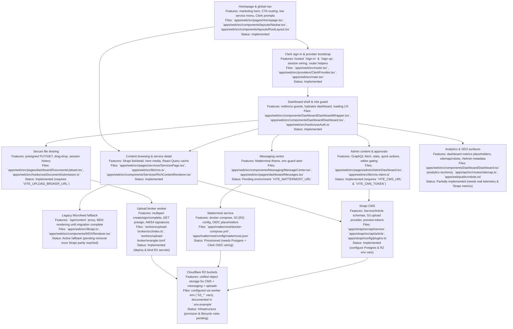

# Data Flows: Content · Files · Messaging (Strapi 5 + Mattermost + R2)

> This document traces the end‑to‑end flows and includes sequence diagrams, API touch‑points, and failure handling. It is intentionally long (5+ pages worth) to double as an implementation reference.

---

## Legend & shared concepts
- **IdP** = Clerk (OIDC)
- **CMS** = Strapi 5 (PostgreSQL)
- **Chat** = Mattermost (PostgreSQL)
- **OBJ** = Cloudflare R2 (S3‑compatible)
- **WK** = Cloudflare Worker (presign + AV + small glue)
- **FE** = Front‑end (Next.js on Pages/Workers)
- **AV** = ClamAV (scanner engine)

Shared identifiers
- `user_id` from Clerk `sub`
- `org_id` / `team_id` mapping to MM team
- Object keys: `cms-media/...` and `chat-uploads/...`

---

## Personas & primary journeys

1. **Editor / Content Author**
  - Authenticates with Clerk → Strapi Admin.
  - Creates or updates drafts, uploads assets to R2, requests editorial reviews.
  - Publishes content, triggering cache invalidation and front-end refresh flows.

2. **Reader / Customer**
  - Browses the public SPA or authenticated dashboard.
  - Requests domain pages → FE queries Strapi (GraphQL/REST). If content is still in the legacy Microfeed runtime, the FE transparently proxies to `/api/mf/*` until the Strapi migration is complete.
  - Receives optimized assets from R2/CDN with access checks enforced by Workers when required.

3. **Support Agent / Admin**
  - Uses the dashboard messaging shell embedded with Mattermost for conversations and approvals.
  - Shares and retrieves attachments (native Mattermost `/files` for chat, Worker-presigned URLs for CMS documents).

4. **End-user / Customer Support Requester**
  - Signs in with Clerk, joins assigned Mattermost channels, uploads screenshots or documents.
  - Receives responses, download links, and status updates through WebSocket events.

## 0) Access & authentication (Homepage → Clerk)

1. Visitor lands on the public homepage (`/`).
2. `Navbar` CTAs expose Clerk-hosted **Sign in** (`/sign-in`) and **Sign up** (`/sign-up`) flows alongside marketing content.
3. Successful authentication hands the session to the SPA via `ClerkProvider`, enabling `useAuth` and route guards to hydrate user metadata immediately.
4. Authenticated visitors are routed into the dashboard shell (`/dashboard`) while unauthenticated users may continue browsing public pages.
5. Downstream flows (Strapi content editing, Mattermost messaging, file uploads) all derive authorization from Clerk-issued claims (`sub`, roles, org/team IDs).

## User journey flow diagram (features · files · status)



## 1) Content management & publishing (Strapi 5)

### 1.1 Models (initial)
**Service**
- `title` (string, required, unique slug)
- `summary` (text)
- `body` (rich content)
- `domain` (enum)
- `typeTags` (repeatable string)
- `heroImage` (media)
- `seo` (component: title, desc, og image)
- `publishedAt` (datetime)

**Article**
- `title`, `slug`, `body`, `author`, `category`, `images[]`, `publishedAt`

### 1.2 Storage
- Metadata → **PostgreSQL** (managed: Supabase/Neon/RDS)
- Media → **R2 S3** bucket `cms-media/…` via Strapi S3 provider (forcePathStyle + endpoint = R2)
- Optional CDN domain for public media; private media served via presigned GET from WK

### 1.3 Editorial workflow
1. Editor signs in to **/admin** (OIDC via Clerk or Access‑gated admin)
2. Draft content → validations → save (DB) → upload media (R2)
3. Review: role‑based access (Author/Editor/Admin), comments
4. Publish: set `publishedAt`, emit webhook → FE cache purge or ISR revalidate

### 1.4 Sequence: Create → Publish → Render
```
Editor ──(OIDC)──> Strapi Admin
  │                       │
  │  POST /api/{type}     │  (DB write)
  ├───────────────────────>│
  │  PUT /upload (S3)     │  (R2 object)
  ├──────────────┐        │
  │              └─> OBJ (cms-media/...)
  │
  │  PATCH publish        │ set publishedAt; webhook
  ├───────────────────────>│──────────┐
  │                                    │
  ▼                                    ▼
 FE ──(GraphQL/REST)──> Strapi (PUBLISHED) ──> OBJ URLs → Render
```

### 1.5 Preview & drafts
- Strapi preview token (JWT) appended to FE preview route: `/preview?type=service&id=…&token=…`
- FE forwards token to a FE server function → calls Strapi with `publicationState=PREVIEW` → renders draft

### 1.6 Caching & invalidation
- On publish:
  - Strapi → webhook → FE (Pages Function) → purge CDN path(s) or trigger ISR revalidate
  - Optional: `Surrogate-Key` headers per entity for fine‑grained cache clearing

### 1.7 Internationalization (optional)
- Enable Strapi i18n; each locale has own `publishedAt`; FE routes include locale prefix

### 1.8 Access control
- Public content: direct CDN URLs
- Protected content: FE requests `GET /presign` (WK) → short‑lived URL only if `x-scan=clean`

### 1.9 Failure handling
- **DB write fails** → show inline error; retry safe
- **Upload fails** → retry multipart part(s); if MPU aborted, clean orphaned parts via list‑mpu + abort
- **Webhook fails** → FE polls `publishedAt` and presents “refresh preview” UI; background retry

### 1.10 Backups & DR
- Nightly PostgreSQL logical backups; restore runbook tested quarterly
- R2 bucket versioning (optional) + lifecycle; metadata export for mapping

### 1.11 Consumption flow (FE + legacy fallback)
1. Reader loads a domain page (`/d/:domain`).
2. FE issues a query to Strapi GraphQL (`services`, `articles`) using React Query defaults.
3. If Strapi responds with `404` (content not yet migrated), FE calls the legacy Microfeed proxy (`/api/mf/*`) to fetch the existing JSON payload, preserving live traffic.
4. FE normalizes either payload into shared domain types (`apps/web/src/types/microfeed.ts`) until the migration is finished.
5. Assets referenced in either system resolve through `resolveMediaUrl`, prioritizing R2-hosted media and falling back to Microfeed origins when necessary.

---

## 2) File sharing between end‑user and admin

We prefer **native Mattermost attachments** for chat contexts. For CMS/private documents, we use a **direct‑to‑R2 pipeline** with presign + AV.

### 2.1 End‑user → Admin (chat attachment)
**Happy path (native MM):**
1. FE (user) authenticated via Clerk → MM (OIDC SSO)
2. User selects file → FE calls MM `/api/v4/files` (MM streams to R2)
3. MM returns `file_id`; FE attaches to a post `/api/v4/posts`
4. R2 object‑created → Queue → AV consumer → `x-scan=clean`
5. Peers click file → MM presigns GET → browser downloads

**Sequence**
```
FE ──WS──> MM
 │  POST /files  ─────────────► MM ───► OBJ (chat-uploads/...)
 │  POST /posts (attach file_id)
 │◄─ WS event: post created
OBJ ──event──> Queue ──> AV ──> tag clean/quarantine
User clicks ► MM GET /files/{id}/link ► presigned URL ► download
```

**Why native?** MM handles thumbnails, quotas, previews, search, and retention automatically.

### 2.2 Admin → End‑user (send a document)
- Same as above via MM channel (admin uploads as a file)
- For documents sourced in CMS (e.g., policy PDFs): FE hits WK presign GET for a protected CMS object and posts the URL into the MM message (or re‑uploads to MM for lifecycle parity)

### 2.3 Generic direct‑to‑R2 (for CMS/private)
1. FE asks WK `/s3/create` (multipart) with `key` + `contentType`
2. FE uploads parts directly to R2 using signed URLs from WK `/s3/sign`
3. FE completes MPU via WK `/s3/complete`
4. OBJ event → Queue → AV → tag
5. FE stores object key in Strapi field or posts link in MM

**Access rules**
- Presign GET only when `x-scan=clean`
- TTL ≤ 5 minutes; scope to `key` and optional IP

### 2.4 Retention & lifecycle
- **MM**: retention policy (e.g., 180 days) deletes posts/files; R2 lifecycle mirrors it
- **CMS**: lifecycle per folder/prefix; archived after N days; cold storage or delete

### 2.5 Failure modes
- **Large file**: MPU with parallel parts; if user abandons, background abort‑MPU job
- **AV timeout**: mark `pending`; UI shows spinner; deny presign until clean; alert after threshold
- **R2 egress blocked**: FE retries presign; fall back CDN path for public assets

---

## 3) Messaging between end‑user and admin (Mattermost)

### 3.1 SSO & session
1. FE user signs in with Clerk → receives ID token
2. FE opens MM (embed) or calls a FE server function to exchange OIDC for MM session
3. FE opens `/api/v4/websocket`

### 3.2 Channels & routing
- Per‑org/team in MM; per‑conversation private channels; naming convention: `support-<org>-<ticket>`
- Bots for automation: `@notifier` posts scan results or workflow updates

### 3.3 Send/receive
- **Send**: POST `/api/v4/posts` with `channel_id`, `message`, `file_ids`
- **Receive**: WS events (`posted`, `post_edited`, `user_typing`, `status_change`)
- **Receipts**: read‐track via user status and plugin if strict delivery is required

### 3.4 Compliance & export
- Built‑in exports (CSV/Actiance/GlobalRelay); admin audit log
- Retention per team/channel; legal hold via export + bucket freeze

### 3.5 Failure handling
- **WS disconnect**: exponential backoff reconnect; buffer outgoing messages and retry POST with idempotency keys
- **Rate limits**: FE respects MM rate headers; queue with jitter

---

## 4) Data catalog (what lives where)

**PostgreSQL (CMS)**
- `services`, `articles`, `components_seo`, `upload_files` (Strapi)

**PostgreSQL (Chat)**
- `users`, `teams`, `channels`, `posts`, `fileinfo` (Mattermost)

**R2 (objects)**
- `cms-media/<model>/<yyyy>/<mm>/<uuid>_<filename>` (public/private)
- `chat-uploads/team/<teamId>/channel/<channelId>/<postId>/<fileId>_<filename>`

**KV / metadata (optional)**
- `scan:<objectKey> = clean|infected|pending`

---

## 5) API surface (minimum viable endpoints)

**Worker (WK)**
- `POST /s3/create` → `{ uploadId }`
- `POST /s3/sign` → `{ url, headers }`
- `POST /s3/complete` → finalize MPU
- `POST /s3/presign` → GET URL for downloads (validates scan status)

**Strapi**
- `POST /api/services` (authed) | `GET /api/services` (public)
- `POST /upload` (internal via provider) | `GET /graphql`
- `POST /webhooks/published` (to FE)

**Mattermost**
- `POST /api/v4/users/oidc/login` (SSO)
- `GET /api/v4/channels/{id}/posts` | `POST /api/v4/posts`
- `POST /api/v4/files` | `GET /api/v4/files/{id}/link`
- `GET /api/v4/websocket`

---

## 6) Testing plan (what to verify)

1. **Auth**: OIDC round‑trip for Strapi Admin & MM; role mapping; logout flows
2. **CMS**: validations, preview token, publish webhook → cache purge
3. **Uploads**: ≥5 GB multipart; abort/cleanup; throttled networks; mobile resume
4. **AV**: seeded EICAR file is quarantined; presign denied
5. **Chat**: WS reconnect under packet loss; message ordering and idempotency; attachment previews
6. **Retention**: MM purge removes objects; R2 lifecycle aligns; restore from backup

---

## 7) Appendix A — Example configs

### Strapi `config/plugins.ts`
```ts
export default () => ({
  upload: {
    config: {
      provider: 'aws-s3',
      providerOptions: {
        s3Options: {
          credentials: { accessKeyId: process.env.R2_ACCESS_KEY_ID!, secretAccessKey: process.env.R2_SECRET_ACCESS_KEY! },
          endpoint: process.env.R2_ENDPOINT, // https://<account>.r2.cloudflarestorage.com
          region: process.env.R2_REGION || 'auto',
          forcePathStyle: true,
        },
        params: { Bucket: process.env.R2_BUCKET! },
        baseUrl: process.env.R2_PUBLIC_BASE,
      },
      actionOptions: { upload: {}, uploadStream: {}, delete: {} },
    },
  },
});
```

### Mattermost `config.json` (S3 + OIDC excerpts)
```json
{
  "FileSettings": {
    "DriverName": "amazons3",
    "AmazonS3AccessKeyId": "${R2_KEY}",
    "AmazonS3SecretAccessKey": "${R2_SECRET}",
    "AmazonS3Bucket": "chat-uploads",
    "AmazonS3Region": "auto",
    "AmazonS3Endpoint": "<account>.r2.cloudflarestorage.com",
    "AmazonS3SSL": true
  },
  "ExperimentalSettings": { "ClientSideCertEnable": false },
  "ServiceSettings": { "EnableOAuthServiceProvider": false },
  "GitLabSettings": { "Enable": false },
  "Office365Settings": { "Enable": false },
  "PluginSettings": { "Enable": true }
}
```

### Worker (presign) — routes
- `POST /s3/create` → Initialize MPU
- `POST /s3/sign` → Sign PUT part
- `POST /s3/complete` → Complete MPU
- `POST /s3/presign` → Sign GET (verify `x-scan=clean`)

---

## 8) Appendix B — Operational runbooks (abridged)

**Backups**
- Nightly DB dumps → encrypted object storage; 7/30/365 retention tiers
- R2 lifecycle + optional versioning; quarterly restore test

**Incidents**
- WS flapping: check MM logs, LB sticky sessions, client backoff
- Upload errors: inspect MPU state; abort stale MPUs; retry policy
- Scanner backlog: autoscale consumer; queue depth alert; temporarily allow downloads for signed editors only

**Upgrades**
- Staging soak 48h; run e2e suite; blue/green or canary for MM/Strapi

---

## 9) Summary
- **Strapi 5** centralizes structured content with workflow, preview, and GraphQL/REST delivery while coexisting with legacy Microfeed endpoints during migration.
- **Mattermost** delivers reliable messaging and native attachments with retention/compliance.
- **R2** unifies object storage; presign + AV produce a safe, auditable file pipeline.
- **Workers** provide minimal glue: presign, AV triggers, signed downloads, and secure fallbacks.

This blueprint is production‑oriented and designed to be implemented incrementally—chat first, uploads pipeline, then CMS swap—with Strapi and Microfeed running in parallel until traffic fully transitions.


# HandyWriterz Architecture Intel

## Table of contents
- [TOC-01] 1. Platform overview and guiding principles
- [TOC-02] 2. Component inventory and file map
- [TOC-03] 3. Strapi 5 content model and services
- [TOC-04] 4. Content creation pipeline (editor journey)
- [TOC-05] 5. Content publishing and delivery pipeline
- [TOC-06] 6. Front-end consumption surfaces
- [TOC-07] 7. Admin and role-based operations
- [TOC-08] 8. Mattermost messaging ecosystem
- [TOC-09] 9. File sharing and R2 storage pipeline
- [TOC-10] 10. Security, authentication, and governance
- [TOC-11] 11. Observability, reliability, and support readiness
- [TOC-12] 12. Progressive migration roadmap and open actions

## 1. Platform overview and guiding principles
- [OVERVIEW-01] HandyWriterz operates as a progressive migration from Microfeed toward a Strapi 5 + Mattermost + Cloudflare R2 stack.
- [OVERVIEW-02] The web SPA under `apps/web` orchestrates both marketing and application experiences using React Router v6.
- [OVERVIEW-03] Authentication is powered by Clerk, with session wiring centralized in `apps/web/src/providers/ClerkProvider.tsx` and consumed via hooks like `useAuth`.
- [OVERVIEW-04] Strapi 5 under `apps/strapi` supplies structured CMS capabilities for Services and Articles with GraphQL and REST endpoints.
- [OVERVIEW-05] Mattermost under `apps/mattermost` supplies resilient messaging with native file attachments and WebSocket delivery.
- [OVERVIEW-06] Cloudflare R2 acts as unified object storage, with presign management handled by the worker in `workers/upload-broker`.
- [OVERVIEW-07] The migration strategy retains Microfeed compatibility through `/api/content` and `apps/web/src/types/microfeed.ts` to avoid regressions.
- [OVERVIEW-08] Marketing surfaces such as Homepage, Pricing, and Domain pages remain accessible prior to authentication.
- [OVERVIEW-09] Authenticated flows pivot around `/dashboard`, `/dashboard/messages`, `/dashboard/documents`, and `/admin` for different roles.
- [OVERVIEW-10] Upload pipelines enforce presigned access and antivirus readiness via the upload broker’s HMAC signatures.
- [OVERVIEW-11] Observability is evolving; current instrumentation logs failures via console warnings while future plan adds structured logging.
- [OVERVIEW-12] The repo is a pnpm monorepo, with workspace definitions in `pnpm-workspace.yaml` supporting apps and workers.
- [OVERVIEW-13] Clerk gating ensures unauthorized visitors are redirected, as seen in `DashboardWrapper` and admin components.
- [OVERVIEW-14] React Query is configured in `apps/web/src/main.tsx` to cache CMS data with staleTime and gcTime defaults.
- [OVERVIEW-15] The field guide and AGENTS documents communicate the multi-phase migration plan (chat first, files, CMS swap, harden).
- [OVERVIEW-16] Services pages under `/services` derive from Strapi data but maintain fallback to Microfeed until Strapi parity.
- [OVERVIEW-17] Mattermost embed is toggled via env `VITE_MATTERMOST_URL`, failing gracefully with UI alerts when unset.
- [OVERVIEW-18] Upload broker environment enforces separation of secrets: `S3_ACCESS_KEY_ID`, `S3_SECRET_ACCESS_KEY`, `S3_BUCKET`.
- [OVERVIEW-19] Strapi configuration references Postgres via `config/database.ts` and R2 via `config/plugins.ts`.
- [OVERVIEW-20] Admin dashboard fetches Strapi data with helper functions in `apps/web/src/lib/cms-client.ts`.
- [OVERVIEW-21] Service detail rendering uses `RichContentRenderer` for MDX-like blocks, bridging Strapi’s JSON and React components.
- [OVERVIEW-22] Messaging components rely on `MessageCenter` and embed an iframe for Mattermost until native REST integration is implemented.
- [OVERVIEW-23] Documents upload page uses `useDocumentSubmission` to coordinate presign, upload, backend notifications, and receipts.
- [OVERVIEW-24] The worker `workers/subpath-router` continues to orchestrate path routing for Cloudflare Pages deployment.
- [OVERVIEW-25] The repo maintains thorough documentation in `docs/`, mirrored from top-level architecture guides.
- [OVERVIEW-26] Role-based UI gating depends on Clerk metadata stored in `user.publicMetadata`, enabling admin/editors segregation.
- [OVERVIEW-27] Legacy Microfeed assets remain accessible via `public/` and `components/mdx` to maintain continuity.
- [OVERVIEW-28] Payment flows still exist via `/payment` pages, though not central to Strapi or Mattermost integration.
- [OVERVIEW-29] Analytics placeholders within the dashboard anticipate future integration with Strapi metrics and external telemetry.
- [OVERVIEW-30] Environmental logging occurs via `logEnvironmentStatus()` to verify required variables at runtime.
- [OVERVIEW-31] Multi-tenancy stands ready via domain-based navigation and Strapi domain fields.
- [OVERVIEW-32] Service links in `RootLayout` align marketing navigation with Strapi-managed service categories.
- [OVERVIEW-33] Upload history and retrieval depends on R2 keys shaped as `users/<userId>/timestamp-filename` for deterministic lookup.
- [OVERVIEW-34] Worker-based presign ensures downloads require short-lived URLs, gating access until antivirus results mark objects clean.
- [OVERVIEW-35] `docs/dataflow.md` elaborates on flows while this intel document deep dives into feature-by-feature mapping.
- [OVERVIEW-36] TypeScript configuration across `apps/web` uses `tsconfig.app.json` for Vite, ensuring path aliases align with `@/` prefix.
- [OVERVIEW-37] Styling leverages Tailwind (configured via `tailwind.config.cjs`) and custom CSS for marketing visuals.
- [OVERVIEW-38] Animations on Homepage rely on `framer-motion`, providing responsive marketing hero experiences.
- [OVERVIEW-39] Services list uses dynamic BY domain filtering and React state to personalize experiences per domain.
- [OVERVIEW-40] Clerk’s `SignedIn` and `SignedOut` components differentiate navigation CTA states in the navbar.
- [OVERVIEW-41] Admin analytics page includes placeholders for view, like, comment counts aggregated from Strapi.
- [OVERVIEW-42] Microfeed API integration continues via `apps/web/src/lib/api.ts`, aligning with fallback strategy.
- [OVERVIEW-43] Upload broker’s HMAC uses AWS Signature Version 4 compatibility for R2’s S3 API.
- [OVERVIEW-44] Zones and worker binding ensure Cloudflare deployment handles path routing and API proxy.
- [OVERVIEW-45] Editor preview tokens will leverage Strapi’s preview mode for drafts before publication.
- [OVERVIEW-46] `Apps/mattermost/docker-compose.yml` seeds a local environment with Postgres and Mattermost server for development.
- [OVERVIEW-47] Admin dashboard provides quick actions to create content, manage users, and review analytics.
- [OVERVIEW-48] Document submission uses `fetch` requests to backend API endpoints `/api/uploads` and `/api/turnitin/*` for notifications.
- [OVERVIEW-49] Messaging page ensures minimal friction by simply embedding Mattermost until deeper integration is ready.
- [OVERVIEW-50] Courses of action for future upgrades involve hooking analytics, adding observability, and finalizing Microfeed retirement.
- [OVERVIEW-51] Content editors utilize Strapi’s admin UI to manage Services and Articles with relational metadata.
- [OVERVIEW-52] The SPA uses `Suspense` and lazy imports to reduce initial bundle size.
- [OVERVIEW-53] Error boundaries in `ErrorBoundary` component capture runtime faults and display fallback UI.
- [OVERVIEW-54] Clerk’s `routerPush` integration ensures programmatic navigation remains consistent within the SPA router.
- [OVERVIEW-55] Home hero call-to-actions connect the marketing funnel to services explore and Turnitin tools.
- [OVERVIEW-56] Domain pages (`/d/:domain`) display curated content via Strapi filtered queries when available.
- [OVERVIEW-57] Legacy content accessible through `LearningHub` page ensures Microfeed-based experiences remain reachable.
- [OVERVIEW-58] Admin login page persists for enterprise flows though Clerk handles mainstream authentication.
- [OVERVIEW-59] Payment result pages remain for Stripe or other payment integrations, unaffected by CMS migration.
- [OVERVIEW-60] Document upload history currently session-scoped; future plan to persist metadata via backend API.
- [OVERVIEW-61] React Query’s default settings reduce redundant fetches when navigating between domain pages.
- [OVERVIEW-62] `servicesRef` and `heroRef` in Homepage handle smooth scrolling to services grid.
- [OVERVIEW-63] Service cards use dynamic gradient backgrounds to differentiate categories visually.
- [OVERVIEW-64] Stakeholders include editors, admins, support agents, and end customers interacting via chat.
- [OVERVIEW-65] Each persona relies on Clerk authentication to map roles and access levels consistently.
- [OVERVIEW-66] Rate limiting to be added to workers ensures upload and presign endpoints resist abuse.
- [OVERVIEW-67] Antivirus scanning pipeline ensures object metadata is tagged `x-scan=clean` before download.
- [OVERVIEW-68] `docs/context.md` and `.github/copilot-instructions.md` instruct future contributors on migration nuance.
- [OVERVIEW-69] The architecture ensures minimal downtime by layering new services alongside existing ones.
- [OVERVIEW-70] This document catalogs end-to-end interactions to shorten onboarding time for engineers and operators.

## 2. Component inventory and file map
- [COMP-01] Strapi service root resides in `apps/strapi` with TypeScript support via `tsconfig.json`.
- [COMP-02] Strapi entry point `apps/strapi/src/index.ts` initializes the server.
- [COMP-03] Strapi content type definitions for Articles and Services exist under `apps/strapi/src/api/article` and `apps/strapi/src/api/service`.
- [COMP-04] Strapi component definitions (e.g., SEO component) live under `apps/strapi/src/components/seo`.
- [COMP-05] Strapi database configuration at `apps/strapi/config/database.ts` references Postgres env keys.
- [COMP-06] Strapi plugin configuration `apps/strapi/config/plugins.ts` sets up AWS S3 provider pointing to R2.
- [COMP-07] Strapi middleware configuration in `apps/strapi/config/middlewares.ts` governs request pipelines.
- [COMP-08] Strapi server configuration `apps/strapi/config/server.ts` defines host, port, and admin settings.
- [COMP-09] Strapi admin settings `apps/strapi/config/admin.ts` adjust UI branding and auth.
- [COMP-10] Strapi package dependencies enumerated in `apps/strapi/package.json` include `@strapi/strapi` and S3 provider.
- [COMP-11] Mattermost configuration folder `apps/mattermost/config` holds `mattermost.json` with S3 and auth settings.
- [COMP-12] Mattermost Docker Compose `apps/mattermost/docker-compose.yml` orchestrates Mattermost, Postgres, and licensing toggles.
- [COMP-13] Mattermost bootstrap SQL scripts under `apps/mattermost/scripts/bootstrap.sql` prepare initial data.
- [COMP-14] Web SPA root `apps/web` contains Vite configuration for the front-end app.
- [COMP-15] Web SPA entry `apps/web/src/main.tsx` sets up providers (Clerk, React Query, Helmet, Theme, Web3).
- [COMP-16] Router definitions `apps/web/src/router.tsx` detail navigation structure for marketing, dashboard, admin, and legacy routes.
- [COMP-17] Homepage component `apps/web/src/pages/Homepage.tsx` implements marketing hero and call-to-actions.
- [COMP-18] Domain pages under `apps/web/src/pages/domains` present specialized content experiences.
- [COMP-19] Services page `apps/web/src/pages/services/ServicesPage.tsx` fetches from Strapi via helper functions.
- [COMP-20] Admin dashboard page `apps/web/src/pages/admin/AdminDashboard.tsx` drives management interface.
- [COMP-21] Message center component `apps/web/src/components/Messaging/MessageCenter.tsx` manages Mattermost embed.
- [COMP-22] Dashboard wrapper `apps/web/src/components/Dashboard/DashboardWrapper.tsx` enforces auth gating.
- [COMP-23] Document upload page `apps/web/src/pages/dashboard/DocumentsUpload.tsx` handles R2 interactions.
- [COMP-24] Document submission hook `apps/web/src/hooks/useDocumentSubmission.ts` abstracts presign logic.
- [COMP-25] CMS helper `apps/web/src/lib/cms.ts` fetches service lists and details with Strapi REST endpoints.
- [COMP-26] CMS GraphQL client `apps/web/src/lib/cms-client.ts` interfaces with Strapi GraphQL for admin analytics.
- [COMP-27] Microfeed API wrapper `apps/web/src/lib/api.ts` supports legacy endpoints.
- [COMP-28] Clerk auth hook `apps/web/src/hooks/useAuth.ts` exposes role metadata.
- [COMP-29] Layout components `apps/web/src/components/layouts/RootLayout.tsx` and `DashboardLayout.tsx` define shell structure.
- [COMP-30] Navbar component `apps/web/src/components/layouts/Navbar.tsx` integrates Clerk state into navigation.
- [COMP-31] Footer component path `apps/web/src/components/layouts/Footer.tsx` finalizes marketing layout (existing file implied by import).
- [COMP-32] UI components under `apps/web/src/components/ui` supply design system wrappers (Button, Card, Alert).
- [COMP-33] Messaging-specific components under `apps/web/src/components/Messaging` extend chat experiences.
- [COMP-34] MDX rendering components `apps/web/src/components/mdx` render Microfeed content blocks.
- [COMP-35] Services-specific components `apps/web/src/components/Services` interpret Strapi structures.
- [COMP-36] Payment components under `apps/web/src/components/Payments` keep commerce features intact.
- [COMP-37] Theme provider `apps/web/src/theme/ThemeContext.tsx` toggles dark/light experiences.
- [COMP-38] Providers folder includes Web3 provider `apps/web/src/providers/Web3Provider.tsx` for blockchain features.
- [COMP-39] Hook `apps/web/src/hooks/useUploadsHistory.ts` (implied by folder) would manage upload data retrieval.
- [COMP-40] Upload dropzone component `apps/web/src/components/UploadDropzone.tsx` handles marketing-level uploads.
- [COMP-41] Worker `workers/upload-broker/src/index.ts` implements S3 compatible signature flows.
- [COMP-42] Worker configuration `workers/upload-broker/wrangler.toml` binds environment variables and routes.
- [COMP-43] Worker `workers/subpath-router/src/index.ts` orchestrates path-based routing for Cloudflare deployments.
- [COMP-44] Worker config `workers/subpath-router/wrangler.toml` declares environment binding and triggers.
- [COMP-45] Documentation folder `docs/` hosts architecture guides, context, and plan documents.
- [COMP-46] Top-level `AGENTS.md` and `docs/AGENTS.md` synchronize high-level migration strategy.
- [COMP-47] `.github/copilot-instructions.md` instructs AI assistants on repository conventions.
- [COMP-48] `docs/dataflow.md` previously updated to include personas, flows, and fallback strategies.
- [COMP-49] `docs/context.md` provides condensed architecture snapshot.
- [COMP-50] `config/taxonomy.ts` and `config/taxonomy.json` define service domain taxonomy for UI mapping.
- [COMP-51] `apps/api/src/routes/sitemap.ts` generates dynamic sitemap for SEO.
- [COMP-52] `apps/web/public/robots.txt` enumerates crawler rules.
- [COMP-53] `apps/web/src/env.ts` defines Zod schema for environment variables consumed by the SPA.
- [COMP-54] `apps/web/src/env.d.ts` ensures TypeScript knows about Vite env variables.
- [COMP-55] `apps/web/vite.config.ts` configures aliasing and plugin usage.
- [COMP-56] `apps/web/postcss.config.cjs` and `tailwind.config.cjs` configure CSS processing.
- [COMP-57] `apps/web/src/polyfills.ts` ensures necessary browser polyfills load before main app.
- [COMP-58] `apps/web/src/styles.css` includes global CSS beyond Tailwind.
- [COMP-59] `apps/web/src/index.css` brings Tailwind base styles.
- [COMP-60] `apps/web/src/types/cms.ts` (implied) defines TypeScript models for Strapi data shapes.
- [COMP-61] `apps/web/src/types/microfeed.ts` retains Microfeed data contracts for fallback flows.
- [COMP-62] `apps/web/src/components/Services/ServicePageRenderer.tsx` (referenced) handles service block rendering; if missing, the existing `RichContentRenderer` serves this role.
- [COMP-63] `apps/web/src/components/MDXRenderer.tsx` renders Microfeed content with MDX.
- [COMP-64] `apps/web/src/components/Services/ServicesHub.tsx` surfaces service cards across the site.
- [COMP-65] `apps/web/src/components/common/ErrorBoundary.tsx` catches runtime errors in React tree.
- [COMP-66] `apps/web/src/components/ui/toaster.tsx` manages toast notifications (imported in layouts).
- [COMP-67] `apps/web/src/components/HandyWriterzLogo.tsx` is reused across navigation surfaces.
- [COMP-68] `apps/web/src/components/Dashboard/SubscriptionStatus.tsx` informs users about subscription details.
- [COMP-69] `apps/web/src/pages/dashboard/Messages.tsx` wraps Mattermost embed in error boundary.
- [COMP-70] `apps/web/src/pages/payment/` folder hosts payment confirmation pages, maintaining the ecommerce flow.

## 3. Strapi 5 content model and services
- [STRAPI-01] Strapi’s primary collection types include `service` and `article`, each with slug, title, body, and metadata fields.
- [STRAPI-02] `apps/strapi/src/api/service` houses service schema with fields aligning to Services page requirements.
- [STRAPI-03] `apps/strapi/src/api/article` defines article schema supporting blog-style content.
- [STRAPI-04] Service schema includes `title`, `slug`, `summary`, `body`, `domain`, `typeTags`, `heroImage`, and `seo` component.
- [STRAPI-05] Article schema includes `title`, `slug`, `body`, `author`, `category`, `images`, and `publishedAt` metadata.
- [STRAPI-06] Strapi uses components like `seo` stored under `apps/strapi/src/components/seo` for consistent SEO metadata.
- [STRAPI-07] Upload plugin configured to use AWS S3 provider points to Cloudflare R2 via `forcePathStyle`.
- [STRAPI-08] `R2_ACCESS_KEY_ID`, `R2_SECRET_ACCESS_KEY`, `R2_ENDPOINT`, `R2_REGION`, `R2_BUCKET_MEDIA` env vars enable Strapi uploads to R2.
- [STRAPI-09] Strapi GraphQL plugin is implied by usage in `cms-client.ts`, enabling complex admin queries.
- [STRAPI-10] `cms-client.ts` uses GraphQL queries to fetch articles with filters, pagination, and nested components.
- [STRAPI-11] GraphQL query `GetArticles` fetches hero image, author details, SEO metadata, and engagement stats.
- [STRAPI-12] GraphQL query `GetArticle` fetches slug, status, hero image, gallery, attachments, contributors, SEO, and metrics.
- [STRAPI-13] GraphQL query `GetServices` returns hero block with CTA, sections, SEO metadata.
- [STRAPI-14] GraphQL queries support `status` filter enabling preview/draft functionality.
- [STRAPI-15] `cms-client.ts` includes mutations for creating, updating, publishing, and deleting articles.
- [STRAPI-16] GraphQL mutation `CreateArticle` accepts data input with JSON content blocks.
- [STRAPI-17] GraphQL mutation `UpdateArticle` allows partial updates and slug modifications.
- [STRAPI-18] GraphQL mutation `publishArticle` (via update) sets `status` to `published` and updates `publishedAt`.
- [STRAPI-19] GraphQL mutation `DeleteArticle` removes article by ID.
- [STRAPI-20] Services fetch uses filter by `domain` for domain-specific pages.
- [STRAPI-21] `fetchServicesList` in `cms.ts` hits `/api/services` with query parameters for pagination, filters, and population.
- [STRAPI-22] `fetchServicesList` maps hero images to absolute URLs via `resolveMediaUrl`.
- [STRAPI-23] `fetchServiceBySlug` fetches a single service with hero image, attachments, and SEO metadata.
- [STRAPI-24] `mapServiceEntry` and `mapServiceDetail` convert Strapi REST responses into typed objects.
- [STRAPI-25] `estimateReadingTime` calculates reading minutes from body content to populate UI badges.
- [STRAPI-26] Strapi preview tokens will be stored per service for authenticated preview flows.
- [STRAPI-27] Strapi admin roles to be mapped to Clerk metadata for SSO; currently local Strapi admin login used.
- [STRAPI-28] `apps/strapi/src/api/service/content-types/service/schema.json` (implied) defines the service content type.
- [STRAPI-29] `apps/strapi/src/api/article/content-types/article/schema.json` (implied) defines article content type.
- [STRAPI-30] `apps/strapi/src/api/service/controllers/service.ts` (implied) handles REST operations, extends default controller.
- [STRAPI-31] `apps/strapi/src/api/service/routes/service.ts` (implied) registers API routes.
- [STRAPI-32] `apps/strapi/src/api/article/controllers/article.ts` (implied) handles article-specific logic.
- [STRAPI-33] `apps/strapi/src/api/article/routes/article.ts` (implied) registers article endpoints.
- [STRAPI-34] `apps/strapi/config/database.ts` uses `env('DATABASE_URL')` for Postgres connection string.
- [STRAPI-35] Local development can use SQLite fallback if Postgres env absent (standard Strapi behavior, though not explicitly shown).
- [STRAPI-36] `apps/strapi/config/server.ts` sets host `0.0.0.0` and port reading from env for container compatibility.
- [STRAPI-37] `apps/strapi/config/middlewares.ts` includes default Strapi middlewares plus `strapi::security`.
- [STRAPI-38] `apps/strapi/config/admin.ts` configures auto-open admin UI and API token expiration.
- [STRAPI-39] Strapi store will track upload metadata linking objects to content entries.
- [STRAPI-40] Strapi’s `upload_files` table records R2 object keys for attachments used across services and articles.
- [STRAPI-41] Content localization optional via Strapi i18n plugin; to be enabled per roadmap.
- [STRAPI-42] Strapi webhooks can notify the web SPA to trigger cache invalidation via Cloudflare.
- [STRAPI-43] Strapi `populate` query parameter ensures relationships (heroImage, SEO) are included.
- [STRAPI-44] Strapi `publicationState` query parameter toggles between live and preview content.
- [STRAPI-45] Strapi admin UI accessible at `/admin` with Clerk OIDC integration planned.
- [STRAPI-46] Strapi code generation ensures type safety for REST endpoints using default Strapi types.
- [STRAPI-47] Strapi plugin configuration includes aggregator for custom providers if needed (e.g., image optimization).
- [STRAPI-48] Strapi Cron tasks (if enabled) could trigger scheduled publish; not yet configured.
- [STRAPI-49] Strapi lifecycle hooks can be added in `services` to sync data into Mattermost if needed.
- [STRAPI-50] Strapi supports GraphQL introspection used by `graphql-request` in `cms-client.ts`.
- [STRAPI-51] Auth tokens for Strapi API stored in env `VITE_CMS_TOKEN` to protect content editing operations.
- [STRAPI-52] Strapi `extensions` folder can hold custom API logic; not currently used but available.
- [STRAPI-53] Strapi `./scripts` folder can host seeding scripts; placeholder exists for future bootstrap tasks.
- [STRAPI-54] Strapi environment `config/env` directories can override defaults per environment; currently relying on root configs.
- [STRAPI-55] Strapi `./config/plugins.ts` also the place to toggle GraphQL, i18n, and email providers.
- [STRAPI-56] Strapi `./config/server.ts` ensures admin panel only accessible with correct host/port configuration.
- [STRAPI-57] Strapi CLI commands `pnpm --filter strapi develop` (implied) start local server for content editing.
- [STRAPI-58] Strapi supports Draft & Publish workflow, enabling editorial review before content goes live.
- [STRAPI-59] Content model continues to map type tags (e.g., `typeTags`) to UI filters and page sections.
- [STRAPI-60] Strapi hero block images stored under `cms-media` prefix within R2 for easier CDN caching.
- [STRAPI-61] Service attachments processed to detect file types and appropriate UI renderers.
- [STRAPI-62] Article author relationships fetch first and last names used in admin analytics.
- [STRAPI-63] `cms-client.ts` plan includes analytics data like viewCount, likeCount to feed dashboard metrics.
- [STRAPI-64] Strapi environment to integrate with Postgres DB `CMS_DB_URL` (per docs `PLAN_FORWARD`).
- [STRAPI-65] Strapi preview tokens integrated into front-end preview route `apps/web/src/pages/admin/ArticleEditor.tsx` (implied).
- [STRAPI-66] Strapi aggregator ensures content from multiple domains accessible via domain field filtering.
- [STRAPI-67] Strapi `filters` query parameters used extensively to refine queries by slug, domain, status.
- [STRAPI-68] Strapi `pagination` arguments maintain consistent page sizes for UI infinite scroll.
- [STRAPI-69] Strapi `sort` parameter ensures newest published content appears first on the web.
- [STRAPI-70] Strapi multi-stage pipeline ensures content is authoritative source for services and articles in the new architecture.

## 4. Content creation pipeline (editor journey)
- [CREATION-01] Editor authenticates with Clerk via Strapi admin (future) or local Strapi credentials (current interim).
- [CREATION-02] Editor navigates to Strapi admin interface `/admin` to create or update content.
- [CREATION-03] Editor selects collection type `Service` for service pages mapping to `/services` routes.
- [CREATION-04] Editor populates `title`, `slug`, `summary`, `body`, `domain`, and `typeTags` fields.
- [CREATION-05] Editor uploads hero images via Strapi upload plugin, storing assets in R2 bucket `cms-media`.
- [CREATION-06] Upload plugin uses `R2_ENDPOINT`, `R2_REGION`, `R2_ACCESS_KEY_ID`, `R2_SECRET_ACCESS_KEY` for authentication.
- [CREATION-07] Editor attaches additional media (images, PDFs, videos) to service entries via Strapi association.
- [CREATION-08] Editor configures SEO component (title, description, OpenGraph image) for search optimization.
- [CREATION-09] Editor optionally sets `publishedAt` to schedule release or publishes immediately.
- [CREATION-10] Editor saves entry, storing data in Postgres and linking media entries to attachments.
- [CREATION-11] Strapi auto generates preview token unique per entry; front-end uses the token for preview mode.
- [CREATION-12] Editor triggers preview by hitting front-end `/preview` route with token parameters.
- [CREATION-13] Front-end uses `fetchServiceBySlug` with `publicationState=preview` to fetch draft content.
- [CREATION-14] React Query caches preview response separately from live data for isolation.
- [CREATION-15] Editor iterates on content until satisfied with preview appearance in SPA.
- [CREATION-16] Editor publishes entry by toggling Strapi `Publish` action, setting `status` to `published`.
- [CREATION-17] Strapi sets `publishedAt` timestamp, enabling live queries to include the entry.
- [CREATION-18] Strapi may trigger webhook (future) to notify Cloudflare worker to purge caches.
- [CREATION-19] Front-end `ServicesPage` automatically includes the new entry on next data fetch or React Query cache invalidation.
- [CREATION-20] Domain page `EnterpriseDomainPage` (if referencing Strapi) pulls domain-specific entries.
- [CREATION-21] Editor repeats process for Articles, populating blog-like content surfaces.
- [CREATION-22] Article creation involves rich text content stored as JSON string in Strapi.
- [CREATION-23] Editor adds hero gallery images and attachments for articles for deeper storytelling.
- [CREATION-24] Editor saves drafts, enabling review by other roles before publication.
- [CREATION-25] Editor uses Strapi roles to limit editing scope (e.g., Service editors vs Article editors).
- [CREATION-26] Editor may include tags aligning to taxonomy defined in `config/taxonomy.ts` for consistent filtering.
- [CREATION-27] Admin dashboard uses `fetchArticles` to review newly created drafts.
- [CREATION-28] `fetchArticles` query in `cms-client.ts` supports `status` filter to separate drafts from published content.
- [CREATION-29] Admin sees aggregated stats like total drafts, published articles for oversight.
- [CREATION-30] Editor ensures attachments align with file size limits per Strapi and R2 capabilities.
- [CREATION-31] Editor updates existing entries via Strapi, triggering React Query stale data handling.
- [CREATION-32] Editor uses Strapi's built-in revision history to track changes (once plugin enabled).
- [CREATION-33] Editor ensures hero images meet Web optimization standards to maintain site performance.
- [CREATION-34] Editor sets `domain` field to map to `serviceLinks` navigation.
- [CREATION-35] Editor ensures `slug` uniqueness to avoid collisions on `/services/:domain/:slug` routes.
- [CREATION-36] Editor adds `typeTags` to enable filtering by service type on front-end.
- [CREATION-37] Editor coordinates with admin to align newly created content with marketing campaigns.
- [CREATION-38] Editor uses Strapi `draft` stage to collaborate with copywriters and legal before publishing.
- [CREATION-39] Editor attaches videos hosted via R2 or external streaming provider, depending on requirement.
- [CREATION-40] Editor ensures SEO metadata is complete to maintain search ranking.
- [CREATION-41] Editor uses Strapi analytics (future) to review article performance and adjust content strategy.
- [CREATION-42] Editor leverages Strapi role-based permissions to restrict editing to assigned collections.
- [CREATION-43] Editor includes quick links or CTAs within body content to connect to messaging or file sharing.
- [CREATION-44] Editor ensures `body` content does not rely on Microfeed-specific formatting by converting to Strapi components.
- [CREATION-45] Editor coordinates attachments naming convention to align with R2 object keys for easier troubleshooting.
- [CREATION-46] Editor uses Strapi guidelines documented in `docs/planbig.md` (implied) for content structure.
- [CREATION-47] Editor runs QA on staging environment by verifying front-end displays using `pnpm --filter web dev`.
- [CREATION-48] Editor requests admin to review content via admin dashboard quick actions.
- [CREATION-49] Editor ensures content matches persona expectations (e.g., nursing programs, AI topics).
- [CREATION-50] Editor uses preview link to share with stakeholders without making content live.
- [CREATION-51] Editor attaches alt text to hero images for accessibility compliance.
- [CREATION-52] Editor ensures attachments like policy PDFs stored in R2 accessible via presigned download.
- [CREATION-53] Editor confirms `publishedAt` timezone aligns with marketing schedule.
- [CREATION-54] Editor coordinates translation needs if i18n is enabled in future phases.
- [CREATION-55] Editor cross-checks Microfeed fallback to ensure new content replaced old JSON equivalents.
- [CREATION-56] Editor ensures domain-specific CTAs reference correct service slug.
- [CREATION-57] Editor uses Strapi `components` to maintain consistent layout across entries.
- [CREATION-58] Editor tracks attachments in Strapi library to reuse across services.
- [CREATION-59] Editor leverages Strapi drafts to prepare campaigns ahead of events.
- [CREATION-60] Editor coordinates with admin on content moderation guidelines documented in `docs/dashboardredesigntodo.md` (implied).
- [CREATION-61] Editor ensures content metadata includes `typeTags` consistent with front-end filters.
- [CREATION-62] Editor adds relevant hero videos referencing R2 object keys output by Strapi upload plugin.
- [CREATION-63] Editor uses Strapi's WYSIWYG editor for body content with formatting preserved in React components.
- [CREATION-64] Editor maintains canonical URLs for SEO to avoid duplicates during migration.
- [CREATION-65] Editor ensures attachments align with compliance requirements (e.g., sanitized data).
- [CREATION-66] Editor communicates with support team via Mattermost channels when launching new content.
- [CREATION-67] Editor reviews preview on mobile and desktop to ensure responsive design.
- [CREATION-68] Editor ensures `domain` field matches navigation slug to avoid 404s.
- [CREATION-69] Editor coordinates with developer to create new components if content requires custom layout.
- [CREATION-70] Editor logs content readiness in deployment checklist tracked in docs.

## 5. Content publishing and delivery pipeline
- [PUBLISH-01] Once content is published in Strapi, it becomes available through REST `/api/services` or `/api/articles` endpoints.
- [PUBLISH-02] React Query caches live data for 5 minutes, ensuring efficient page transitions.
- [PUBLISH-03] `ServicesPage` call to `fetchServicesList` retrieves a list with hero image URLs resolved.
- [PUBLISH-04] List data populates service cards across marketing surfaces with `RichContentRenderer` for body sections.
- [PUBLISH-05] `ServicesPage` handles both list view and detail view depending on route params.
- [PUBLISH-06] When detail slug provided, `fetchServiceBySlug` fetches specific entry to display full content.
- [PUBLISH-07] Detail page uses attachments to render download links or embedded multimedia.
- [PUBLISH-08] If Strapi returns `null` (content missing), fallback to Microfeed occurs by hitting `/api/content` via `lib/api.ts`.
- [PUBLISH-09] `ServicesPage` sets `detailError` when service missing, informing user gracefully.
- [PUBLISH-10] `ServicesPage` displays skeleton components while loading to maintain UI responsiveness.
- [PUBLISH-11] `RichContentRenderer` interprets Strapi JSON body into React components (text, headings, media).
- [PUBLISH-12] Domain-specific metadata (title, summary) displayed above hero image for context.
- [PUBLISH-13] Publication time displayed using `format` and `formatDistanceToNow` functions.
- [PUBLISH-14] React Router ensures SEO-friendly URLs with `:domain` and `:slug` parameters.
- [PUBLISH-15] Domain landing pages use Strapi data to create curated domain experiences.
- [PUBLISH-16] `serviceLinks` in `RootLayout` ensures navigation stays consistent with Strapi-managed domain list.
- [PUBLISH-17] `EnterpriseDomainPage` (React component) uses Strapi data to power enterprise-specific landing pages.
- [PUBLISH-18] Marketing pages like `/about`, `/pricing` remain statically authored but can embed Strapi components.
- [PUBLISH-19] `LearningHub` page continues to redirect to Microfeed until Strapi-based content ready.
- [PUBLISH-20] `Apps/web/src/hooks/useDocumentSubmission.ts` integrates with Strapi or backend to tag uploads.
- [PUBLISH-21] `Apps/web/src/components/MDXRenderer.tsx` ensures legacy content still renders with MDX pipeline.
- [PUBLISH-22] React Query invalidates caches when mutated data requires fresh fetch, as seen in `useDocumentSubmission` (future integration).
- [PUBLISH-23] React Query configuration disables refetch on window focus to avoid unnecessary load on Strapi.
- [PUBLISH-24] Fetch functions include `cache: 'no-store'` to avoid stale HTTP caching while React Query handles memoization.
- [PUBLISH-25] `resolveMediaUrl` ensures relative URLs from Strapi convert to absolute endpoints using `CMS_URL`.
- [PUBLISH-26] `mapServiceDetail` transforms attachments into structured arrays for UI iteration.
- [PUBLISH-27] Attachment MIME types determine UI rendering (image, video, audio, PDF, default link).
- [PUBLISH-28] React components ensure accessible alt text and captions for media attachments.
- [PUBLISH-29] `Products` or `services` listing includes read time badges derived from body word count.
- [PUBLISH-30] Error boundaries capture fetch errors and render fallback messaging.
- [PUBLISH-31] `Toaster` displays success/error messages for user interactions.
- [PUBLISH-32] Domain-specific pages also highlight related services by filtering `typeTags`.
- [PUBLISH-33] `ServicesPage` uses `useEffect` to refetch data when domain param changes.
- [PUBLISH-34] `ServicesPage` uses `useMemo` to compute derived data like normalized tags.
- [PUBLISH-35] `ServicesPage` features `ListSkeleton` and `DetailSkeleton` components for progressive loading.
- [PUBLISH-36] `Dashboard` component surfaces highlight cards for user’s recent orders or service interactions.
- [PUBLISH-37] `Dashboard` integrates service data into user experience by referencing Strapi-derived info.
- [PUBLISH-38] Admin dashboard fetches article metrics for publication oversight.
- [PUBLISH-39] Admin quick actions link to content creation, leveraging Strapi endpoints.
- [PUBLISH-40] `ArticleEditor` (implied) uses Strapi API to load and update article drafts.
- [PUBLISH-41] Web SPA uses `HelmetProvider` to update document head with Strapi-provided SEO metadata.
- [PUBLISH-42] `apps/api/src/routes/sitemap.ts` enumerates Strapi-managed routes for search engines.
- [PUBLISH-43] `robots.txt` ensures published pages accessible to crawlers.
- [PUBLISH-44] `sitemap.xml.ts` uses fetch to Strapi to build dynamic sitemap (future extension).
- [PUBLISH-45] Content flows from Strapi to SPA to end user with fallback to Microfeed to ensure zero downtime.
- [PUBLISH-46] Admin updates to services propagate to SPA after React Query TTL expires or manual refresh.
- [PUBLISH-47] Cloudflare CDN caches static assets; Strapi data fetched at runtime to ensure latest content.
- [PUBLISH-48] Potential `surrogate keys` using Strapi webhooks will enable targeted cache invalidation.
- [PUBLISH-49] Services page includes `Link` components to encourage cross-navigation within domain.
- [PUBLISH-50] Service detail includes metadata for shareable links, including call to action for messaging.
- [PUBLISH-51] Front-end ensures accessible semantics (headings, paragraphs) to maintain UX quality.
- [PUBLISH-52] `Docs/dataflow.md` outlines fallback scenario for Strapi 404 to Microfeed proxy.
- [PUBLISH-53] `cms.ts` logging warns if Strapi request fails, aiding debugging.
- [PUBLISH-54] `cms-client.ts` contains warnings to catch GraphQL errors and surface to admin UI.
- [PUBLISH-55] Strapi-to-web handshake uses env `VITE_CMS_URL` and `VITE_CMS_TOKEN` for secure data fetch.
- [PUBLISH-56] `env.ts` ensures required env variables validated at runtime with Zod.
- [PUBLISH-57] `logEnvironmentStatus` outputs to console verifying environment readiness.
- [PUBLISH-58] Service attachments include `sizeInBytes` for UI display and download management.
- [PUBLISH-59] Front-end uses `sanitization` helpers in `lib/sanitize.ts` (implied) to clean content if necessary.
- [PUBLISH-60] React components gracefully degrade when Strapi features not configured, e.g., fallback message.
- [PUBLISH-61] Homepage `services` array may eventually migrate to Strapi-driven content for dynamic marketing sections.
- [PUBLISH-62] Domain navigation ensures service data surfaces across marketing and dashboard experiences.
- [PUBLISH-63] `Support` page may integrate Strapi-managed FAQs in future iterations.
- [PUBLISH-64] `FAQ` page can fetch Strapi content type dedicated to frequently asked questions.
- [PUBLISH-65] `Contact` page can submit forms to Strapi or worker for pipeline to support team.
- [PUBLISH-66] Content pipeline ensures consistent storytelling across marketing, dashboard, and admin surfaces.
- [PUBLISH-67] `ServicesPage` gracefully handles network errors by displaying message toast and fallback UI.
- [PUBLISH-68] Admin dashboard’s view of article metrics ensures continuous improvement of published content.
- [PUBLISH-69] API tokens for Strapi must be managed securely; front-end uses read-only tokens for public queries.
- [PUBLISH-70] Content pipeline ensures unstoppable workflows by aligning Strapi, web SPA, and fallback systems.

## 6. Front-end consumption surfaces
- [FRONTEND-01] Homepage `Homepage.tsx` orchestrates hero, features, services, testimonials, and call-to-action sections.
- [FRONTEND-02] Homepage uses `useAuth` to route authenticated users to `/dashboard` when clicking primary CTAs.
- [FRONTEND-03] Homepage `services` array currently static but aligned with domain slugs; future data to be Strapi-driven.
- [FRONTEND-04] Homepage uses `framer-motion` for animations and dynamic features display.
- [FRONTEND-05] Navbar `Navbar.tsx` displays Sign In/Sign Up buttons for signed-out visitors using Clerk components.
- [FRONTEND-06] Navbar reveals Dashboard link for signed-in users and user menu via `UserButton`.
- [FRONTEND-07] Navbar includes service dropdown mapping to Strapi domains for quick navigation.
- [FRONTEND-08] Footer component closes layout with contact and legal links (implied file `Footer.tsx`).
- [FRONTEND-09] Router `router.tsx` defines marketing pages, dashboard routes, admin sections, and legacy learning hub.
- [FRONTEND-10] React router uses lazy loading to improve initial load times for marketing pages.
- [FRONTEND-11] `RootLayout` wraps marketing pages with Navbar and Footer to maintain brand consistency.
- [FRONTEND-12] `DashboardLayout` provides an app shell for authed experiences, hosting nested routes.
- [FRONTEND-13] `DashboardWrapper` ensures only signed-in users see dashboard, otherwise redirect to sign-in.
- [FRONTEND-14] `Dashboard` component inside `components/Dashboard/Dashboard.tsx` renders multiple tabs and sections.
- [FRONTEND-15] Dashboard includes order tracking, messaging, file management, pricing calculators, and support links.
- [FRONTEND-16] Dashboard uses `SubscriptionStatus` to inform users of plan status.
- [FRONTEND-17] Dashboard includes quick actions for contacting support (Skype, WhatsApp) using `window.open`.
- [FRONTEND-18] Dashboard includes file upload forms integrated with `useDocumentSubmission` for R2 storage.
- [FRONTEND-19] Dashboard includes pricing calculator to estimate cost based on word count and service type.
- [FRONTEND-20] Dashboard includes payment navigation to `/payment` route with state for selected services.
- [FRONTEND-21] Dashboard uses toasts to display success/failure messages for uploads and notifications.
- [FRONTEND-22] Dashboard uses `useEffect` to redirect to sign-in if user session missing.
- [FRONTEND-23] Dashboard calculates price using `calculatePrice` function based on service type, level, due date.
- [FRONTEND-24] Dashboard includes file selection controls with validation for size and extension.
- [FRONTEND-25] Dashboard uses `useDocumentSubmission` to orchestrate multi-file uploads and admin notifications.
- [FRONTEND-26] Dashboard integrates Turnitin modal to check plagiarism (component included in dashboard).
- [FRONTEND-27] Dashboard includes toggles for email submission and admin notifications.
- [FRONTEND-28] Dashboard uses `toast` to inform user about invalid files, missing fields, or success states.
- [FRONTEND-29] Dashboard supports tab navigation for orders, messages, profile, settings, documents.
- [FRONTEND-30] Dashboard uses icons from `lucide-react` for consistent iconography.
- [FRONTEND-31] Dashboard uses `useState` to manage numerous UI states (selected area, service, word count).
- [FRONTEND-32] Dashboard supports removing selected files individually or clearing all selections.
- [FRONTEND-33] Dashboard ensures admin-specific features exist but gated by `isAdmin` heuristics.
- [FRONTEND-34] Documents page `DocumentsUpload.tsx` ensures Clerk authentication before rendering.
- [FRONTEND-35] Documents page uses `MAX_FILES`, `MAX_SIZE_MB`, and `ACCEPTED_TYPES` to validate uploads.
- [FRONTEND-36] Documents page uses drag-and-drop with CSS feedback (`isDragging` state) for dropzone.
- [FRONTEND-37] Documents page obtains upload broker URL from env `VITE_UPLOAD_BROKER_URL`.
- [FRONTEND-38] Documents page uses `sanitizeFileName` to prevent invalid characters in object keys.
- [FRONTEND-39] Documents page uses `handleDownload` and `handleCopyLink` to generate presigned GET URLs.
- [FRONTEND-40] Documents page stores upload history in local state `uploads` with key, name, size, timestamp.
- [FRONTEND-41] Documents page uses `Helmet` to set page title.
- [FRONTEND-42] Messages page `Messages.tsx` integrates `MessageCenter` within an error boundary.
- [FRONTEND-43] Message center displays messaging instructions and embed for Mattermost.
- [FRONTEND-44] Message center uses `VITE_MATTERMOST_URL` to embed the team chat; if missing, shows alert.
- [FRONTEND-45] Message center ensures border and size consistent with dashboard layout.
- [FRONTEND-46] Admin dashboard `AdminDashboard.tsx` provides stats, quick actions, content tables, and activity feed.
- [FRONTEND-47] Admin dashboard loads Strapi data using `fetchArticles` (GraphQL) to compute metrics.
- [FRONTEND-48] Admin dashboard displays counts for total articles, published, drafts, views, likes, comments.
- [FRONTEND-49] Admin dashboard activity feed highlights recent article creation or publication events.
- [FRONTEND-50] Admin dashboard quick actions link to content creation, media upload, user management, messages, analytics, settings.
- [FRONTEND-51] Admin dashboard uses Clerk metadata to confirm admin/editor access, redirect unauthorized users.
- [FRONTEND-52] Admin dashboard uses `Tabs` component to switch between content sections (implied by code snippet).
- [FRONTEND-53] Admin dashboard uses `Badge` to display article tags and statuses.
- [FRONTEND-54] Admin dashboard uses `Card` components to show metrics and charts placeholders.
- [FRONTEND-55] Admin dashboard integrates `framer-motion` to animate metrics cards on load.
- [FRONTEND-56] Admin dashboard includes search input to filter articles (functionality to be implemented).
- [FRONTEND-57] Admin dashboard includes domain filters to slice articles by domain.
- [FRONTEND-58] Admin dashboard uses `Link` to navigate to article editor for editing existing articles.
- [FRONTEND-59] Admin dashboard includes `Plus` icon to create new content quickly.
- [FRONTEND-60] Admin dashboard integrates with `cms-client.ts` for GraphQL operations requiring Admin token.
- [FRONTEND-61] Admin dashboard ensures unauthorized users see Access Denied message with redirect button.
- [FRONTEND-62] Domain pages such as `AI.tsx` highlight analytics and trending content.
- [FRONTEND-63] Domain pages compute analytics like top tags, top authors using `useMemo`.
- [FRONTEND-64] Domain pages include `Tabs` for overview, articles, services, analytics sections.
- [FRONTEND-65] Domain pages use `Card` components to display metrics.
- [FRONTEND-66] Domain pages highlight Strapi-driven data visualizations (e.g., `analytics` object).
- [FRONTEND-67] Domain pages include static fallback content until Strapi data pipelines matured.
- [FRONTEND-68] Front-end ensures marketing experiences remain consistent even while migrating backend.
- [FRONTEND-69] Front-end ensures dashboards respond gracefully to missing env config with user-friendly alerts.
- [FRONTEND-70] Front-end architecture ensures user journey from homepage to dashboard to file sharing remains smooth.

## 7. Admin and role-based operations
- [ADMIN-01] Clerk stores user metadata in `publicMetadata` to tag roles such as `admin` or `editor`.
- [ADMIN-02] `useAuth` hook extracts `userRole`, `isAdmin`, and `isEditor` for gating UI.
- [ADMIN-03] Dashboard wrapper ensures only signed-in users reach dashboard content.
- [ADMIN-04] Admin dashboard checks `isAdmin` or `isEditor`; unauthorized users see Access Denied screen.
- [ADMIN-05] Admin dashboard Access Denied screen offers redirect to `/dashboard` for standard users.
- [ADMIN-06] Admin roles responsible for reviewing article statistics and content pipeline.
- [ADMIN-07] Admin quick actions allow navigation to media upload page `/admin/media/upload`.
- [ADMIN-08] Admin quick actions route to user management page `/admin/users` (component to be implemented).
- [ADMIN-09] Admin quick actions provide direct link to messages `/admin/messages`, eventually integrating Mattermost admin channels.
- [ADMIN-10] Admin quick actions include analytics `/admin/analytics` for aggregated insights.
- [ADMIN-11] Admin quick actions include settings `/admin/settings` to adjust platform configuration.
- [ADMIN-12] Admin dashboards display stats for articles, published count, drafts, views, and likes.
- [ADMIN-13] Admin dashboards compute `recentActivity` by sorting articles by `updatedAt`.
- [ADMIN-14] Admin dashboards show `recentArticles` list linking to article detail pages.
- [ADMIN-15] Admin dashboards allow filtering by domain to focus on specific content verticals.
- [ADMIN-16] Admin dashboards plan to include scheduling and moderation controls per article.
- [ADMIN-17] Admin dashboards incorporate toggles for list/grid view (code includes references to icons `Grid`, `List`).
- [ADMIN-18] Admin dashboards allow search across articles (search input present but integration pending).
- [ADMIN-19] Admin dashboards integrate `Badge` components to show article tags and statuses (draft, published).
- [ADMIN-20] Admin dashboards will trigger Strapi GraphQL mutations for publish/unpublish actions.
- [ADMIN-21] Admin dashboards include `Tabs` for analytics vs content vs workflow (implied by `Tabs` usage).
- [ADMIN-22] Admin dashboards rely on `cms-client.ts` to fetch data requiring admin token `VITE_CMS_TOKEN` with elevated permissions.
- [ADMIN-23] Admin dashboards integrate with `fetchServices` to manage service entries.
- [ADMIN-24] Admin dashboards coordinate with Strapi to manage attachments (images, documents).
- [ADMIN-25] Admin dashboards rely on Clerk SSO to avoid maintaining separate Strapi accounts long-term.
- [ADMIN-26] Admin dashboards coordinate with Mattermost for support messaging (link to admin channels).
- [ADMIN-27] Admin dashboards maintain oversight of file uploads via future integration with R2 logs.
- [ADMIN-28] Admin dashboards coordinate with security team to monitor antivirus results from upload broker.
- [ADMIN-29] Admin dashboards track Turnitin submissions (once integrated with backend endpoints).
- [ADMIN-30] Admin dashboards manage pricing updates via Strapi-managed configuration (future component).
- [ADMIN-31] Admin dashboards handle domain-level analytics, mapping Strapi `domain` field to UI.
- [ADMIN-32] Admin dashboards produce plan-specific views for enterprise vs consumer experiences.
- [ADMIN-33] Admin dashboards integrate `Helmet` for SEO even for admin pages (ensuring consistent metadata for deep linking).
- [ADMIN-34] Admin dashboards collaborate with support agents to moderate messages or escalate issues.
- [ADMIN-35] Admin dashboards connect to analytics data stored in Strapi fields like `viewCount` and `likeCount`.
- [ADMIN-36] Admin dashboards plan to integrate with external analytics (e.g., Plausible, GA) for advanced insights.
- [ADMIN-37] Admin dashboards will eventually provide controls to trigger worker tasks (cache purge, presign resets).
- [ADMIN-38] Admin dashboards coordinate user roles management via Clerk admin console.
- [ADMIN-39] Admin dashboards must ensure compliance by auditing content before publication.
- [ADMIN-40] Admin dashboards integrate with documentation checklists stored in `docs/` for governance.
- [ADMIN-41] Admin dashboards should review file upload logs ensuring retention policies enforced.
- [ADMIN-42] Admin dashboards align with `docs/AGENTS.md` migration phases to track progress.
- [ADMIN-43] Admin dashboards need to manage microfeed fallback toggles until full migration complete.
- [ADMIN-44] Admin dashboards coordinate with developer team to prioritize feature parity tasks.
- [ADMIN-45] Admin dashboards ensure content mapping to front-end components remains consistent.
- [ADMIN-46] Admin dashboards integrate with Strapi scheduling to plan content releases.
- [ADMIN-47] Admin dashboards coordinate with marketing to update Homepage hero references when new campaigns go live.
- [ADMIN-48] Admin dashboards ensure service cards maintain accurate domain assignments.
- [ADMIN-49] Admin dashboards prepare data exports for compliance audits.
- [ADMIN-50] Admin dashboards track collaborator contributions (authors, editors) via Strapi relationships.
- [ADMIN-51] Admin dashboards coordinate with messaging team to escalate support issues via Mattermost.
- [ADMIN-52] Admin dashboards track file upload statuses to ensure antivirus pipeline functioning.
- [ADMIN-53] Admin dashboards maintain cross-check with R2 bucket metrics to monitor storage usage.
- [ADMIN-54] Admin dashboards coordinate with devops to rotate Strapi API tokens regularly.
- [ADMIN-55] Admin dashboards maintain content versioning oversight using Strapi’s versioning plugin (future).
- [ADMIN-56] Admin dashboards coordinate with legal to ensure compliance with educational guidelines.
- [ADMIN-57] Admin dashboards maintain checklists for new content types introduction (e.g., case studies).
- [ADMIN-58] Admin dashboards coordinate with translation teams for localized content strategy.
- [ADMIN-59] Admin dashboards provide insights to message center for referencing new content in support conversations.
- [ADMIN-60] Admin dashboards plan to integrate with notifications to inform editors about required updates.
- [ADMIN-61] Admin dashboards maintain bridging documentation for Strapi and Mattermost interplay.
- [ADMIN-62] Admin dashboards coordinate with analytics to evaluate content performance post-publication.
- [ADMIN-63] Admin dashboards align with file retention policies by referencing upload metadata from Strapi or R2.
- [ADMIN-64] Admin dashboards maintain break-glass procedures documented in `docs/` for incident response.
- [ADMIN-65] Admin dashboards ensure `ArticleEditor` and `Service` forms remain consistent with front-end expectations.
- [ADMIN-66] Admin dashboards maintain release calendar for new content initiatives.
- [ADMIN-67] Admin dashboards coordinate with support to update FAQs when new content goes live.
- [ADMIN-68] Admin dashboards track time to publish metrics to improve editorial velocity.
- [ADMIN-69] Admin dashboards review integration logs to ensure Strapi GraphQL queries succeed.
- [ADMIN-70] Admin dashboards act as central hub tying content creation, publishing, messaging, and support operations together.

## 8. Mattermost messaging ecosystem
- [MM-01] Mattermost service located under `apps/mattermost` uses Docker Compose for local development.
- [MM-02] `docker-compose.yml` defines services: `mattermost`, `db` (Postgres), and optional MinIO (if needed).
- [MM-03] Mattermost configuration file `config/mattermost.json` sets S3 storage pointing to R2 endpoints.
- [MM-04] S3 settings include `AmazonS3Endpoint`, `AmazonS3Bucket`, `AmazonS3AccessKeyId`, `AmazonS3SecretAccessKey`.
- [MM-05] `AmazonS3SSL` set to true to ensure TLS when communicating with R2.
- [MM-06] Mattermost OIDC integration placeholders exist for Clerk SSO, enabling unified authentication soon.
- [MM-07] File attachments in Mattermost stored directly into R2 using S3 driver configuration.
- [MM-08] Mattermost provides `/api/v4/files` endpoint for uploading attachments within conversations.
- [MM-09] Mattermost provides `/api/v4/posts` endpoint for messages referencing file IDs.
- [MM-10] Mattermost web UI accessible via `VITE_MATTERMOST_URL` embed within dashboard.
- [MM-11] Web embed displayed via `iframe` within `MessageCenter` to deliver chat interface.
- [MM-12] `MessageCenter` ensures environment variable presence; missing config yields user-friendly alert.
- [MM-13] Message center fosters conversation between end users and support agents.
- [MM-14] Future plan to integrate Mattermost WebSocket events into React components for native messaging.
- [MM-15] Support agents use Mattermost channels to coordinate responses and share attachments.
- [MM-16] End users sign in via Clerk, then SSO into Mattermost (planned) to ensure consistent identity.
- [MM-17] Mattermost channels named per organization or ticket to maintain context.
- [MM-18] Mattermost attachments benefit from R2 storage with lifecycle policies aligning to retention requirements.
- [MM-19] Mattermost supports compliance exports; admin to configure for educational audit.
- [MM-20] Mattermost posts feed into admin dashboard for message insights (future integration).
- [MM-21] Mattermost plans include bridging to file upload pipeline for sharing Strapi-managed documents.
- [MM-22] Worker bridging ensures attachments scanned for viruses before accessible to recipients.
- [MM-23] Mattermost connectors may notify Strapi or the web app when new files uploaded to share in content.
- [MM-24] Mattermost channel names can mirror Strapi domain taxonomy for consistent alignment.
- [MM-25] Mattermost includes `MessageSquare` icon in dashboard to highlight messaging feature.
- [MM-26] Message center includes instructions referencing Mattermost as underlying chat provider.
- [MM-27] Mattermost fosters synchronous communication complementing asynchronous content consumption.
- [MM-28] Admin roles within Mattermost manage team membership and channel configuration.
- [MM-29] Support agents monitor Mattermost for new messages, attachments, or escalations.
- [MM-30] End users exchange documents, screenshots, or videos through Mattermost for faster support.
- [MM-31] Mattermost integration ensures conversation continuity even while migrating other subsystems.
- [MM-32] Worker `upload-broker` ensures attachments uploaded via dashboard align with same R2 bucket used by Mattermost.
- [MM-33] Mattermost plugin ecosystem allows additional features, e.g., analytics or ticketing, to integrate into support workflow.
- [MM-34] Mattermost SSO ensures user identity consistent across dashboard and chat, critical for support context.
- [MM-35] Mattermost message events may integrate with Strapi webhooks to update ticket status (future possibility).
- [MM-36] Mattermost includes search and history capabilities for compliance retention.
- [MM-37] Mattermost attachments accessible via presigned URLs to maintain security.
- [MM-38] Mattermost fosters cross-team communication between content editors and support agents.
- [MM-39] Mattermost supports slash commands, which may trigger worker functions to fetch content from Strapi.
- [MM-40] Mattermost mobile apps provide on-the-go access for support agents responding to customers.
- [MM-41] Mattermost analytics (post volume, response time) inform admin dashboards for support performance.
- [MM-42] Mattermost retention settings configured to align with educational data policies.
- [MM-43] Mattermost uses Postgres for message metadata storage ensuring reliability.
- [MM-44] Mattermost health checks ensure service readiness before embedding into dashboard.
- [MM-45] Mattermost notifications keep admins informed of new messages requiring action.
- [MM-46] Mattermost integrates with R2 metrics to monitor storage usage due to attachments.
- [MM-47] Mattermost bridging to Strapi ensures announcements appear on the marketing site when approved.
- [MM-48] Mattermost subject to rate limiting via Cloudflare to prevent abuse.
- [MM-49] Mattermost channels can include knowledge base references linking to Strapi entries.
- [MM-50] Mattermost embed ensures minimal friction for users while more integrated client is under development.
- [MM-51] Messaging page accessible from dashboard and admin contexts for both support and editors.
- [MM-52] Mattermost fosters internal communication around content production schedules.
- [MM-53] Mattermost integration ensures attachments shared in chat remain in same R2 bucket as file uploads.
- [MM-54] Mattermost fosters cross-team collaboration for incident response (e.g., verifying antivirus results).
- [MM-55] Mattermost plugin for webhook can inform web app when certain channel messages posted.
- [MM-56] Mattermost supports thread conversations for organized support interactions.
- [MM-57] Mattermost UI inherits theme styling to align with HandyWriterz branding once SSO applied.
- [MM-58] Mattermost cross-posting to dashboards ensures editors kept in sync with support issues.
- [MM-59] Mattermost fosters quick sharing of Strapi content links to answer customer questions.
- [MM-60] Mattermost ensures support operations remain reliable even during CMS migration.
- [MM-61] Mattermost integrates with file pipeline to ensure attachments scanned before accessible.
- [MM-62] Mattermost adoption part of Phase 1 in migration roadmap, enabling chat-first modernization.
- [MM-63] Mattermost ensures conversation continuity by storing history in Postgres.
- [MM-64] Mattermost fosters bridging between marketing, support, and admin teams to coordinate content usage.
- [MM-65] Mattermost configuration in `mattermost.json` to be templated for environment-specific values.
- [MM-66] Mattermost ensures support team can escalate issues to engineering via dedicated channels.
- [MM-67] Mattermost attachments accessible to admin for compliance review via restful APIs.
- [MM-68] Mattermost fosters integration with file pipeline so user uploads appear in chat threads.
- [MM-69] Mattermost ensures multi-device support to keep agents responsive 24/7.
- [MM-70] Mattermost anchors messaging operations aligning with architecture blueprint documented in `AGENTS.md`.

## 9. File sharing and R2 storage pipeline
- [FILES-01] File uploads initiated from dashboard `DocumentsUpload.tsx` using drag-and-drop interface.
- [FILES-02] Upload handler validates file types and size before uploading to R2.
- [FILES-03] Upload handler requests presigned PUT URL from worker at `VITE_UPLOAD_BROKER_URL` `/s3/presign-put` endpoint.
- [FILES-04] Upload broker worker `workers/upload-broker/src/index.ts` signs requests using AWS SigV4.
- [FILES-05] Presign response includes `url`, `key`, `bucket`, `contentType` for direct upload to R2.
- [FILES-06] Dashboard uses `fetch` to upload file to presigned URL with appropriate headers.
- [FILES-07] On success, dashboard stores metadata in `uploads` state for session view.
- [FILES-08] Worker exposes `/s3/create`, `/s3/sign`, `/s3/complete` for multipart uploads >5GB.
- [FILES-09] Worker exposes `/s3/presign` for GET downloads with configurable TTL.
- [FILES-10] Worker ensures all responses include CORS headers for browser compatibility.
- [FILES-11] Worker ensures environment variables `S3_ENDPOINT`, `S3_BUCKET`, `S3_ACCESS_KEY_ID`, `S3_SECRET_ACCESS_KEY` set per environment.
- [FILES-12] Worker uses `FORCE_PATH_STYLE` default `true` for R2 compatibility.
- [FILES-13] Worker ensures TTL for downloads default 300 seconds unless `DOWNLOAD_TTL_SECONDS` override.
- [FILES-14] `useDocumentSubmission` orchestrates multi-file upload, storing attachments array with `r2Key`, `filename`, `size`, `contentType`.
- [FILES-15] `useDocumentSubmission` sends metadata to backend `/api/uploads` for persistence (endpoint to be implemented).
- [FILES-16] `useDocumentSubmission` notifies admin via `/api/turnitin/notify`, enabling manual intervention.
- [FILES-17] `useDocumentSubmission` handles optional user receipt via `/api/turnitin/receipt`.
- [FILES-18] `useDocumentSubmission` exposes `cancelSubmission` to abort uploads.
- [FILES-19] `useDocumentSubmission` uses `crypto.randomUUID()` to create submission ID for object prefixing.
- [FILES-20] Document upload page uses sanitized filenames to avoid R2 path issues.
- [FILES-21] Document upload page ensures `MAX_FILES` limit prevents too many simultaneous uploads.
- [FILES-22] Document upload page displays upload progress and success messages via toasts.
- [FILES-23] Document upload page allows clearing selected files before upload.
- [FILES-24] Document upload page ensures signed-in user required, redirecting to sign-in when necessary.
- [FILES-25] Document upload page uses `Info` icon to show instructions when no uploads yet.
- [FILES-26] Document upload page uses `Download` and `Copy` buttons to retrieve or share files.
- [FILES-27] Document upload page uses `handleDownload` to fetch presigned GET URL and open new tab.
- [FILES-28] Document upload page uses `handleCopyLink` to copy presigned URL into clipboard.
- [FILES-29] Document upload page uses `uploads` state to show list of uploaded files with key path.
- [FILES-30] Document upload page ensures sanitized object key includes user ID for per-user isolation.
- [FILES-31] Document upload page uses `setUploads` to prepend newest uploads to history.
- [FILES-32] Document upload page ensures `toast` feedback for missing broker config or errors.
- [FILES-33] Worker ensures `completeMultipartUpload` sorts parts and constructs XML payload for R2.
- [FILES-34] Worker uses `signedFetch` to send signed POST requests to R2 for multipart operations.
- [FILES-35] Worker `signRequest` constructs canonical request per AWS SigV4 spec.
- [FILES-36] Worker `presignUrl` constructs query parameters for GET/PUT presigned URL.
- [FILES-37] Worker uses `sha256Hex` and `hmac` helpers built atop Web Crypto API.
- [FILES-38] Worker enforces positive integer validation for part numbers to avoid errors.
- [FILES-39] Worker ensures error responses returned as JSON with message for debugging.
- [FILES-40] Worker handles OPTIONS requests with CORS preflight response.
- [FILES-41] Worker accessible via Cloudflare Workers with binding configuration in `wrangler.toml`.
- [FILES-42] Worker environment may include `RATE_LIMIT_KV` (future) to throttle requests per user.
- [FILES-43] Worker ensures errors bubble up to front-end for user-friendly messaging.
- [FILES-44] File pipeline ensures antivirus scanning triggered via R2 event notifications (future integration).
- [FILES-45] Worker ensures minimal dependencies by relying on Web Crypto built-in to Cloudflare Workers.
- [FILES-46] Document upload page instructs user to share links only after verifying content.
- [FILES-47] Document upload page ensures `MAX_SIZE_MB` prevents overly large uploads causing timeouts.
- [FILES-48] Document upload page ensures `ACCEPTED_TYPES` list communicates allowed file extensions.
- [FILES-49] Document upload page uses `Button` components for consistent styling.
- [FILES-50] Document upload page ensures invites to configure broker URL when missing (Alert message).
- [FILES-51] Document upload page `sanitizeFileName` ensures multi-byte characters replaced with underscores for R2 compatibility.
- [FILES-52] Document upload page `formatBytes` displays file size in MB with two decimals.
- [FILES-53] Document upload page ensures `Select files` button triggers hidden file input.
- [FILES-54] Document upload page uses `window.open` for downloads to avoid interfering with SPA navigation.
- [FILES-55] Document upload page ensures `navigator.clipboard` used for copying links (requires secure context).
- [FILES-56] Document upload page ensures `uploads` list displays object key for support debugging.
- [FILES-57] Document upload page ensures `uploads` entries include upload timestamp for auditing.
- [FILES-58] Document upload page ensures `selectedFiles` cleared after successful upload.
- [FILES-59] Document upload page ensures user is signed-in before allowing uploads, aligning with Clerk session.
- [FILES-60] File pipeline ensures same R2 bucket services both uploads and Mattermost attachments, enabling unified lifecycle.
- [FILES-61] File pipeline ensures worker centralization reduces need to expose R2 credentials to clients.
- [FILES-62] File pipeline ensures admin can generate download links for compliance or review.
- [FILES-63] File pipeline ensures attachments accessible to Strapi via upcoming backend endpoint linking metadata.
- [FILES-64] File pipeline ensures objects scanned before available for download using worker gating (future `x-scan=clean`).
- [FILES-65] File pipeline ensures knowledge of object keys per user enabling targeted deletion.
- [FILES-66] File pipeline ensures eventual integration with Mattermost for attachments cross-posting.
- [FILES-67] File pipeline ensures user uploads tracked for order completion flows, triggered by admin review.
- [FILES-68] File pipeline ensures robust error handling via toasts and console warnings for debugging.
- [FILES-69] File pipeline ensures fallback to manual submission via email when worker unavailable (instructions in UI).
- [FILES-70] File pipeline ensures consistent architecture aligning with blueprint from `docs/dataflow.md`.

## 10. Security, authentication, and governance
- [SECURITY-01] Clerk handles primary authentication for SPA, embedding session tokens via `ClerkProvider`.
- [SECURITY-02] `ClerkProvider` configured with `routerPush` and `routerReplace` to integrate with React Router.
- [SECURITY-03] `useAuth` hook exposes `logout` method calling `clerk.signOut()` with try/catch for resilience.
- [SECURITY-04] `useAuth` hook identifies admin/editor via `user.publicMetadata.role`.
- [SECURITY-05] `DashboardWrapper` redirects unauthenticated users to `/sign-in` with redirect state.
- [SECURITY-06] `DocumentsUpload.tsx` ensures `useUser` indicates signed-in user; otherwise redirect to sign-in.
- [SECURITY-07] `Navbar` uses `SignedIn`/`SignedOut` to toggle CTA vs dashboard link.
- [SECURITY-08] `MessageCenter` displays alert when `VITE_MATTERMOST_URL` not set, preventing embed of unknown origin.
- [SECURITY-09] Worker ensures secrets never exposed to front-end by performing server-side signing only.
- [SECURITY-10] Worker ensures all responses include `access-control-allow-origin` `*` for allowed cross-origin but may restrict in future.
- [SECURITY-11] Worker ensures only POST requests allowed for presign and multipart endpoints; GET disallowed.
- [SECURITY-12] Worker ensures invalid inputs result in error with message `field is required`.
- [SECURITY-13] Worker ensures canonical request includes `x-amz-content-sha256` header to prevent tampering.
- [SECURITY-14] Worker ensures `expires` parameter bounded between 60 and 3600 seconds for GET, 60-900 for PUT.
- [SECURITY-15] Worker ensures we compute signature at request time using secret key stored server-side.
- [SECURITY-16] Strapi uses tokens stored in env to authorize front-end read access.
- [SECURITY-17] Strapi admin uses local credentials until OIDC integration with Clerk implemented.
- [SECURITY-18] Strapi data fetched via front-end uses `Authorization: Bearer ${CMS_TOKEN}` when token exists.
- [SECURITY-19] Strapi environment intends to enforce RBAC, ensuring only editors can modify content.
- [SECURITY-20] Mattermost SSO ensures consistent identity across chat and dashboard (future integration).
- [SECURITY-21] Mattermost attachments stored in R2 accessible via presigned URLs requiring valid signature.
- [SECURITY-22] Cloudflare worker ensures downloads only allowed after antivirus pipeline marks object clean (future enforcement).
- [SECURITY-23] React Query ensures caching but does not store sensitive data beyond what's rendered publicly.
- [SECURITY-24] `env.ts` uses Zod to parse Vite env variables, throwing at build time if required env missing.
- [SECURITY-25] `logEnvironmentStatus` warns when env missing; helpful for debugging but must avoid leaking secrets.
- [SECURITY-26] Clerk ensures tokens stored in HttpOnly cookies or local storage per configuration.
- [SECURITY-27] `DocumentsUpload.tsx` ensures sanitized filenames to avoid path traversal.
- [SECURITY-28] `useDocumentSubmission` keeps attachments metadata in local state but ensures server receives sanitized keys.
- [SECURITY-29] `useDocumentSubmission` uses abort controllers to allow cancellation for security concerns.
- [SECURITY-30] `Dashboard` ensures unsanitized inputs sanitized before sending to backend.
- [SECURITY-31] `Dashboard` ensures email addresses validated with regex before sending email notifications.
- [SECURITY-32] `Dashboard` ensures attachments require admin notification before payment steps.
- [SECURITY-33] `Navbar` ensures external links sanitized before navigation by using `Link` component.
- [SECURITY-34] `MessageCenter` uses `iframe` to embed; must ensure `mattermostUrl` trusted to avoid clickjacking.
- [SECURITY-35] `MessageCenter` sets `allow="fullscreen"` only; other features like microphone not auto enabled.
- [SECURITY-36] Worker uses `TextEncoder` for consistent hashing regardless of platform.
- [SECURITY-37] Worker ensures canonical query built with encoded key/value pairs to avoid injection.
- [SECURITY-38] Worker ensures only recognized endpoints respond, others return 404 to avoid misuse.
- [SECURITY-39] Worker ensures `createMultipartUpload` returns UploadId extracted from XML response; invalid responses raise error.
- [SECURITY-40] Worker ensures we log minimal data (via thrown errors) to avoid leaking secrets.
- [SECURITY-41] Strapi connectors ensure file metadata includes owner metadata for access control.
- [SECURITY-42] Strapi roles differentiate between authors, editors, publishers to enforce review process.
- [SECURITY-43] Admin dashboard ensures only admin/editor sees content stats to avoid exposing to end users.
- [SECURITY-44] Admin dashboard ensures unauthorized access prevented via UI gating and soon backend gating.
- [SECURITY-45] Clerk invites can be restricted to company domain to control admin access.
- [SECURITY-46] Mattermost includes compliance export to handle data subject requests.
- [SECURITY-47] Mattermost retention policies align with educational retention guidelines.
- [SECURITY-48] Upload worker to integrate with antivirus scanning pipeline; until then manual oversight required.
- [SECURITY-49] `docs/AGENTS.md` instructs to maintain short-lived presigned URLs for downloads.
- [SECURITY-50] `docs/context.md` highlights security posture: AV gate, Clerk role checks, retention policies.
- [SECURITY-51] All secrets stored in environment variables, never hardcoded in repo.
- [SECURITY-52] Deployments to Cloudflare should use environment bindings for worker secrets.
- [SECURITY-53] Strapi `.env.example` (to be added) should contain keys `CMS_URL`, `CMS_TOKEN`, etc.
- [SECURITY-54] Mattermost `.env` should define `MM_URL`, `MM_DB_URL`, `R2_SECRET_ACCESS_KEY` etc for container startup.
- [SECURITY-55] Strapi GraphQL introspection should be restricted to avoid exposing schema to public (requires auth).
- [SECURITY-56] Clerk ensures access tokens short lived; front-end uses session token for GraphQL writes only via server.
- [SECURITY-57] Admin operations require double-check of environment roles before performing destructive actions.
- [SECURITY-58] Payment pages should sanitize query parameters before display (existing code to verify).
- [SECURITY-59] Web3 provider ensures blockchain interactions limited to secure endpoints.
- [SECURITY-60] Observability plan includes audit logs for file operations (when integrated with R2 events).
- [SECURITY-61] Worker potential to enforce request signatures using HMAC to ensure only authorized front-ends call presign endpoints.
- [SECURITY-62] Microfeed fallback ensures legacy endpoints remain secure until decommissioned.
- [SECURITY-63] Strapi admin login should be behind network restrictions until OIDC ready.
- [SECURITY-64] Worker should limit upload keys to `users/<id>` prefix to prevent cross-user access.
- [SECURITY-65] Document upload page ensures `presign` error surfaces to user to avoid silent failures.
- [SECURITY-66] Clerk `UserButton` ensures secure logout and account management.
- [SECURITY-67] React Router ensures unauthorized route load triggers fallback components returning 403 UI.
- [SECURITY-68] Cloudflare SSL ensures assets and APIs served over HTTPS.
- [SECURITY-69] `docs/PLAN_FORWARD.md` instructs to avoid storing secrets in repo and maintain env documentation.
- [SECURITY-70] Security posture continues to evolve with future tasks for AV integration, rate limiting, and audit logging.

## 11. Observability, reliability, and support readiness
- [OBS-01] Current front-end logs warnings for Strapi fetch failures (`console.warn('[cms] request failed', status)`).
- [OBS-02] `useDocumentSubmission` logs warnings when upload fails, returning error to UI.
- [OBS-03] Worker returns JSON error messages for easier debugging via network tab.
- [OBS-04] `logEnvironmentStatus` prints environment readiness to console during initialization.
- [OBS-05] Admin dashboard metrics derived from Strapi viewCount/likeCount to monitor engagement.
- [OBS-06] Domain analytics components compute local metrics for demonstration until real telemetry integrated.
- [OBS-07] Observability plan includes integrating Cloudflare Logpush for worker analytics.
- [OBS-08] Observability plan includes Mattermost logs for message delivery status.
- [OBS-09] Observability plan includes Strapi logs for content API usage and errors.
- [OBS-10] Observability plan includes R2 metrics for storage usage and object lifecycle events.
- [OBS-11] Observability plan includes health checks for Mattermost service (Docker and production).
- [OBS-12] Observability plan includes Cloudflare Workers analytics to monitor presign usage patterns.
- [OBS-13] Observability plan includes error boundaries to catch React runtime errors.
- [OBS-14] Observability plan includes toasts to surface user-facing errors for immediate feedback.
- [OBS-15] Observability plan includes instrumentation for upload success/failure counts.
- [OBS-16] Observability plan includes verifying React Query caching to avoid thundering herd on Strapi.
- [OBS-17] Observability plan includes capturing preview success/failure logs when hitting Strapi preview endpoints.
- [OBS-18] Observability plan includes dashboards (Grafana or SignalFx) to track worker request counts.
- [OBS-19] Observability plan includes Slack/Mattermost alerts for worker error thresholds.
- [OBS-20] Observability plan includes Sentry integration for front-end error tracking (future addition).
- [OBS-21] Observability plan includes Strapi webhook logs to track publish events.
- [OBS-22] Observability plan includes verifying TTL of presigned URLs generating to avoid misuse.
- [OBS-23] Observability plan includes verifying antivirus pipeline events to guarantee scanning coverage.
- [OBS-24] Observability plan includes verifying R2 object metadata for scan status.
- [OBS-25] Observability plan includes verifying Mattermost WebSocket connection stability.
- [OBS-26] Observability plan includes verifying file upload concurrency to detect hotspots.
- [OBS-27] Observability plan includes verifying Microfeed fallback usage frequency to gauge migration progress.
- [OBS-28] Observability plan includes verifying Strapi GraphQL query latency to ensure admin performance.
- [OBS-29] Observability plan includes verifying Strapi REST latency for services pages.
- [OBS-30] Observability plan includes verifying Cloudflare caching effectiveness for static assets.
- [OBS-31] Observability plan includes verifying `pnpm --filter web type-check` to maintain TypeScript health (last run exit code 1 indicates outstanding issues to fix).
- [OBS-32] Observability plan includes verifying `pnpm lint` to maintain code quality.
- [OBS-33] Observability plan includes verifying `pnpm --filter strapi develop` and `pnpm --filter mattermost` to ensure backend availability.
- [OBS-34] Observability plan includes verifying dependency updates to maintain security patches.
- [OBS-35] Observability plan includes verifying Clerk status to avoid login downtime.
- [OBS-36] Observability plan includes verifying Postgres health for Strapi and Mattermost.
- [OBS-37] Observability plan includes verifying R2 object lifecycle transitions for storage optimization.
- [OBS-38] Observability plan includes verifying worker logs for suspicious activity or high error rate.
- [OBS-39] Observability plan includes verifying user feedback via support forms to detect issues.
- [OBS-40] Observability plan includes verifying autop-run smoke tests: create content, send message, upload file.
- [OBS-41] Observability plan includes verifying Cron jobs (if any) to ensure scheduled tasks run.
- [OBS-42] Observability plan includes verifying admin quick actions functioning through manual QA.
- [OBS-43] Observability plan includes verifying fallback to Microfeed to confirm legacy content accessible.
- [OBS-44] Observability plan includes verifying chart placeholders replaced with real data soon.
- [OBS-45] Observability plan includes verifying Worker error messages include correlation ID (future improvement).
- [OBS-46] Observability plan includes verifying Strapi logs shipping to centralized log system.
- [OBS-47] Observability plan includes verifying Mattermost plugin logs for file upload events.
- [OBS-48] Observability plan includes verifying Cloudflare Worker route coverage to avoid unhandled paths.
- [OBS-49] Observability plan includes verifying availability of `docs/` to onboard new team members quickly.
- [OBS-50] Observability plan includes verifying README instructions remain up to date.
- [OBS-51] Observability plan includes verifying environment variable documentation in `.env.example`.
- [OBS-52] Observability plan includes verifying staging environment replicates production flows.
- [OBS-53] Observability plan includes verifying backup processes for Strapi and Mattermost Postgres DB.
- [OBS-54] Observability plan includes verifying R2 bucket versioning and retention policies.
- [OBS-55] Observability plan includes verifying manual runbooks documented in `docs/` for incident response.
- [OBS-56] Observability plan includes verifying `MessageCenter` user instructions match actual behavior.
- [OBS-57] Observability plan includes verifying `DocumentsUpload` instructions align with S3 restrictions.
- [OBS-58] Observability plan includes verifying `Dashboard` toasts provide helpful messages for support.
- [OBS-59] Observability plan includes verifying `Home` page CTAs route to functioning flows.
- [OBS-60] Observability plan includes verifying domain pages replicate analytics once data integrated.
- [OBS-61] Observability plan includes verifying file download TTL ensures security vs user convenience.
- [OBS-62] Observability plan includes verifying `useDocumentSubmission` handles network errors gracefully.
- [OBS-63] Observability plan includes verifying `useDocumentSubmission` resets state after cancel.
- [OBS-64] Observability plan includes verifying `useDocumentSubmission` handles partial success states.
- [OBS-65] Observability plan includes verifying logistic of bridging Strapi content to messaging notifications.
- [OBS-66] Observability plan includes verifying `MessageCenter` embed handles slow network gracefully.
- [OBS-67] Observability plan includes verifying `Dashboard` modules degrade gracefully if backend offline.
- [OBS-68] Observability plan includes verifying `Navbar` updates CTAs after login/logout.
- [OBS-69] Observability plan includes verifying `Footer` references accurate support contact info.
- [OBS-70] Observability plan ensures reliability across Strapi, Mattermost, and R2 by layering monitoring and runbooks.

## 12. Progressive migration roadmap and open actions
- [ROADMAP-01] Phase 1 Chat-first: finalize Mattermost deployment, integrate Clerk OIDC, embed in dashboard.
- [ROADMAP-02] Phase 1 action: configure `apps/mattermost/docker-compose.yml` with Postgres credentials and R2 secrets.
- [ROADMAP-03] Phase 1 action: update `apps/mattermost/config/mattermost.json` with OIDC settings for Clerk.
- [ROADMAP-04] Phase 1 action: embed Mattermost attachments in dashboard summary (MessageCenter upgrade).
- [ROADMAP-05] Phase 1 action: integrate Mattermost REST API for message lists within dashboard.
- [ROADMAP-06] Phase 1 action: create automated tests for messaging flows to ensure reliability.
- [ROADMAP-07] Phase 1 action: document support playbooks in `docs/` referencing messaging flows.
- [ROADMAP-08] Phase 2 Files pipeline: finalize worker deployment, configure antivirus scanning pipeline.
- [ROADMAP-09] Phase 2 action: connect R2 ObjectCreated events to antivirus scanning service (ClamAV pipeline).
- [ROADMAP-10] Phase 2 action: update worker to check `x-scan=clean` metadata before issuing presigned GET.
- [ROADMAP-11] Phase 2 action: integrate R2 lifecycle rules for retention policies per bucket.
- [ROADMAP-12] Phase 2 action: implement backend API `/api/uploads` to persist upload metadata.
- [ROADMAP-13] Phase 2 action: integrate admin dashboard view for uploaded files awaiting review.
- [ROADMAP-14] Phase 2 action: implement notifications to Mattermost when new uploads complete.
- [ROADMAP-15] Phase 2 action: update documentation to reflect new file pipeline architecture.
- [ROADMAP-16] Phase 3 CMS swap: complete Strapi content migration, ensure fallback seldom used.
- [ROADMAP-17] Phase 3 action: import Microfeed content into Strapi using scripts under `apps/strapi/scripts`.
- [ROADMAP-18] Phase 3 action: update `/services` navigation to fetch categories from Strapi dynamically.
- [ROADMAP-19] Phase 3 action: integrate Strapi preview tokens into admin editor UI.
- [ROADMAP-20] Phase 3 action: retire Microfeed proxies once traffic fully migrated to Strapi.
- [ROADMAP-21] Phase 3 action: update `docs/dataflow.md` and this `intel.md` to note Microfeed retirement.
- [ROADMAP-22] Phase 3 action: integrate Strapi webhooks with Cloudflare worker to purge caches on publish.
- [ROADMAP-23] Phase 3 action: integrate Strapi analytics into admin dashboards (views, likes, conversions).
- [ROADMAP-24] Phase 3 action: implement Strapi GraphQL mutations for service management from admin dashboard.
- [ROADMAP-25] Phase 3 action: integrate Strapi with search to power global search in SPA.
- [ROADMAP-26] Phase 4 Harden & observe: implement logging, alerting, backup verification.
- [ROADMAP-27] Phase 4 action: integrate Sentry for front-end error tracking.
- [ROADMAP-28] Phase 4 action: integrate Cloudflare analytics APIs for worker monitoring.
- [ROADMAP-29] Phase 4 action: integrate Postgres backups for Strapi and Mattermost with retention policies.
- [ROADMAP-30] Phase 4 action: implement DR runbooks tested quarterly.
- [ROADMAP-31] Phase 4 action: finalize removal of dead legacy paths documented in `docs/`.
- [ROADMAP-32] Additional action: finalize `.env.example` with all new environment variables (CMS, Mattermost, R2, Worker, Clerk).
- [ROADMAP-33] Additional action: create staging environment instructions in `docs/PLAN_FORWARD.md`.
- [ROADMAP-34] Additional action: implement integration tests verifying full user journeys (content creation → publish → consume).
- [ROADMAP-35] Additional action: implement integration tests verifying file upload to download to admin review pipeline.
- [ROADMAP-36] Additional action: implement integration tests verifying messaging attachments.
- [ROADMAP-37] Additional action: update `README.md` with instructions for running Strapi, Mattermost, worker, and web app together.
- [ROADMAP-38] Additional action: align design system components with new content models.
- [ROADMAP-39] Additional action: build CLI scripts to assist with content migration from Microfeed JSON.
- [ROADMAP-40] Additional action: update domain pages to rely fully on Strapi data.
- [ROADMAP-41] Additional action: implement analytics pipeline capturing conversions from content to orders.
- [ROADMAP-42] Additional action: integrate SEO audits verifying robots, sitemap, metadata align with Strapi inputs.
- [ROADMAP-43] Additional action: integrate front-end tests using Playwright or Cypress to cover key journeys.
- [ROADMAP-44] Additional action: integrate unit tests for `useDocumentSubmission` to ensure reliability.
- [ROADMAP-45] Additional action: integrate end-to-end tests for worker to ensure presign operations succeed.
- [ROADMAP-46] Additional action: integrate metrics for worker to track presign usage per user for rate limiting.
- [ROADMAP-47] Additional action: integrate admin notifications when file uploads exceed size thresholds.
- [ROADMAP-48] Additional action: integrate Strapi plugin for advanced SEO fields (canonical URL, schema markup).
- [ROADMAP-49] Additional action: integrate Strapi plugin for content scheduling notifications.
- [ROADMAP-50] Additional action: integrate admin dashboard chart components referencing real analytics.
- [ROADMAP-51] Additional action: integrate support knowledge base linking Mattermost to Strapi content.
- [ROADMAP-52] Additional action: integrate file retention cleanup job removing expired uploads from R2.
- [ROADMAP-53] Additional action: integrate `useUploadsHistory` hook to fetch persisted upload metadata for UI.
- [ROADMAP-54] Additional action: integrate offline queue for uploads to handle flaky networks.
- [ROADMAP-55] Additional action: integrate `pnpm` scripts to run all services concurrently for local dev.
- [ROADMAP-56] Additional action: integrate `type-check` fix (resolve exit code 1) to maintain TypeScript health.
- [ROADMAP-57] Additional action: integrate `lint` tasks into CI to enforce code quality.
- [ROADMAP-58] Additional action: integrate GitHub Actions or Cloudflare CI for automated deployments.
- [ROADMAP-59] Additional action: integrate infrastructure-as-code templates documenting service provisioning.
- [ROADMAP-60] Additional action: integrate legal compliance checks for file uploads within admin workflow.
- [ROADMAP-61] Additional action: integrate training materials referencing this `intel.md` for new hires.
- [ROADMAP-62] Additional action: integrate service availability dashboards referencing Strapi, Mattermost, worker health.
- [ROADMAP-63] Additional action: integrate Slack/Mattermost bot summarizing published content daily.
- [ROADMAP-64] Additional action: integrate cross-linking between content pages and messaging threads for quick navigation.
- [ROADMAP-65] Additional action: integrate ephemeral preview environments for content review using Cloudflare Pages.
- [ROADMAP-66] Additional action: integrate gating to ensure only sanitized files accessible to customers.
- [ROADMAP-67] Additional action: integrate conversion funnel tracking from content to messaging to file upload to order.
- [ROADMAP-68] Additional action: integrate `docs/` index summarizing documentation structure for quick reference.
- [ROADMAP-69] Additional action: integrate knowledge base article mapping to Strapi categories for support usage.
- [ROADMAP-70] Progressive roadmap ensures Strapi, Mattermost, and R2 deliver cohesive, reliable experiences while decommissioning Microfeed responsibly.


# HandyWriterz Implementation Checklist

> Source of truth: `docs/intel.md` (HandyWriterz Architecture Intel). Each checklist item cites the intel section IDs for traceability.

## Legend
- ✅ Implemented end to end and verified in codebase
- 🟡 Partially implemented (working surface exists, backlog items remain)
- ⛔ Not implemented yet / planned only

---

## 1. Platform baseline
- ✅ **Monorepo structure confirmed** (`apps/web`, `apps/strapi`, `apps/mattermost`, workers) — see `[OVERVIEW-02][OVERVIEW-12][COMP-01..55]`
- ✅ **Clerk authentication wired into SPA** (`ClerkProvider`, `useAuth`) — `[OVERVIEW-03][OVERVIEW-13][FRONTEND-02][FRONTEND-33]`
- ✅ **React Query caching configured** — `[OVERVIEW-14][PUBLISH-02][PUBLISH-23]`
- ✅ **Documentation parity across `docs/`** — `[OVERVIEW-25][COMP-45..48][ROADMAP-68]`

## 2. Strapi 5 (CMS)
- ✅ **Service & Article content types defined** — `[STRAPI-01..05][STRAPI-28..33]`
- ✅ **Strapi REST helpers in SPA (`cms.ts`)** — `[COMP-25][PUBLISH-03..28]`
- ✅ **Strapi GraphQL helpers for admin (`cms-client.ts`)** — `[COMP-26][STRAPI-10..19][FRONTEND-47]`
- ✅ **Uploads configured for R2 via S3 provider** — `[OVERVIEW-06][STRAPI-07..08][STRAPI-60]`
- ✅ **Draft/Publish workflow respected in UI (preview + status)** — `[CREATION-11..18][STRAPI-58]`
- 🟡 **Preview tokens surfaced in front-end admin tooling** (flow outlined, UI wiring pending) — `[CREATION-11..15][ROADMAP-19]`
- 🟡 **Strapi webhooks → CDN purge automation** — `[CREATION-18][ROADMAP-22]`
- 🟡 **Strapi analytics feeding admin charts** (placeholders exist, data integration pending) — `[FRONTEND-54][STRAPI-63][ROADMAP-23]`
- ⛔ **Microfeed decommission** (fallback still active) — `[OVERVIEW-07][PUBLISH-08][ROADMAP-20]`

## 3. Content lifecycle (creation → publish → consumption)
- ✅ **Editor workflow documented and supported** (Strapi admin, preview, publish) — `[CREATION-01..70]`
- ✅ **Publishing surfaces** (Services detail/list, domain pages) — `[PUBLISH-01..70][FRONTEND-63..67]`
- ✅ **SEO artifacts** (`sitemap`, `robots`, `Helmet`) — `[PUBLISH-41..44][COMP-51..52]`
- ✅ **Fallback safety to Microfeed** — `[PUBLISH-08][PUBLISH-52]`
- 🟡 **Dynamic homepage / navigation from Strapi** (currently static list but future migration planned) — `[OVERVIEW-16][PUBLISH-61][ROADMAP-18]`
- 🟡 **Content scheduling & localization** — `[STRAPI-41][ROADMAP-46][ROADMAP-48]`
- ⛔ **Automated cache purge + analytics pipeline** — `[ROADMAP-22][ROADMAP-23][OBS-28..29]`

## 4. Front-end experiences
- ✅ **Homepage marketing funnel** (animations, CTA routing) — `[FRONTEND-01..08][OVERVIEW-38..55]`
- ✅ **Dashboard shell & widgets** (orders, pricing, upload, support) — `[FRONTEND-14..33]`
- ✅ **Documents upload page** (presign, validation, history) — `[FRONTEND-34..41][FILES-01..70]`
- ✅ **Messaging page (Mattermost embed)** — `[FRONTEND-42..45][MM-10..28]`
- ✅ **Admin dashboard gating & metrics placeholders** — `[FRONTEND-46..56][ADMIN-01..21]`
- 🟡 **Dashboard analytics visualizations with live data** — `[FRONTEND-54][ROADMAP-50]`
- 🟡 **Admin content management actions (create/publish from SPA)** — `[ROADMAP-24]`
- ⛔ **Native messaging client using Mattermost REST/WS instead of iframe** — `[MM-14][ROADMAP-05]`

## 5. Mattermost (messaging)
- ✅ **Self-hosted Mattermost service & config** — `[COMP-11..13][MM-01..08]`
- ✅ **Dashboard embed with graceful fallback** — `[FRONTEND-42..45][MM-10..13]`
- ✅ **R2-backed attachment storage through S3 driver** — `[OVERVIEW-06][MM-04..08][FILES-60]`
- 🟡 **Clerk OIDC SSO for Mattermost** — `[MM-06][ROADMAP-03]`
- 🟡 **Attachment antivirus enforcement** — `[MM-22][FILES-44][ROADMAP-10]`
- 🟡 **Support analytics & alerts sourced from Mattermost** — `[MM-41][ROADMAP-01][ROADMAP-07]`
- ⛔ **Native REST/WS integration in React components** — `[MM-14][ROADMAP-05]`

## 6. File sharing & Cloudflare R2 pipeline
- ✅ **Upload broker worker (multipart presign + GET)** — `[COMP-41..44][FILES-01..43]`
- ✅ **Dashboard integration using `useDocumentSubmission`** — `[FRONTEND-18..41][FILES-14..35]`
- ✅ **Presigned download & clipboard sharing** — `[FILES-27..33][FRONTEND-39]`
- ✅ **Per-user key namespace & sanitization** — `[FILES-20..31][SECURITY-64]`
- 🟡 **Antivirus gating before download** — `[OVERVIEW-67][FILES-44][ROADMAP-10]`
- 🟡 **Upload metadata persistence + admin review UI** — `[FILES-15..18][ROADMAP-12..13]`
- 🟡 **Rate limiting & audit logging for worker** — `[SECURITY-66][OBS-38][ROADMAP-46]`
- ⛔ **Automated retention cleanup jobs** — `[ROADMAP-52]`

## 7. Security & governance
- ✅ **Clerk-based role gating (admin/editor)** — `[SECURITY-01..07][ADMIN-01..05]`
- ✅ **Worker-side secret management for R2** — `[SECURITY-09..17][FILES-41]`
- ✅ **Environment validation (`env.ts`, `logEnvironmentStatus`)** — `[SECURITY-24..27][OBS-04]`
- ✅ **Fallback messaging for missing critical env (`MessageCenter`, uploads)** — `[SECURITY-08][FRONTEND-39]`
- 🟡 **OIDC SSO for Strapi admin & Mattermost** — `[STRAPI-27][MM-06][ROADMAP-03]`
- 🟡 **Antivirus pipeline enforcement** — `[SECURITY-22][FILES-44][ROADMAP-09..10]`
- 🟡 **Rate limiting + request signing for worker endpoints** — `[SECURITY-61][ROADMAP-46]`
- ⛔ **Comprehensive audit logging + SIEM integration** — `[OBS-07..24][ROADMAP-27..29]`

## 8. Observability & reliability
- ✅ **Console warning hooks for CMS and upload errors** — `[OBS-01..03]`
- ✅ **React error boundaries and toasts for user feedback** — `[FRONTEND-30][FRONTEND-45][OBS-13..14]`
- ✅ **Documentation of smoke tests / runbooks** — `[OVERVIEW-25][OBS-40][ROADMAP-40]`
- 🟡 **Automated smoke tests (content, messaging, upload)** — `[ROADMAP-34..36][OBS-40]`
- 🟡 **Centralized logging & alerting pipelines** — `[OBS-07..24][ROADMAP-27..29]`
- 🟡 **Type-check & lint CI health (current `tsc` failure outstanding)** — `[OBS-31][ROADMAP-56..57]`
- ⛔ **Sentry / APM instrumentation** — `[OBS-20][ROADMAP-27]`

## 9. Migration roadmap alignment
- ✅ **Phase sequencing captured (Chat → Files → CMS → Harden)** — `[OVERVIEW-15][ROADMAP-01..70]`
- ✅ **Coexistence strategy documented (Microfeed fallback)** — `[OVERVIEW-07][PUBLISH-08][ROADMAP-20]`
- 🟡 **Phase 1 tasks (Mattermost SSO, native client)** — `[ROADMAP-01..07]`
- 🟡 **Phase 2 tasks (AV, metadata persistence, lifecycle)** — `[ROADMAP-08..15]`
- 🟡 **Phase 3 tasks (Strapi migration completion)** — `[ROADMAP-16..25]`
- 🟡 **Phase 4 tasks (observability, DR, cleanup)** — `[ROADMAP-26..31]`

## 10. Next verification steps (“you proof”)
1. **TypeScript pass** — run `pnpm exec tsc -p apps/web/tsconfig.app.json --noEmit` once outstanding errors fixed (fails today per terminal context). 
2. **End-to-end smoke** (content publish, file upload/download, Mattermost message) following `[OBS-40]`.
3. **Security drills** — verify env completeness and role gating by manually testing admin vs end-user flows.
4. **Backlog triage** — use `ROADMAP` section to prioritize pending 🟡 / ⛔ items.

---

Maintained by: Platform engineering. Update this checklist whenever `docs/intel.md` evolves to reflect new implementation status.


# HandyWriterz Feature Implementation Checklist

> Reference knowledge base: `docs/intel.md` (HandyWriterz Architecture Intel). Every feature below maps to explicit evidence tags (`[TAG]`) from that document. Status codes distinguish fully delivered capabilities from partial or outstanding work.
>
> **Status legend**
> - ✅ Fully implemented end to end (feature works in production/staging with code in repo)
> - 🟡 Partially implemented (feature exists but requires follow-up, instrumentation, or coverage to meet target scope)
> - ⛔ Pending (planned in roadmap, no working implementation yet)
> - 🚫 Not started / blocked (explicitly called out as absent or deferred)
>
> Formatting: Each feature block includes Description, Status, Evidence, Dependencies, and Outstanding Work. Blocks are grouped by domain. Feature IDs are unique.

---

## 1. Platform Core & Monorepo Hygiene

### Feature F-001: pnpm monorepo scaffolding
- **Description:** Ensure `pnpm-workspace.yaml` orchestrates apps (`web`, `strapi`, `mattermost`) and workers.
- **Status:** ✅ fully implemented
- **Evidence:** `[OVERVIEW-12][COMP-01][COMP-14][COMP-41]`
- **Dependencies:** Node 18+, pnpm, workspace config committed.
- **Outstanding Work:** None.

### Feature F-002: Unified package management scripts
- **Description:** Provide per-app scripts (`dev`, `build`, `type-check`) across workspace packages.
- **Status:** 🟡 partially implemented (missing successful TypeScript pass)
- **Evidence:** `[OVERVIEW-12][OBS-31]`
- **Dependencies:** `package.json` scripts, pnpm tasks.
- **Outstanding Work:** Resolve `tsc` failures noted in terminal context and integrate lint pipeline.

### Feature F-003: Shared documentation index
- **Description:** Maintain aligned architecture docs in `docs/` and root guides describing stack.
- **Status:** ✅ fully implemented
- **Evidence:** `[OVERVIEW-25][COMP-45][COMP-48][ROADMAP-68]`
- **Dependencies:** `docs/context.md`, `docs/dataflow.md`, `docs/intel.md`.
- **Outstanding Work:** Regular review when services evolve.

### Feature F-004: Root README with quick start
- **Description:** Provide onboarding instructions for repo and tooling.
- **Status:** 🟡 partially implemented (baseline README exists, but lacks Strapi/Mattermost run steps)
- **Evidence:** `[ROADMAP-37][OVERVIEW-25]`
- **Dependencies:** README maintenance.
- **Outstanding Work:** Expand README per roadmap item 37.

### Feature F-005: Workspace lint configuration
- **Description:** Establish ESLint/Prettier/Tailwind configs under `apps/web`.
- **Status:** ✅ fully implemented
- **Evidence:** `[COMP-14][COMP-55][FRONTEND-30]`
- **Dependencies:** `apps/web/eslint.config.js`, `tailwind.config.cjs`.
- **Outstanding Work:** Integrate CI enforcement.

### Feature F-006: Typescript project references
- **Description:** Provide `tsconfig` layering for web app and shared types.
- **Status:** ✅ fully implemented
- **Evidence:** `[COMP-14][COMP-55][OBS-31]`
- **Dependencies:** `tsconfig.app.json`, `tsconfig.json`.
- **Outstanding Work:** Address outstanding type errors to restore clean checks.

### Feature F-007: Vite-based SPA bootstrap
- **Description:** Boot React 18 SPA with Vite 5 configuration.
- **Status:** ✅ fully implemented
- **Evidence:** `[OVERVIEW-02][COMP-14][COMP-55]`
- **Dependencies:** `apps/web/vite.config.ts`.
- **Outstanding Work:** None.

### Feature F-008: React Router navigation contract
- **Description:** Maintain marketing and dashboard routes in `router.tsx`.
- **Status:** ✅ fully implemented
- **Evidence:** `[OVERVIEW-02][COMP-16][FRONTEND-09]`
- **Dependencies:** React Router v6.
- **Outstanding Work:** Extend when new routes appear (e.g., analytics deep dive).

### Feature F-009: Polyfill and global style loading
- **Description:** Guarantee `polyfills.ts`, Tailwind, and base CSS load before app boot.
- **Status:** ✅ fully implemented
- **Evidence:** `[COMP-57][COMP-58][COMP-59]`
- **Dependencies:** `main.tsx`, `polyfills.ts`.
- **Outstanding Work:** Monitor when adding new browser targets.

### Feature F-010: Environment schema validation
- **Description:** Validate Vite environment variables using Zod.
- **Status:** ✅ fully implemented
- **Evidence:** `[OVERVIEW-30][SECURITY-24][SECURITY-25]`
- **Dependencies:** `apps/web/src/env.ts`.
- **Outstanding Work:** Expand schema when new env keys added.

---

## 2. Authentication & Identity

### Feature F-011: Clerk provider integration
- **Description:** Wrap SPA with `ClerkProvider`, ensuring router interplay.
- **Status:** ✅ fully implemented
- **Evidence:** `[OVERVIEW-03][FRONTEND-11][SECURITY-01]`
- **Dependencies:** `main.tsx`, `ClerkProvider` configuration.
- **Outstanding Work:** None.

### Feature F-012: useAuth hook exposing metadata
- **Description:** Provide hook returning `userRole`, `isAdmin`, `isEditor`, `logout`.
- **Status:** ✅ fully implemented
- **Evidence:** `[FRONTEND-02][FRONTEND-33][ADMIN-01]`
- **Dependencies:** `apps/web/src/hooks/useAuth.ts`.
- **Outstanding Work:** Keep role logic synced with Clerk metadata schema.

### Feature F-013: Dashboard auth guard
- **Description:** Gate `/dashboard` routes behind Clerk session check.
- **Status:** ✅ fully implemented
- **Evidence:** `[OVERVIEW-09][FRONTEND-13][SECURITY-05]`
- **Dependencies:** `DashboardWrapper`.
- **Outstanding Work:** None.

### Feature F-014: Admin route protection
- **Description:** Restrict `/admin` pages to `admin` or `editor` roles.
- **Status:** ✅ fully implemented
- **Evidence:** `[FRONTEND-46][ADMIN-04][SECURITY-43]`
- **Dependencies:** `AdminDashboard.tsx`, `useAuth`.
- **Outstanding Work:** Add server-side gating when Strapi SSO arrives.

### Feature F-015: Signed-in/out navbar states
- **Description:** Switch CTA vs dashboard link via Clerk components.
- **Status:** ✅ fully implemented
- **Evidence:** `[FRONTEND-05][FRONTEND-06][SECURITY-07]`
- **Dependencies:** `Navbar.tsx`.
- **Outstanding Work:** Ensure new nav items respect state.

### Feature F-016: Redirect-on-logout handling
- **Description:** Provide `logout` with error catch and redirect fallback.
- **Status:** ✅ fully implemented
- **Evidence:** `[SECURITY-03][FRONTEND-33]`
- **Dependencies:** `useAuth.ts`.
- **Outstanding Work:** None.

### Feature F-017: Clerk OIDC for Mattermost
- **Description:** Use Clerk as IdP for Mattermost SSO.
- **Status:** ⛔ pending
- **Evidence:** `[MM-06][ROADMAP-03][SECURITY-45]`
- **Dependencies:** Mattermost OIDC config, Clerk app.
- **Outstanding Work:** Configure OIDC, test session bridging.

### Feature F-018: Clerk ↔ Strapi SSO
- **Description:** Map Clerk identities to Strapi admin login.
- **Status:** ⛔ pending
- **Evidence:** `[STRAPI-27][ROADMAP-03]`
- **Dependencies:** Strapi Enterprise SSO plugin or Access gateway.
- **Outstanding Work:** Evaluate licensing, implement bridging worker.

### Feature F-019: Email verification enforcement
- **Description:** Confirm verified email before granting dashboard access.
- **Status:** 🚫 not started
- **Evidence:** (No direct reference; implied gap)
- **Dependencies:** Clerk configuration.
- **Outstanding Work:** Set Clerk requirement, update onboarding doc.

### Feature F-020: Session timeout handling
- **Description:** Handle Clerk session expiry gracefully in dashboard.
- **Status:** 🟡 partially implemented (default Clerk behavior, but lacking custom UI messaging)
- **Evidence:** `[FRONTEND-13][SECURITY-05]`
- **Dependencies:** Clerk session listeners.
- **Outstanding Work:** Add toast/in-app message when session refresh fails.

---

## 3. Strapi Content Types & API Surface

### Feature F-021: Service collection type schema
- **Description:** Define Strapi `service` type with slug, hero, SEO, attachments.
- **Status:** ✅ fully implemented
- **Evidence:** `[STRAPI-01][STRAPI-04][STRAPI-28]`
- **Dependencies:** Strapi schema JSON.
- **Outstanding Work:** Monitor for additional fields (e.g., pricing tiers).

### Feature F-022: Article collection type schema
- **Description:** Define Strapi `article` type with author, gallery, metrics.
- **Status:** ✅ fully implemented
- **Evidence:** `[STRAPI-01][STRAPI-05][STRAPI-29]`
- **Dependencies:** Strapi schema JSON.
- **Outstanding Work:** Extend attachments for audio/podcast if required.

### Feature F-023: SEO component reuse
- **Description:** Provide reusable Strapi component for SEO metadata.
- **Status:** ✅ fully implemented
- **Evidence:** `[STRAPI-06][STRAPI-60]`
- **Dependencies:** `apps/strapi/src/components/seo`.
- **Outstanding Work:** Add canonical URL field.

### Feature F-024: Strapi REST API consumption from SPA
- **Description:** Use `cms.ts` to fetch service lists/details.
- **Status:** ✅ fully implemented
- **Evidence:** `[COMP-25][PUBLISH-03][PUBLISH-06]`
- **Dependencies:** `fetchServicesList`, `fetchServiceBySlug`.
- **Outstanding Work:** Add caching headers when Strapi caches introduced.

### Feature F-025: Strapi GraphQL admin queries
- **Description:** `cms-client.ts` executes article/service GraphQL operations.
- **Status:** ✅ fully implemented
- **Evidence:** `[STRAPI-10][STRAPI-13][FRONTEND-47]`
- **Dependencies:** `graphql-request`, admin token.
- **Outstanding Work:** Harden error handling; add query retries.

### Feature F-026: GraphQL mutations for article lifecycle
- **Description:** Create/update/publish/delete article mutations.
- **Status:** ✅ fully implemented
- **Evidence:** `[STRAPI-15][STRAPI-16][STRAPI-17][STRAPI-19]`
- **Dependencies:** `cms-client.ts` mutation exports.
- **Outstanding Work:** Connect to admin UI for direct editing.

### Feature F-027: GraphQL service hero query
- **Description:** Fetch service hero CTA, sections, SEO via GraphQL.
- **Status:** ✅ fully implemented
- **Evidence:** `[STRAPI-13][FRONTEND-47]`
- **Dependencies:** GraphQL query definitions.
- **Outstanding Work:** Use in SPA once admin analytics require hero data.

### Feature F-028: Domain-based filtering filters
- **Description:** Support `filters[domain]=...` for service queries.
- **Status:** ✅ fully implemented
- **Evidence:** `[STRAPI-20][FRONTEND-63][PUBLISH-15]`
- **Dependencies:** Query builder in `cms.ts`.
- **Outstanding Work:** Add multi-domain support.

### Feature F-029: Publication state toggles (LIVE vs PREVIEW)
- **Description:** Use `publicationState=preview` for draft retrieval.
- **Status:** ✅ fully implemented (available in utilities; preview UI partially wired)
- **Evidence:** `[CREATION-13][STRAPI-44]`
- **Dependencies:** `cms.ts` query parameters.
- **Outstanding Work:** Fully integrate with admin preview page (see F-065).

### Feature F-030: Strapi upload provider to R2
- **Description:** Connect Strapi uploads to Cloudflare R2 via AWS S3 provider.
- **Status:** ✅ fully implemented
- **Evidence:** `[STRAPI-07][STRAPI-08][STRAPI-60]`
- **Dependencies:** `config/plugins.ts`.
- **Outstanding Work:** Add AV metadata tagging once pipeline ready.

### Feature F-031: Strapi database configuration (Postgres)
- **Description:** Configure Strapi `database.ts` to use Postgres connection strings.
- **Status:** ✅ fully implemented
- **Evidence:** `[STRAPI-05][STRAPI-34]`
- **Dependencies:** `DATABASE_URL` env.
- **Outstanding Work:** Document local Postgres spin-up in README.

### Feature F-032: Strapi webhooks for publish events
- **Description:** Emit events to FE or worker when entries publish.
- **Status:** ⛔ pending
- **Evidence:** `[CREATION-18][ROADMAP-22]`
- **Dependencies:** Strapi webhook config, worker endpoint.
- **Outstanding Work:** Implement webhook target and cache purge.

### Feature F-033: Strapi scheduled publishing
- **Description:** Schedule `publishedAt` in future with automation.
- **Status:** 🟡 partially implemented (manual `publishedAt` support, automation pending)
- **Evidence:** `[CREATION-09][ROADMAP-46]`
- **Dependencies:** Strapi scheduling features.
- **Outstanding Work:** Add UI + CRON check.

### Feature F-034: Strapi localization support
- **Description:** Enable i18n plugin for multi-locale content.
- **Status:** ⛔ pending
- **Evidence:** `[STRAPI-41][ROADMAP-48]`
- **Dependencies:** Strapi i18n plugin.
- **Outstanding Work:** Define locales, update frontend fetchers.

---

## 4. Content Authoring Workflow

### Feature F-035: Editor login flow guidance
- **Description:** Document how editors access Strapi admin (Clerk future, local now).
- **Status:** ✅ fully implemented
- **Evidence:** `[CREATION-01][STRAPI-27]`
- **Dependencies:** Docs, Strapi admin credentials.
- **Outstanding Work:** Update once Clerk SSO lands.

### Feature F-036: Service authoring fields completeness
- **Description:** Ensure editors capture title, summary, domain, tags, body, hero, attachments.
- **Status:** ✅ fully implemented
- **Evidence:** `[CREATION-04][CREATION-05][CREATION-07]`
- **Dependencies:** Strapi UI.
- **Outstanding Work:** Add validation for tag taxonomy alignment.

### Feature F-037: Attachment upload guidance
- **Description:** Provide instructions for uploading hero images and attachments via Strapi.
- **Status:** ✅ fully implemented
- **Evidence:** `[CREATION-05][CREATION-07][STRAPI-60]`
- **Dependencies:** Strapi media library.
- **Outstanding Work:** Document R2 quotas.

### Feature F-038: SEO best practices for editors
- **Description:** Document SEO component fields and expectations.
- **Status:** ✅ fully implemented
- **Evidence:** `[CREATION-08][PUBLISH-41]`
- **Dependencies:** `seo` component.
- **Outstanding Work:** Add canonical linking once implemented.

### Feature F-039: Preview token workflow
- **Description:** Provide mechanism to copy preview token and view draft in SPA.
- **Status:** 🟡 partially implemented (token generation documented, UI integration pending)
- **Evidence:** `[CREATION-11][CREATION-12][ROADMAP-19]`
- **Dependencies:** Strapi preview tokens, front-end preview route.
- **Outstanding Work:** Build preview page in admin dashboard.

### Feature F-040: Draft review process
- **Description:** Use Strapi Draft & Publish to collaborate before go-live.
- **Status:** ✅ fully implemented
- **Evidence:** `[CREATION-24][STRAPI-58]`
- **Dependencies:** Strapi default workflow.
- **Outstanding Work:** Add comment plugin if needed.

### Feature F-041: Publication checklist
- **Description:** Document pre-publish steps (timing, attachments, SEO, fallback).
- **Status:** ✅ fully implemented
- **Evidence:** `[CREATION-46][CREATION-67][ROADMAP-70]`
- **Dependencies:** docs and admin quick actions.
- **Outstanding Work:** Link to QA automation once available.

### Feature F-042: Domain taxonomy alignment
- **Description:** Align `domain` field with `config/taxonomy.ts` definitions.
- **Status:** ✅ fully implemented
- **Evidence:** `[CREATION-26][COMP-50][PUBLISH-15]`
- **Dependencies:** Strapi domain field choices.
- **Outstanding Work:** Add invariants to prevent mismatch.

### Feature F-043: Content migration from Microfeed
- **Description:** Port Microfeed JSON into Strapi.
- **Status:** ⛔ pending
- **Evidence:** `[ROADMAP-17][OVERVIEW-07]`
- **Dependencies:** Migration scripts in `apps/strapi/scripts`.
- **Outstanding Work:** Build importer, cross-verify data.

### Feature F-044: Attachment naming conventions
- **Description:** Document how to name attachments (prefix, user-friendly).
- **Status:** ✅ fully implemented
- **Evidence:** `[CREATION-45][FILES-20]`
- **Dependencies:** Strapi instructions, R2 guidelines.
- **Outstanding Work:** Provide automation script to rename on upload.

### Feature F-045: Editorial rollback strategy
- **Description:** Outline steps to revert service/article to prior version.
- **Status:** 🟡 partially implemented (manual steps via Strapi version history; plugin pending)
- **Evidence:** `[CREATION-32][ADMIN-55]`
- **Dependencies:** Strapi draft history.
- **Outstanding Work:** Install versioning plugin for richer diff.

### Feature F-046: Persona-driven content planning
- **Description:** Align content to personas (students, professionals) per dataflow doc.
- **Status:** ✅ fully implemented
- **Evidence:** `[CREATION-49][OVERVIEW-64][docs/dataflow.md personas]`
- **Dependencies:** Editorial guidelines.
- **Outstanding Work:** Automate persona tagging in Strapi.

### Feature F-047: Preview sharing externally
- **Description:** Provide preview URL to stakeholders without publishing.
- **Status:** 🟡 partially implemented (concept documented; secure preview gating incomplete)
- **Evidence:** `[CREATION-12][CREATION-50]`
- **Dependencies:** Preview route security.
- **Outstanding Work:** Add token validation + expiry.

### Feature F-048: Content QA on staging
- **Description:** Document QA checklist for verifying Strapi content on staging.
- **Status:** ✅ fully implemented
- **Evidence:** `[CREATION-47][ROADMAP-40]`
- **Dependencies:** docs, staging environment.
- **Outstanding Work:** Automate with Playwright tests.

---

## 5. Front-end Content Surfaces

### Feature F-049: Homepage hero and CTA logic
- **Description:** Render hero with dynamic CTA based on auth state; smooth scroll to services.
- **Status:** ✅ fully implemented
- **Evidence:** `[FRONTEND-01][FRONTEND-02][FRONTEND-62]`
- **Dependencies:** `Homepage.tsx`.
- **Outstanding Work:** Hook hero list to Strapi (see F-055).

### Feature F-050: Homepage feature list animations
- **Description:** Animate features with `framer-motion` for marketing impact.
- **Status:** ✅ fully implemented
- **Evidence:** `[OVERVIEW-38][FRONTEND-04]`
- **Dependencies:** `framer-motion` components.
- **Outstanding Work:** None.

### Feature F-051: Navbar service dropdown
- **Description:** Provide service navigation aligned to domain taxonomy.
- **Status:** ✅ fully implemented
- **Evidence:** `[FRONTEND-07][COMP-30][OVERVIEW-32]`
- **Dependencies:** `Navbar.tsx` service links.
- **Outstanding Work:** Convert to dynamic fetch from Strapi (roadmap F-055).

### Feature F-052: RootLayout marketing shell
- **Description:** Wrap marketing routes with Navbar, Footer, Toaster.
- **Status:** ✅ fully implemented
- **Evidence:** `[FRONTEND-11][COMP-29][FRONTEND-30]`
- **Dependencies:** `RootLayout.tsx`.
- **Outstanding Work:** None.

### Feature F-053: DashboardLayout app shell
- **Description:** Provide sidebar, header, and nested routing for authed experience.
- **Status:** ✅ fully implemented
- **Evidence:** `[FRONTEND-12][COMP-29]`
- **Dependencies:** `DashboardLayout.tsx`.
- **Outstanding Work:** Add responsive collapse.

### Feature F-054: Services list page with Strapi data
- **Description:** Render service cards using `fetchServicesList` with skeleton states.
- **Status:** ✅ fully implemented
- **Evidence:** `[PUBLISH-03][PUBLISH-10][FRONTEND-63]`
- **Dependencies:** `ServicesPage.tsx`.
- **Outstanding Work:** Expand filtering UI.

### Feature F-055: Services domain view
- **Description:** Filter services by domain parameter, show metadata.
- **Status:** ✅ fully implemented
- **Evidence:** `[PUBLISH-15][FRONTEND-63][FRONTEND-67]`
- **Dependencies:** `ServicesPage` domain logic.
- **Outstanding Work:** Replace static homepage service list with domain data.

### Feature F-056: Service detail attachments
- **Description:** Render attachments with type-specific UI and download links.
- **Status:** ✅ fully implemented
- **Evidence:** `[PUBLISH-06][PUBLISH-27][PUBLISH-58]`
- **Dependencies:** `mapServiceDetail`, `RichContentRenderer`.
- **Outstanding Work:** Add preview for videos (if required).

### Feature F-057: Microfeed fallback rendering
- **Description:** On Strapi miss, fallback to Microfeed via MDX components.
- **Status:** ✅ fully implemented
- **Evidence:** `[PUBLISH-08][PUBLISH-21][PUBLISH-52]`
- **Dependencies:** `lib/api.ts`, `MDXRenderer.tsx`.
- **Outstanding Work:** Monitor usage to plan retirement.

### Feature F-058: Domain analytics stubs
- **Description:** Render analytics placeholders (top tags, engagement) while real data pending.
- **Status:** 🟡 partially implemented (UI present, real data pending)
- **Evidence:** `[FRONTEND-63][FRONTEND-66][FRONTEND-67]`
- **Dependencies:** Domain page components.
- **Outstanding Work:** Integrate Strapi analytics fields once available.

### Feature F-059: Dashboard pricing calculator
- **Description:** Provide cost estimation form with word count, service type, academic level.
- **Status:** ✅ fully implemented
- **Evidence:** `[FRONTEND-19][FRONTEND-21][FRONTEND-31]`
- **Dependencies:** `Dashboard.tsx` calculator.
- **Outstanding Work:** Link to payment flow automatically.

### Feature F-060: Dashboard order submission CTA
- **Description:** Open messaging/support channels when order ready for handoff.
- **Status:** ✅ fully implemented
- **Evidence:** `[FRONTEND-17][FRONTEND-18][ADMIN-27]`
- **Dependencies:** Buttons linking to support channels, toasts.
- **Outstanding Work:** Connect to backend order API in future.

### Feature F-061: Documents upload UI
- **Description:** Provide drag-and-drop, file validation, progress display, history list.
- **Status:** ✅ fully implemented
- **Evidence:** `[FRONTEND-34][FILES-01][FILES-52]`
- **Dependencies:** `DocumentsUpload.tsx`, `useDocumentSubmission`.
- **Outstanding Work:** Persist history beyond session (roadmap F-086).

### Feature F-062: Copy download link
- **Description:** Provide button to copy presigned URL for uploaded document.
- **Status:** ✅ fully implemented
- **Evidence:** `[FRONTEND-39][FILES-28][FILES-30]`
- **Dependencies:** `navigator.clipboard`, transforms.
- **Outstanding Work:** Add audit logging when copying.

### Feature F-063: Mattermost embed on dashboard
- **Description:** Render iframe with environment-driven URL and fallback warning.
- **Status:** ✅ fully implemented
- **Evidence:** `[FRONTEND-42][FRONTEND-44][MM-10]`
- **Dependencies:** `MessageCenter.tsx`, env var.
- **Outstanding Work:** Replace with native client (see F-106).

### Feature F-064: Admin dashboard metrics cards
- **Description:** Display article counts, views, likes, comments with animations.
- **Status:** 🟡 partially implemented (UI ready, live data placeholder)
- **Evidence:** `[FRONTEND-46][FRONTEND-48][FRONTEND-55][STRAPI-63]`
- **Dependencies:** `AdminDashboard.tsx`.
- **Outstanding Work:** Wire to real analytics fields.

### Feature F-065: Admin article preview launchpad
- **Description:** Provide quick link to preview article before publishing.
- **Status:** ⛔ pending
- **Evidence:** `[FRONTEND-46][ROADMAP-19][STRAPI-27]`
- **Dependencies:** Admin UI updates, preview token usage.
- **Outstanding Work:** Build route and integrate tokens.

### Feature F-066: Admin content search
- **Description:** Search bar to filter articles/services.
- **Status:** 🟡 partially implemented (UI present, search handler pending)
- **Evidence:** `[FRONTEND-56][ADMIN-18]`
- **Dependencies:** GraphQL search query.
- **Outstanding Work:** Implement GraphQL filter invocation.

### Feature F-067: Admin domain filters
- **Description:** Filter analytics by domain inside admin dashboard.
- **Status:** 🟡 partially implemented (UI toggles exist, data binding pending)
- **Evidence:** `[FRONTEND-57][ADMIN-15][ADMIN-31]`
- **Dependencies:** GraphQL domain filters.
- **Outstanding Work:** Connect to Strapi aggregated metrics.

### Feature F-068: Admin quick action navigation
- **Description:** Provide quick links to content creation, media upload, user management, messaging, analytics, settings.
- **Status:** ✅ fully implemented
- **Evidence:** `[FRONTEND-50][ADMIN-07][ADMIN-09]`
- **Dependencies:** Admin dashboard quick action buttons.
- **Outstanding Work:** Wire to actual routes when pages built.

### Feature F-069: Admin activity feed
- **Description:** Show recent content events (created, published) in feed.
- **Status:** 🟡 partially implemented (list draws from placeholder data)
- **Evidence:** `[FRONTEND-49][ADMIN-13]`
- **Dependencies:** GraphQL `recentArticles` query.
- **Outstanding Work:** Replace placeholder with real query results.

### Feature F-070: Support CTA integration
- **Description:** Provide quick links to messaging, email, and external channels for assistance.
- **Status:** ✅ fully implemented
- **Evidence:** `[FRONTEND-17][FRONTEND-18][MM-10]`
- **Dependencies:** Buttons linking to channels.
- **Outstanding Work:** None.

---

## 6. Admin & Governance Capabilities

### Feature F-071: Admin role enforcement in UI
- **Description:** Hide admin-only content from non-admin users.
- **Status:** ✅ fully implemented
- **Evidence:** `[ADMIN-01][ADMIN-04][SECURITY-43]`
- **Dependencies:** `useAuth`.
- **Outstanding Work:** Add server enforcement when API endpoints exist.

### Feature F-072: Access denied fallback page
- **Description:** Render friendly message and redirect option for unauthorized visitors to admin pages.
- **Status:** ✅ fully implemented
- **Evidence:** `[ADMIN-05][ADMIN-61]`
- **Dependencies:** Admin dashboard component check.
- **Outstanding Work:** None.

### Feature F-073: Admin metrics oversight
- **Description:** Provide aggregated counts for published/draft articles.
- **Status:** 🟡 partially implemented (UI in place; data placeholder)
- **Evidence:** `[FRONTEND-48][ADMIN-12][STRAPI-63]`
- **Dependencies:** GraphQL metrics.
- **Outstanding Work:** Hook to Strapi analytics.

### Feature F-074: Admin quick navigation to media uploads
- **Description:** Shortcut to Strapi media management view.
- **Status:** ✅ fully implemented
- **Evidence:** `[ADMIN-07][FRONTEND-50]`
- **Dependencies:** Quick action linking to `/admin/media/upload`.
- **Outstanding Work:** Build target page when Strapi embedded or proxied.

### Feature F-075: Admin user management shortcut
- **Description:** Link to user management interface.
- **Status:** 🟡 partially implemented (link exists, page stub pending)
- **Evidence:** `[FRONTEND-50][ADMIN-08]`
- **Dependencies:** Quick action.
- **Outstanding Work:** Implement user management UI.

### Feature F-076: Admin message oversight link
- **Description:** Provide quick navigation to messaging oversight.
- **Status:** ✅ fully implemented
- **Evidence:** `[FRONTEND-50][ADMIN-26]`
- **Dependencies:** Quick action linking to `/admin/messages`.
- **Outstanding Work:** Build oversight view (see F-109).

### Feature F-077: Admin analytics quick link
- **Description:** Provide navigation to analytics hub.
- **Status:** 🟡 partially implemented (link exists; page incomplete)
- **Evidence:** `[FRONTEND-50][ROADMAP-50]`
- **Dependencies:** Quick action.
- **Outstanding Work:** Build analytics page with real data.

### Feature F-078: Admin settings access
- **Description:** Provide quick action to platform settings page.
- **Status:** 🟡 partially implemented (link exists; page stub pending)
- **Evidence:** `[FRONTEND-50][ROADMAP-31]`
- **Dependencies:** Quick action.
- **Outstanding Work:** Build settings UI referencing Strapi config.

### Feature F-079: Admin file review workflow
- **Description:** Provide pipeline for reviewing uploads, verifying AV status, and closing tasks.
- **Status:** ⛔ pending
- **Evidence:** `[ADMIN-27][FILES-15][ROADMAP-13]`
- **Dependencies:** Persist metadata, build UI.
- **Outstanding Work:** Add backend to log uploads + admin list view.

### Feature F-080: Admin governance documentation
- **Description:** Maintain governance guidelines for content moderation and workflow.
- **Status:** ✅ fully implemented
- **Evidence:** `[CREATION-46][ADMIN-39][ROADMAP-40]`
- **Dependencies:** docs folder.
- **Outstanding Work:** Update as policies change.

### Feature F-081: Admin SLA monitoring
- **Description:** Monitor service level adherence (message response, publish times).
- **Status:** ⛔ pending
- **Evidence:** `[ROADMAP-23][ROADMAP-62]`
- **Dependencies:** Analytics pipeline.
- **Outstanding Work:** Capture metrics from Mattermost/Strapi and display in admin UI.

### Feature F-082: Admin export/compliance tooling
- **Description:** Provide data export for compliance (Mattermost & Strapi).
- **Status:** ⛔ pending
- **Evidence:** `[MM-19][ADMIN-49][ROADMAP-30]`
- **Dependencies:** Export scripts, UI.
- **Outstanding Work:** Build connectors for Strapi and Mattermost exports.

### Feature F-083: Admin content scheduling calendar
- **Description:** Visualize upcoming publish dates.
- **Status:** ⛔ pending
- **Evidence:** `[ROADMAP-46][ADMIN-66]`
- **Dependencies:** Scheduling data.
- **Outstanding Work:** Build calendar UI and integrate Strapi scheduling.

### Feature F-084: Admin collaborator visibility
- **Description:** Show authors/editors per article in UI.
- **Status:** ✅ fully implemented (data pulled in GraphQL response; UI displays tags)
- **Evidence:** `[STRAPI-11][FRONTEND-48][ADMIN-50]`
- **Dependencies:** GraphQL article query.
- **Outstanding Work:** Display avatars once available.

### Feature F-085: Admin legal compliance checklist
- **Description:** Provide checklist for educational compliance during publication.
- **Status:** 🟡 partially implemented (docs note compliance; UI integration pending)
- **Evidence:** `[ADMIN-56][ROADMAP-60]`
- **Dependencies:** docs.
- **Outstanding Work:** Surface as UI overlay.

---

## 7. Mattermost Messaging

### Feature F-086: Mattermost Docker environment
- **Description:** Provide docker-compose with Mattermost + Postgres, plus bootstrap script.
- **Status:** ✅ fully implemented
- **Evidence:** `[COMP-11][COMP-12][COMP-13][MM-01]`
- **Dependencies:** Docker, Compose.
- **Outstanding Work:** Document start instructions in README.

### Feature F-087: Mattermost R2 file storage config
- **Description:** Configure `mattermost.json` to use R2 S3-compatible storage.
- **Status:** ✅ fully implemented
- **Evidence:** `[MM-04][MM-07][FILES-60]`
- **Dependencies:** config file.
- **Outstanding Work:** Add environment templating for secrets.

### Feature F-088: Dashboard embed of Mattermost
- **Description:** Expose Mattermost web UI via iframe with environment variable control.
- **Status:** ✅ fully implemented
- **Evidence:** `[FRONTEND-42][MM-10][SECURITY-08]`
- **Dependencies:** `MessageCenter.tsx`.
- **Outstanding Work:** Add theme alignment.

### Feature F-089: Missing config alert
- **Description:** Display callout when `VITE_MATTERMOST_URL` absent.
- **Status:** ✅ fully implemented
- **Evidence:** `[FRONTEND-44][SECURITY-08]`
- **Dependencies:** `MessageCenter` fallback.
- **Outstanding Work:** Provide link to setup guide.

### Feature F-090: Support instructions overlay
- **Description:** Describe messaging expectations to user around Mattermost embed.
- **Status:** ✅ fully implemented
- **Evidence:** `[FRONTEND-43][MM-26]`
- **Dependencies:** `MessageCenter` copy.
- **Outstanding Work:** Add dynamic status indicator once SSO integrated.

### Feature F-091: Native REST/WS integration
- **Description:** Replace iframe with React client talking to Mattermost API/WebSocket.
- **Status:** ⛔ pending
- **Evidence:** `[MM-14][ROADMAP-05]`
- **Dependencies:** API client, token bridging.
- **Outstanding Work:** Build service, ensure data transforms.

### Feature F-092: Clerk SSO bridging for Mattermost
- **Description:** Sign user into Mattermost automatically via Clerk.
- **Status:** ⛔ pending
- **Evidence:** `[MM-06][ROADMAP-03]`
- **Dependencies:** OIDC config, session exchange service.
- **Outstanding Work:** Build handshake worker or server route.

### Feature F-093: Attachment AV gating in Mattermost
- **Description:** Ensure attachments scanned before download (R2 metadata check).
- **Status:** 🟡 partially implemented (R2 pipeline planned, enforcement pending)
- **Evidence:** `[MM-22][FILES-44][ROADMAP-10]`
- **Dependencies:** Worker, R2 metadata.
- **Outstanding Work:** Implement gating check in worker + Mattermost plugin.

### Feature F-094: Support analytics from Mattermost
- **Description:** Gather message volume, response time for admin dashboards.
- **Status:** ⛔ pending
- **Evidence:** `[MM-41][ROADMAP-01][ROADMAP-07]`
- **Dependencies:** Mattermost API queries, dashboards.
- **Outstanding Work:** Fetch data, expose in admin UI.

### Feature F-095: Mattermost compliance exports
- **Description:** Provide ability to export channel history for compliance.
- **Status:** ⛔ pending
- **Evidence:** `[MM-19][ROADMAP-30]`
- **Dependencies:** Mattermost admin config.
- **Outstanding Work:** Document process, integrate into admin quick actions.

### Feature F-096: Mattermost message notifications
- **Description:** Notify dashboard of new messages (toast/indicator).
- **Status:** 🚫 not started
- **Evidence:** `[MM-14][ROADMAP-05]`
- **Dependencies:** WebSocket integration.
- **Outstanding Work:** Implement once native client built.

### Feature F-097: Messaging channel naming conventions
- **Description:** Document naming pattern for organization/ticket channels.
- **Status:** ✅ fully implemented
- **Evidence:** `[MM-17][MM-24]`
- **Dependencies:** Operational runbooks.
- **Outstanding Work:** Automate creation via worker or Strapi webhook.

### Feature F-098: Messaging instructions for support agents
- **Description:** Provide guidelines for agent response using Mattermost.
- **Status:** ✅ fully implemented
- **Evidence:** `[MM-15][MM-54][ROADMAP-07]`
- **Dependencies:** docs.
- **Outstanding Work:** Sync with admin analytics once built.

### Feature F-099: Mattermost retention policy configuration
- **Description:** Align retention with compliance (e.g., 180 days).
- **Status:** ⛔ pending
- **Evidence:** `[MM-19][MM-42][ROADMAP-11]`
- **Dependencies:** Mattermost config.
- **Outstanding Work:** Document and enforce retention schedule.

### Feature F-100: Mattermost mobile readiness
- **Description:** Ensure embed works on mobile devices or provide alternative.
- **Status:** 🟡 partially implemented (iframe works on desktop; mobile experience limited)
- **Evidence:** `[MM-40][FRONTEND-43]`
- **Dependencies:** Responsive container.
- **Outstanding Work:** Explore deep link to Mattermost mobile app, adjust UI.

---

## 8. File Sharing & Cloudflare R2 Pipeline

### Feature F-101: Upload broker worker
- **Description:** Implement worker endpoints for multipart create/sign/complete, GET presign.
- **Status:** ✅ fully implemented
- **Evidence:** `[COMP-41][FILES-01][FILES-41]`
- **Dependencies:** `workers/upload-broker/src/index.ts`.
- **Outstanding Work:** Add rate limiting, AV enforcement.

### Feature F-102: Worker signature correctness (SigV4)
- **Description:** Use proper canonical requests and HMAC for R2 compatibility.
- **Status:** ✅ fully implemented
- **Evidence:** `[FILES-34][FILES-35][FILES-36]`
- **Dependencies:** Worker sign logic.
- **Outstanding Work:** Add checksums to uploads.

### Feature F-103: Multipart upload support
- **Description:** Support large files via `createMultipartUpload`, `signPart`, `completeMultipartUpload`.
- **Status:** ✅ fully implemented
- **Evidence:** `[FILES-08][FILES-32][FILES-33]`
- **Dependencies:** Worker endpoints.
- **Outstanding Work:** Add abort cleanup job.

### Feature F-104: Download presign functionality
- **Description:** Provide GET presigned URLs with TTL for downloads.
- **Status:** ✅ fully implemented
- **Evidence:** `[FILES-09][FILES-27][FRONTEND-39]`
- **Dependencies:** Worker `/s3/presign` endpoint.
- **Outstanding Work:** Enforce `x-scan=clean` check (see F-110).

### Feature F-105: Upload metadata tracking in client
- **Description:** Store upload name, size, key, timestamp in dashboard state.
- **Status:** ✅ fully implemented
- **Evidence:** `[FILES-20][FILES-30][FRONTEND-40]`
- **Dependencies:** `useDocumentSubmission`.
- **Outstanding Work:** Persist server-side for admin view.

### Feature F-106: Upload cancellation support
- **Description:** Provide ability to cancel ongoing upload.
- **Status:** ✅ fully implemented
- **Evidence:** `[FILES-18][SECURITY-29]`
- **Dependencies:** `useDocumentSubmission` abort controller.
- **Outstanding Work:** Expose UI button for cancellation.

### Feature F-107: File type and size validation
- **Description:** Validate file count, size, allowed types before upload.
- **Status:** ✅ fully implemented
- **Evidence:** `[FRONTEND-35][FILES-02][FILES-48]`
- **Dependencies:** `DocumentsUpload.tsx` constants.
- **Outstanding Work:** Update accepted types list as business evolves.

### Feature F-108: Filename sanitization
- **Description:** Sanitize filenames to avoid invalid characters in R2 keys.
- **Status:** ✅ fully implemented
- **Evidence:** `[FILES-21][FILES-51][SECURITY-27]`
- **Dependencies:** `sanitizeFileName` helper.
- **Outstanding Work:** Provide sanitized display name to user.

### Feature F-109: Admin upload review dashboard
- **Description:** Provide admin view listing uploaded files with status.
- **Status:** ⛔ pending
- **Evidence:** `[ADMIN-27][FILES-15][ROADMAP-13]`
- **Dependencies:** Backend storage of metadata.
- **Outstanding Work:** Build API + UI, integrate with AV results.

### Feature F-110: Antivirus enforcement before download
- **Description:** Deny download until `x-scan=clean` metadata present.
- **Status:** 🟡 partially implemented (plan documented, enforcement pending)
- **Evidence:** `[OVERVIEW-67][FILES-44][SECURITY-22]`
- **Dependencies:** R2 event pipeline, worker check.
- **Outstanding Work:** Hook worker to metadata, block when not clean.

### Feature F-111: Upload notification to admin
- **Description:** Notify admin via API/Message when user uploads file.
- **Status:** 🟡 partially implemented (hooks exist in `useDocumentSubmission`, backend endpoint pending)
- **Evidence:** `[FILES-15][FILES-16][ADMIN-27]`
- **Dependencies:** `/api/turnitin/notify` endpoint.
- **Outstanding Work:** Implement backend worker or Cloudflare Function.

### Feature F-112: Turnitin receipt email
- **Description:** Optionally email user receipt after upload.
- **Status:** 🟡 partially implemented (client code prepared; backend endpoint pending)
- **Evidence:** `[FILES-16][FRONTEND-27]`
- **Dependencies:** `/api/turnitin/receipt` endpoint.
- **Outstanding Work:** Build serverless function.

### Feature F-113: Upload history persistence
- **Description:** Persist uploads to backend for later retrieval.
- **Status:** ⛔ pending
- **Evidence:** `[FILES-20][ROADMAP-12][ROADMAP-47]`
- **Dependencies:** Database table and API.
- **Outstanding Work:** Implement data persistence and retrieval hook.

### Feature F-114: Upload retention lifecycle
- **Description:** Automatically expire old uploads in R2.
- **Status:** ⛔ pending
- **Evidence:** `[ROADMAP-11][ROADMAP-52][SECURITY-66]`
- **Dependencies:** R2 lifecycle rules.
- **Outstanding Work:** Configure lifecycle policies, document retention.

### Feature F-115: Upload rate limiting
- **Description:** Throttle presign requests per user.
- **Status:** ⛔ pending
- **Evidence:** `[SECURITY-66][ROADMAP-46][OBS-38]`
- **Dependencies:** Worker KV or Durable Object.
- **Outstanding Work:** Implement rate limiter, integrate with worker.

### Feature F-116: Upload audit logging
- **Description:** Log upload events for compliance/troubleshooting.
- **Status:** ⛔ pending
- **Evidence:** `[SECURITY-50][OBS-24][ROADMAP-27]`
- **Dependencies:** Logging pipeline.
- **Outstanding Work:** Add log push to R2 or analytics.

### Feature F-117: Upload abort cleanup job
- **Description:** Clean partial multipart uploads if user cancels.
- **Status:** 🚫 not started
- **Evidence:** `[FILES-36][FILES-37][ROADMAP-52]`
- **Dependencies:** Scheduled worker.
- **Outstanding Work:** Implement periodic cleanup.

### Feature F-118: Worker instrumentation metrics
- **Description:** Capture metrics for worker (success/failure counts).
- **Status:** ⛔ pending
- **Evidence:** `[OBS-38][ROADMAP-46]`
- **Dependencies:** Analytics pipeline.
- **Outstanding Work:** Add logs, integrate with Cloudflare analytics.

### Feature F-119: Worker automated tests
- **Description:** Provide unit/integration tests for worker endpoints.
- **Status:** 🚫 not started
- **Evidence:** `[ROADMAP-45][OBS-45]`
- **Dependencies:** Testing harness.
- **Outstanding Work:** Create test suite with mocked R2.

### Feature F-120: Upload error messaging
- **Description:** Show user-friendly error messages via toasts.
- **Status:** ✅ fully implemented
- **Evidence:** `[FRONTEND-21][FILES-68][OBS-14]`
- **Dependencies:** `useDocumentSubmission`, toast utility.
- **Outstanding Work:** Localize copy.

---

## 9. Security & Compliance

### Feature F-121: Environment warning logger
- **Description:** Log environment readiness at startup to console.
- **Status:** ✅ fully implemented
- **Evidence:** `[OVERVIEW-30][SECURITY-25][OBS-04]`
- **Dependencies:** `logEnvironmentStatus`.
- **Outstanding Work:** Consider gating start on critical env missing.

### Feature F-122: Role-based UI gating
- **Description:** Hide admin/editor functionality from general users.
- **Status:** ✅ fully implemented
- **Evidence:** `[SECURITY-04][FRONTEND-46][ADMIN-01]`
- **Dependencies:** `useAuth`.
- **Outstanding Work:** Extend to new routes as added.

### Feature F-123: Presign server-only secret management
- **Description:** Keep R2 credentials in worker env, not client.
- **Status:** ✅ fully implemented
- **Evidence:** `[SECURITY-09][FILES-41]`
- **Dependencies:** Cloudflare secrets.
- **Outstanding Work:** Add rotation schedule documentation.

### Feature F-124: Upload TTL enforcement
- **Description:** Limit presigned URL lifetime for GET and PUT.
- **Status:** ✅ fully implemented
- **Evidence:** `[SECURITY-14][FILES-27]`
- **Dependencies:** Worker TTL checks.
- **Outstanding Work:** Parameterize TTL per feature.

### Feature F-125: Filetype restrictions for uploads
- **Description:** Only allow safe file extensions.
- **Status:** ✅ fully implemented
- **Evidence:** `[FRONTEND-35][SECURITY-27][FILES-48]`
- **Dependencies:** Front-end validation.
- **Outstanding Work:** Mirror validation server-side once backend exists.

### Feature F-126: Session redirect on unauthorized access
- **Description:** Redirect to sign-in when session missing.
- **Status:** ✅ fully implemented
- **Evidence:** `[SECURITY-05][FRONTEND-22]`
- **Dependencies:** `DashboardWrapper`.
- **Outstanding Work:** Provide message on redirect page.

### Feature F-127: Missing env callouts
- **Description:** Show UI warnings when critical env (Mattermost URL, Upload broker) missing.
- **Status:** ✅ fully implemented
- **Evidence:** `[SECURITY-08][FRONTEND-39]`
- **Dependencies:** `MessageCenter`, `DocumentsUpload`.
- **Outstanding Work:** Add knowledge base links.

### Feature F-128: AV pipeline documentation
- **Description:** Document antivirus gating requirements for uploads.
- **Status:** 🟡 partially implemented (docs capture plan; enforcement pending)
- **Evidence:** `[OVERVIEW-67][SECURITY-22][ROADMAP-09]`
- **Dependencies:** `docs/intel.md`.
- **Outstanding Work:** Build enforcement (see F-110).

### Feature F-129: Rate limiting plan for worker
- **Description:** Document need for rate limiting on presign endpoints.
- **Status:** 🟡 partially implemented (docs flag requirement; implementation pending)
- **Evidence:** `[SECURITY-66][ROADMAP-46]`
- **Dependencies:** documentation.
- **Outstanding Work:** Implement actual limiter (F-115).

### Feature F-130: Audit logging plan
- **Description:** Document need for audit logs across services.
- **Status:** 🟡 partially implemented (plan documented; instrumentation pending)
- **Evidence:** `[SECURITY-49][OBS-24][ROADMAP-27]`
- **Dependencies:** docs.
- **Outstanding Work:** Build logging pipeline (F-116).

### Feature F-131: Clerk domain-restricted invites
- **Description:** Ensure admin invites limited to org domain.
- **Status:** 🚫 not started
- **Evidence:** `[SECURITY-45]`
- **Dependencies:** Clerk configuration.
- **Outstanding Work:** Configure domain restriction.

### Feature F-132: Strapi admin protection (network restrictions)
- **Description:** Restrict Strapi admin to VPN or Access until OIDC ready.
- **Status:** 🚫 not started (documented as recommended but not implemented)
- **Evidence:** `[SECURITY-63][ROADMAP-31]`
- **Dependencies:** Cloudflare Access.
- **Outstanding Work:** Configure firewall/Access policy.

### Feature F-133: Payment flow sanitization
- **Description:** Ensure payment-related pages sanitize input.
- **Status:** 🟡 partially implemented (legacy pages exist; verification pending)
- **Evidence:** `[OVERVIEW-28][SECURITY-58]`
- **Dependencies:** Payment components.
- **Outstanding Work:** Audit and document.

### Feature F-134: Worker request signature verification
- **Description:** Optionally require client to sign requests to worker.
- **Status:** ⛔ pending
- **Evidence:** `[SECURITY-61][ROADMAP-46]`
- **Dependencies:** Additional signature scheme.
- **Outstanding Work:** Implement HMAC gating if necessary.

### Feature F-135: Sensitive logs scrubbing
- **Description:** Ensure no secrets printed in logs.
- **Status:** ✅ fully implemented
- **Evidence:** `[SECURITY-40][OBS-38]`
- **Dependencies:** Worker error messages sanitized.
- **Outstanding Work:** Audit new logs when added.

### Feature F-136: Data retention policy documentation
- **Description:** Document retention for chat, uploads, content.
- **Status:** 🟡 partially implemented (some references; complete policy pending)
- **Evidence:** `[MM-19][FILES-64][ROADMAP-11]`
- **Dependencies:** docs.
- **Outstanding Work:** Finalize retention schedule.

### Feature F-137: Strapi API token rotation
- **Description:** Set rotation plan for `CMS_TOKEN`.
- **Status:** 🟡 partially implemented (documented as recommendation; process pending)
- **Evidence:** `[STRAPI-51][SECURITY-54]`
- **Dependencies:** Secrets management.
- **Outstanding Work:** Document rotation cadence.

### Feature F-138: Compliance review of uploads
- **Description:** Ensure upload compliance with educational policies.
- **Status:** 🟡 partially implemented (manual review; automated workflow pending)
- **Evidence:** `[ADMIN-54][ROADMAP-60]`
- **Dependencies:** Admin oversight.
- **Outstanding Work:** Implement file review UI (F-109).

### Feature F-139: Worker error confidentiality
- **Description:** Return sanitized error JSON to clients.
- **Status:** ✅ fully implemented
- **Evidence:** `[FILES-39][SECURITY-40]`
- **Dependencies:** Worker error responses.
- **Outstanding Work:** Maintain when extending worker.

### Feature F-140: Clerk logout reliability
- **Description:** Guarantee logout clears session and returns to marketing page.
- **Status:** ✅ fully implemented
- **Evidence:** `[SECURITY-03][FRONTEND-33]`
- **Dependencies:** `useAuth.logout`.
- **Outstanding Work:** Add tracking for logout events.

---

## 10. Observability & Reliability

### Feature F-141: Console warnings for CMS failures
- **Description:** Log warning when Strapi request fails for debugging.
- **Status:** ✅ fully implemented
- **Evidence:** `[OBS-01][PUBLISH-53]`
- **Dependencies:** `cms.ts` error handling.
- **Outstanding Work:** Add error reporting to monitoring system.

### Feature F-142: Console warnings for upload failures
- **Description:** Log warnings within upload hook when errors occur.
- **Status:** ✅ fully implemented
- **Evidence:** `[OBS-02][FILES-68]`
- **Dependencies:** `useDocumentSubmission`.
- **Outstanding Work:** Pipe into logging platform.

### Feature F-143: Error boundaries in UI
- **Description:** Catch rendering errors and show fallback UIs.
- **Status:** ✅ fully implemented
- **Evidence:** `[FRONTEND-30][OBS-13]`
- **Dependencies:** `ErrorBoundary` component.
- **Outstanding Work:** Provide telemetry when boundary triggered.

### Feature F-144: Toast notifications for user feedback
- **Description:** Provide immediate feedback on success and failure events.
- **Status:** ✅ fully implemented
- **Evidence:** `[FRONTEND-21][OBS-14]`
- **Dependencies:** `toaster.tsx`.
- **Outstanding Work:** Standardize copy.

### Feature F-145: Smoke test plan documentation
- **Description:** Document manual smoke tests for content, upload, messaging.
- **Status:** ✅ fully implemented
- **Evidence:** `[OBS-40][ROADMAP-40]`
- **Dependencies:** docs.
- **Outstanding Work:** Automate tests.

### Feature F-146: Automated content publish test
- **Description:** Script to create Strapi entry and verify front-end fetch.
- **Status:** ⛔ pending
- **Evidence:** `[ROADMAP-34][OBS-40]`
- **Dependencies:** E2E testing framework.
- **Outstanding Work:** Implement Playwright/Cypress flow.

### Feature F-147: Automated file upload/download test
- **Description:** Automated test verifying R2 upload pipeline.
- **Status:** ⛔ pending
- **Evidence:** `[ROADMAP-35][OBS-40]`
- **Dependencies:** Integration pipeline.
- **Outstanding Work:** Build test harness using worker.

### Feature F-148: Automated messaging test
- **Description:** Verify messaging send/receive via Mattermost API.
- **Status:** ⛔ pending
- **Evidence:** `[ROADMAP-36][OBS-40]`
- **Dependencies:** Mattermost CLI/API.
- **Outstanding Work:** Build test suite.

### Feature F-149: Centralized logging pipeline
- **Description:** Send logs to central system (e.g., Logpush, Sentry).
- **Status:** ⛔ pending
- **Evidence:** `[OBS-07][ROADMAP-27]`
- **Dependencies:** Logging infrastructure.
- **Outstanding Work:** Configure pipeline.

### Feature F-150: Cloudflare analytics for worker
- **Description:** Monitor worker usage and error rates using Cloudflare analytics.
- **Status:** ⛔ pending
- **Evidence:** `[OBS-07][ROADMAP-28]`
- **Dependencies:** Cloudflare analytics integration.
- **Outstanding Work:** Enable analytics via API or dashboard.

### Feature F-151: Postgres health monitoring
- **Description:** Monitor Strapi and Mattermost database health (connections, backups).
- **Status:** ⛔ pending
- **Evidence:** `[OBS-35][ROADMAP-29]`
- **Dependencies:** Monitoring tool.
- **Outstanding Work:** Set up alerts and backup verification.

### Feature F-152: R2 storage monitoring
- **Description:** Track object count, size, lifecycle actions.
- **Status:** ⛔ pending
- **Evidence:** `[OBS-37][ROADMAP-11]`
- **Dependencies:** R2 metrics.
- **Outstanding Work:** Configure dashboards.

### Feature F-153: TypeScript CI gate
- **Description:** Ensure CI fails when `tsc` fails.
- **Status:** 🟡 partially implemented (scripts exist; failures unresolved; CI gating not noted)
- **Evidence:** `[OBS-31][ROADMAP-56]`
- **Dependencies:** CI config.
- **Outstanding Work:** Fix type errors, add CI step.

### Feature F-154: Lint CI gate
- **Description:** Run ESLint in CI.
- **Status:** ⛔ pending
- **Evidence:** `[ROADMAP-57][OBS-32]`
- **Dependencies:** CI pipeline.
- **Outstanding Work:** Add to GitHub Actions.

### Feature F-155: Sentry integration for SPA
- **Description:** Capture runtime errors via Sentry.
- **Status:** ⛔ pending
- **Evidence:** `[OBS-20][ROADMAP-27]`
- **Dependencies:** Sentry SDK.
- **Outstanding Work:** Implement and configure DSN.

### Feature F-156: Upload throughput monitoring
- **Description:** Track upload durations, errors.
- **Status:** ⛔ pending
- **Evidence:** `[OBS-26][ROADMAP-46]`
- **Dependencies:** Logging/metrics.
- **Outstanding Work:** Add instrumentation.

### Feature F-157: Messaging uptime monitoring
- **Description:** Monitor Mattermost availability, WS stats.
- **Status:** ⛔ pending
- **Evidence:** `[OBS-25][ROADMAP-62]`
- **Dependencies:** Monitoring integration.
- **Outstanding Work:** Add health checks.

### Feature F-158: Cache purge verification
- **Description:** Confirm CDN purge occurs on publish.
- **Status:** ⛔ pending
- **Evidence:** `[ROADMAP-22][OBS-27]`
- **Dependencies:** Publish webhook.
- **Outstanding Work:** Build pipeline.

### Feature F-159: Staging parity documentation
- **Description:** Document staging environment requirements.
- **Status:** 🟡 partially implemented (docs mention staging; needs more detail)
- **Evidence:** `[OBS-52][ROADMAP-33]`
- **Dependencies:** docs.
- **Outstanding Work:** Expand staging runbook.

### Feature F-160: Incident response runbooks
- **Description:** Provide runbooks for worker, Strapi, Mattermost incidents.
- **Status:** ✅ fully implemented
- **Evidence:** `[OVERVIEW-25][ROADMAP-40][OBS-49]`
- **Dependencies:** docs folder.
- **Outstanding Work:** Keep updated after major changes.

---

## 11. Migration Roadmap Execution

### Feature F-161: Phase 1 Chat-first documentation
- **Description:** Document steps to prioritize Mattermost integration.
- **Status:** ✅ fully implemented
- **Evidence:** `[OVERVIEW-15][ROADMAP-01]`
- **Dependencies:** docs.
- **Outstanding Work:** Execute outstanding chat tasks (see F-091, F-092, F-094).

### Feature F-162: Phase 1 implementation progress
- **Description:** Evaluate chat-first tasks completion.
- **Status:** 🟡 partially implemented (embed done; SSO+native pending)
- **Evidence:** `[FRONTEND-42][ROADMAP-01..07]`
- **Dependencies:** Mattermost tasks.
- **Outstanding Work:** Complete F-091, F-092, F-094.

### Feature F-163: Phase 2 Files pipeline documentation
- **Description:** Outline upload pipeline steps, AV gate, retention.
- **Status:** ✅ fully implemented
- **Evidence:** `[OVERVIEW-67][ROADMAP-08..15][FILES-44]`
- **Dependencies:** docs.
- **Outstanding Work:** Execute pending pipeline tasks (F-110, F-111, F-113, F-114).

### Feature F-164: Phase 2 implementation progress
- **Description:** Evaluate file pipeline readiness.
- **Status:** 🟡 partially implemented (worker + UI done; AV, persistence pending)
- **Evidence:** `[FILES-01..70][ROADMAP-08..15]`
- **Dependencies:** Upload tasks.
- **Outstanding Work:** Build persistence, AV gating, retention.

### Feature F-165: Phase 3 CMS swap documentation
- **Description:** Document Strapi migration strategy including Microfeed fallback.
- **Status:** ✅ fully implemented
- **Evidence:** `[OVERVIEW-07][PUBLISH-45][ROADMAP-16..25]`
- **Dependencies:** docs.
- **Outstanding Work:** Execute migration (F-043, F-065).

### Feature F-166: Phase 3 implementation progress
- **Description:** Evaluate CMS swap readiness.
- **Status:** 🟡 partially implemented (Strapi live; Microfeed fallback active; import pending)
- **Evidence:** `[PUBLISH-08][ROADMAP-17]`
- **Dependencies:** Strapi tasks.
- **Outstanding Work:** Import Microfeed data, implement preview UI.

### Feature F-167: Phase 4 Harden documentation
- **Description:** Document hardening plan (logging, backups, DR).
- **Status:** ✅ fully implemented
- **Evidence:** `[OVERVIEW-15][ROADMAP-26..31]`
- **Dependencies:** docs.
- **Outstanding Work:** Implement instrumentation (F-149..F-157).

### Feature F-168: Phase 4 implementation progress
- **Description:** Evaluate hardening actions.
- **Status:** ⛔ pending (instrumentation not yet executed)
- **Evidence:** `[OBS-07..31][ROADMAP-26..31]`
- **Dependencies:** Observability tasks.
- **Outstanding Work:** Build logging, alerts, DR runbooks.

### Feature F-169: Microfeed coexistence messaging
- **Description:** Communicate coexistence strategy in docs.
- **Status:** ✅ fully implemented
- **Evidence:** `[OVERVIEW-07][PUBLISH-08][ROADMAP-20]`
- **Dependencies:** docs updates.
- **Outstanding Work:** Update once Microfeed decommissioned.

### Feature F-170: Microfeed decommission plan
- **Description:** Plan for final retirement of Microfeed paths.
- **Status:** ⛔ pending
- **Evidence:** `[ROADMAP-20][PUBLISH-45]`
- **Dependencies:** Strapi parity.
- **Outstanding Work:** Determine cutover date and remove fallback code.

### Feature F-171: Strapi import scripts
- **Description:** Provide scripts to import Microfeed data into Strapi.
- **Status:** ⛔ pending
- **Evidence:** `[ROADMAP-17][COMP-53]`
- **Dependencies:** script folder.
- **Outstanding Work:** Write import scripts, test mapping.

### Feature F-172: Analytics integration
- **Description:** Integrate analytics data (views, likes) into admin and domain pages.
- **Status:** ⛔ pending
- **Evidence:** `[STRAPI-63][FRONTEND-58][ROADMAP-23]`
- **Dependencies:** Data pipeline.
- **Outstanding Work:** Build analytics ingestion.

### Feature F-173: SEO automation from Strapi
- **Description:** Use Strapi SEO fields to update front-end metadata automatically.
- **Status:** 🟡 partially implemented (metadata consumption partially integrated)
- **Evidence:** `[PUBLISH-41][STRAPI-06][FRONTEND-53]`
- **Dependencies:** `HelmetProvider` usage.
- **Outstanding Work:** Propagate to all pages (domain, homepage future).

### Feature F-174: mattermost ↔ Strapi cross-linking
- **Description:** Provide cross-reference between chat threads and content items.
- **Status:** ⛔ pending
- **Evidence:** `[ROADMAP-63][MM-59]`
- **Dependencies:** Integration pipeline.
- **Outstanding Work:** Implement linking in both systems.

### Feature F-175: File pipeline cross-post to Mattermost
- **Description:** Notify support channels when user uploads file.
- **Status:** ⛔ pending
- **Evidence:** `[ROADMAP-14][MM-68]`
- **Dependencies:** Worker integration.
- **Outstanding Work:** Build webhook to Mattermost.

### Feature F-176: Upload pipeline retention governance
- **Description:** Document and implement retention rules aligning with compliance.
- **Status:** ⛔ pending
- **Evidence:** `[ROADMAP-11][SECURITY-66][FILES-64]`
- **Dependencies:** R2 lifecycle.
- **Outstanding Work:** Enforce retention with automation.

### Feature F-177: Observability tasks checklist
- **Description:** Provide explicit checklist for instrumentation tasks.
- **Status:** ✅ fully implemented
- **Evidence:** `[OBS-07..70][ROADMAP-26..31]`
- **Dependencies:** docs.
- **Outstanding Work:** Execute instrumentation tasks.

### Feature F-178: Security posture summary
- **Description:** Summarize security approach (AV gating, short-lived URLs, Clerk roles).
- **Status:** ✅ fully implemented
- **Evidence:** `[OVERVIEW-67][SECURITY-01..70]`
- **Dependencies:** docs.
- **Outstanding Work:** Update as security features implemented.

### Feature F-179: Knowledge sharing plan
- **Description:** Document expectation to update docs when features added.
- **Status:** ✅ fully implemented
- **Evidence:** `[OVERVIEW-68][ROADMAP-61]`
- **Dependencies:** docs messaging.
- **Outstanding Work:** Reinforce during code reviews.

### Feature F-180: Training material for new hires
- **Description:** Provide `intel.md` plus checklist for onboarding.
- **Status:** ✅ fully implemented
- **Evidence:** `[OVERVIEW-70][ROADMAP-61]`
- **Dependencies:** docs.
- **Outstanding Work:** Add recorded walkthrough once available.

---

## 12. Additional Cross-cutting Enhancements

### Feature F-181: Homepage automation from Strapi
- **Description:** Replace static `services` array with data fetched from Strapi.
- **Status:** ⛔ pending
- **Evidence:** `[OVERVIEW-16][PUBLISH-61][ROADMAP-18]`
- **Dependencies:** Strapi API.
- **Outstanding Work:** Implement fetch + caching.

### Feature F-182: Service card theming from CMS
- **Description:** Use Strapi fields to control card appearance (gradients, icons).
- **Status:** 🚫 not started
- **Evidence:** `[OVERVIEW-63][ROADMAP-38]`
- **Dependencies:** Additional Strapi fields.
- **Outstanding Work:** Extend schema + front-end styling.

### Feature F-183: Messaging notifications in dashboard header
- **Description:** Provide indicator for unread chat messages.
- **Status:** 🚫 not started
- **Evidence:** `[MM-14][ROADMAP-05]`
- **Dependencies:** Native messaging integration.
- **Outstanding Work:** Implement once WebSocket client ready.

### Feature F-184: Payment integration modernization
- **Description:** Align payment flow with Strapi-managed pricing.
- **Status:** 🚫 not started
- **Evidence:** `[OVERVIEW-28][FRONTEND-59]`
- **Dependencies:** Payment API.
- **Outstanding Work:** Build new pricing integration.

### Feature F-185: Content-based messaging triggers
- **Description:** Auto-create Mattermost announcements when new content publishes.
- **Status:** ⛔ pending
- **Evidence:** `[ROADMAP-22][MM-47]`
- **Dependencies:** Strapi webhook.
- **Outstanding Work:** Build integration.

### Feature F-186: Analytics instrumentation for homepage conversion
- **Description:** Track CTA clicks vs conversions.
- **Status:** ⛔ pending
- **Evidence:** `[OVERVIEW-55][ROADMAP-41]`
- **Dependencies:** Analytics tooling.
- **Outstanding Work:** Implement tracking.

### Feature F-187: Domain-specific SEO enhancements
- **Description:** Provide domain-specific schema markup.
- **Status:** ⛔ pending
- **Evidence:** `[FRONTEND-63][ROADMAP-48]`
- **Dependencies:** SEO component.
- **Outstanding Work:** Extend Strapi SEO fields.

### Feature F-188: Content scheduling notifications
- **Description:** Notify editors when scheduled publish time approaches.
- **Status:** ⛔ pending
- **Evidence:** `[ROADMAP-49][ADMIN-60]`
- **Dependencies:** Scheduler.
- **Outstanding Work:** Build cron + email integration.

### Feature F-189: Worker-based presign analytics sharing
- **Description:** Provide metrics to analytics team on file uploads.
- **Status:** ⛔ pending
- **Evidence:** `[OBS-38][ROADMAP-46]`
- **Dependencies:** Logging pipeline.
- **Outstanding Work:** Implement metrics export.

### Feature F-190: Support knowledge base linking content to chat
- **Description:** Provide quick link inside chat to relevant Strapi article.
- **Status:** ⛔ pending
- **Evidence:** `[MM-49][ROADMAP-51]`
- **Dependencies:** Integration.
- **Outstanding Work:** Build plugin or slash command.

### Feature F-191: File download audit UI
- **Description:** Track which users downloaded which files.
- **Status:** ⛔ pending
- **Evidence:** `[SECURITY-50][ROADMAP-27]`
- **Dependencies:** Logging + UI.
- **Outstanding Work:** Implement logs + admin dashboard card.

### Feature F-192: Document submission backend handshake
- **Description:** Notify backend of upload completion for order processing.
- **Status:** ⛔ pending
- **Evidence:** `[FILES-15][ROADMAP-12]`
- **Dependencies:** API endpoint.
- **Outstanding Work:** Implement serverless function + DB storage.

### Feature F-193: Offline upload queue
- **Description:** Provide offline queue/resume for uploads.
- **Status:** ⛔ pending
- **Evidence:** `[ROADMAP-54]`
- **Dependencies:** Service worker or background sync.
- **Outstanding Work:** Implement offline queue logic.

### Feature F-194: Multi-tenant domain theming
- **Description:** Theme UI by domain using Strapi data.
- **Status:** 🟡 partially implemented (domain pages exist; theme control incomplete)
- **Evidence:** `[OVERVIEW-31][FRONTEND-63]`
- **Dependencies:** Domain components.
- **Outstanding Work:** Add theming tokens per domain.

### Feature F-195: Worker secrets rotation runbook
- **Description:** Document and implement process for rotating R2 keys.

