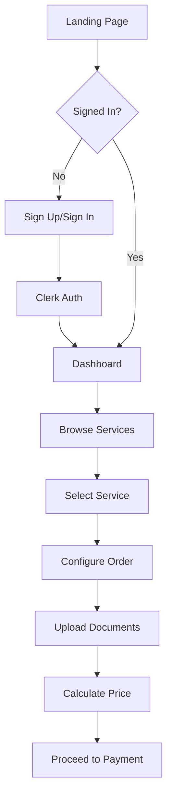
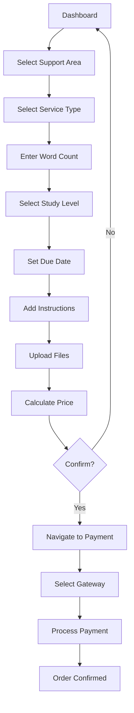
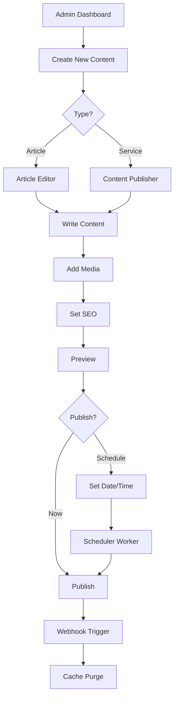
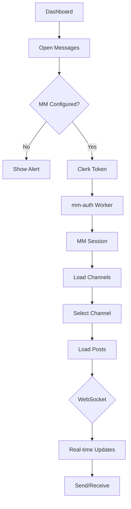
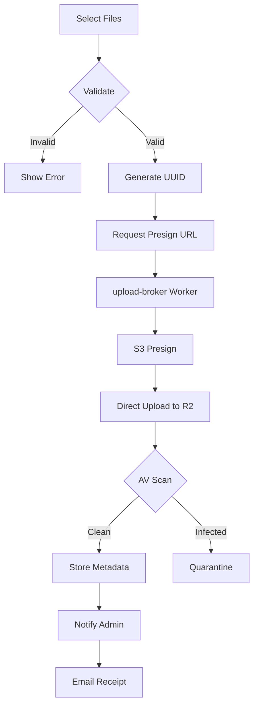

# HandyWriterz - Comprehensive Platform Analysis

> **Document Version**: 1.0  
> **Last Updated**: January 2025  
> **Purpose**: Complete feature analysis, user flow mapping, and production readiness assessment

---

## Table of Contents

1. [Executive Summary](#1-executive-summary)
2. [Platform Overview](#2-platform-overview)
3. [Technology Stack](#3-technology-stack)
4. [Feature Inventory](#4-feature-inventory)
5. [User Flows](#5-user-flows)
6. [Architecture Diagram](#6-architecture-diagram)
7. [Issues & Gaps Analysis](#7-issues--gaps-analysis)
8. [Production Readiness Checklist](#8-production-readiness-checklist)
9. [Recommended Stack Changes](#9-recommended-stack-changes)
10. [Priority Action Plan](#10-priority-action-plan)

---

## 1. Executive Summary

HandyWriterz is an **academic writing services platform** built as a modern full-stack application with the following core capabilities:

| Feature Area | Status | Maturity |
|-------------|--------|----------|
| User Dashboard | 🟡 Partial | 60% |
| Admin CMS | 🟡 Partial | 70% |
| Order Management | 🟡 Partial | 40% |
| Payments | 🟡 Partial | 50% |
| Document Uploads | ✅ Complete | 85% |
| Messaging (Mattermost) | 🟡 Partial | 65% |
| Authentication | ✅ Complete | 90% |
| CMS Publishing | 🟡 Partial | 60% |

### Key Findings

1. **Strengths**: Modern tech stack, sophisticated architecture, excellent library implementations
2. **Critical Issues**: Monolithic Dashboard component (2027 lines), dual CMS clients, empty/placeholder hooks
3. **Blocker**: Strapi backend deployment issues preventing CMS functionality
4. **Quick Wins**: Deploy workers, fix environment variables, decompose Dashboard

---

## 2. Platform Overview

### 2.1 Business Context

HandyWriterz provides academic writing services across domains:
- Adult Health Nursing
- Mental Health Nursing  
- Child Nursing
- Social Work
- Healthcare Technology
- AI Applications
- Blockchain/Crypto

### 2.2 User Types

| Role | Capabilities |
|------|--------------|
| **Guest** | Browse services, view pricing, register |
| **Customer** | Place orders, upload documents, chat with support, track orders, make payments |
| **Editor** | Create/edit content, preview articles, manage drafts |
| **Admin** | Full CMS access, user management, analytics, Turnitin reports |

### 2.3 Monorepo Structure

```
HandyWriterz/
├── apps/
│   ├── web/                 # React SPA (Vite + TypeScript)
│   ├── strapi/             # CMS Backend (Strapi 5)
│   └── mattermost/         # Messaging Service (Docker)
├── workers/
│   ├── upload-broker/      # R2 file upload presigning
│   ├── mm-auth/            # Mattermost SSO bridge
│   ├── strapi-webhooks/    # Cache purge on publish
│   ├── strapi-scheduler/   # Auto-publish scheduled content
│   └── subpath-router/     # Cloudflare Pages routing
└── docs/                   # Documentation
```

---

## 3. Technology Stack

### 3.1 Frontend

| Technology | Version | Purpose |
|------------|---------|---------|
| React | 18.2 | UI Framework |
| Vite | 5.x | Build Tool |
| TypeScript | 5.x | Type Safety |
| React Router | 6.x | Navigation |
| React Query | 5.x | Server State |
| Clerk | Latest | Authentication |
| Tailwind CSS | 3.x | Styling |
| Framer Motion | - | Animations |
| Zod | - | Validation |

### 3.2 Backend Services

| Service | Technology | Status |
|---------|------------|--------|
| CMS | Strapi 5.25 | 🔴 Not deployed |
| Database | PostgreSQL | ⚪ Via Strapi |
| Messaging | Mattermost | 🟡 Docker only |
| Auth | Clerk | ✅ Working |
| Storage | Cloudflare R2 | 🟡 Worker needed |

### 3.3 Cloudflare Workers

| Worker | Function | Status |
|--------|----------|--------|
| upload-broker | S3 presigning, multipart uploads, AV scanning | 🟡 Code ready |
| mm-auth | Clerk → Mattermost session exchange | 🟡 Code ready |
| strapi-webhooks | Cache purge on publish | 🟡 Code ready |
| strapi-scheduler | Auto-publish scheduled content | 🟡 Code ready |
| subpath-router | URL routing for Pages | 🟡 Code ready |

---

## 4. Feature Inventory

### 4.1 Customer Dashboard Features

Located in `apps/web/src/components/Dashboard/Dashboard.tsx` (2027 lines - NEEDS DECOMPOSITION)

| Feature | Component/Location | Status | Notes |
|---------|-------------------|--------|-------|
| Order Creation | Dashboard.tsx | 🟡 | Uses mock data |
| Area Selection | Dashboard.tsx | ✅ | 6 support areas |
| Service Selection | Dashboard.tsx | ✅ | 5 service types |
| Word Count Input | Dashboard.tsx | ✅ | With validation |
| Study Level | Dashboard.tsx | ✅ | Level selection |
| Due Date | Dashboard.tsx | ✅ | Date picker |
| Price Calculator | Dashboard.tsx | ✅ | Dynamic pricing |
| File Upload | Dashboard.tsx | ✅ | Multi-file, R2 integration |
| Turnitin Check | Dashboard.tsx | 🟡 | UI only |
| Admin Notify | Dashboard.tsx | ✅ | Via document submission |
| Payment Flow | Dashboard.tsx | 🟡 | Navigates to /payment |
| Support Chat | Dashboard.tsx | ✅ | Links to Skype/WhatsApp |

**Pricing Algorithm:**
```typescript
// Base rate: £15/100 words (standard) or £18/100 words (premium)
// Premium triggers: dissertation, Level 7, or < 2 days deadline
const baseRate = useHigherRate ? 18 : 15;
const pricePerWord = baseRate / 100;
```

### 4.2 Admin Dashboard Features

Located in `apps/web/src/pages/admin/AdminDashboard.tsx`

| Feature | Status | Notes |
|---------|--------|-------|
| Published Count | ✅ | Via fetchArticles |
| Draft Count | ✅ | Via fetchArticles |
| Services Count | ✅ | Via fetchServices |
| Views/Likes | 🟡 | Placeholder data |
| Recent Drafts | ✅ | From CMS |
| Quick Actions | ✅ | Navigation links |
| Env Check | ✅ | Shows Strapi/MM status |

### 4.3 Content Publishing Features

#### Article Editor (`ArticleEditor.tsx` - 750 lines)
| Feature | Status |
|---------|--------|
| Rich Text Editor | ✅ |
| Media Upload | ✅ |
| SEO Fields | ✅ |
| Domain/Category | ✅ |
| Preview | ✅ |
| Auto-save | 🟡 |
| Collaboration | 🔴 |

#### Content Publisher (`ContentPublisher.tsx` - 681 lines)
| Feature | Status |
|---------|--------|
| Service/Article Toggle | ✅ |
| Slug Generation | ✅ |
| Preview Tokens | ✅ |
| Scheduled Publishing | 🟡 |
| Hero Image Upload | ✅ |

### 4.4 Payment Features

Located in `apps/web/src/pages/payment/PaymentGateway.tsx`

| Gateway | Status | Notes |
|---------|--------|-------|
| StableLink | 🟡 | Primary, API ready |
| PayPal | 🔴 | Not implemented |
| Stripe/Paystack | 🔴 | Not implemented |
| Coinbase | 🔴 | Crypto, not implemented |

### 4.5 Messaging Features

Located in `apps/web/src/components/Messaging/MessageCenter.tsx`

| Feature | Status | Notes |
|---------|--------|-------|
| Channel List | ✅ | Via MM API |
| Message Timeline | ✅ | Real-time via WebSocket |
| Send Message | ✅ | Via createPost |
| File Attachments | ✅ | MM file upload |
| Typing Indicators | ✅ | WebSocket events |
| User Profiles | ✅ | Fetched from MM |
| Mark as Read | ✅ | Via markChannelViewed |

### 4.6 Document Upload Features

Located in `apps/web/src/hooks/useDocumentSubmission.ts`

| Feature | Status | Notes |
|---------|--------|-------|
| Multi-file Upload | ✅ | Parallel processing |
| R2 Presigning | ✅ | Via upload-broker |
| Progress Tracking | ✅ | Per-file status |
| Admin Notification | ✅ | Backend API call |
| User Receipt | ✅ | Email notification |
| Cancellation | ✅ | AbortController |

### 4.7 Authentication Features

Located in `apps/web/src/hooks/useAuth.ts`

| Feature | Status |
|---------|--------|
| Clerk Integration | ✅ |
| Role Detection | ✅ (via publicMetadata) |
| isAdmin Check | ✅ |
| isEditor Check | ✅ |
| Logout | ✅ |

---

## 5. User Flows

### 5.1 Guest → Customer Onboarding



### 5.2 Order Creation Flow



### 5.3 Content Publishing Flow (Admin/Editor)



### 5.4 Messaging Flow



### 5.5 Document Upload Flow



---

## 6. Architecture Diagram

```
┌─────────────────────────────────────────────────────────────────────────┐
│                           HANDYWRITERZ PLATFORM                          │
├─────────────────────────────────────────────────────────────────────────┤
│                                                                          │
│  ┌──────────────┐    ┌──────────────┐    ┌──────────────┐               │
│  │    CLERK     │    │  CLOUDFLARE  │    │   RAILWAY    │               │
│  │    (Auth)    │    │   (Edge)     │    │  (Backend)   │               │
│  └──────┬───────┘    └──────┬───────┘    └──────┬───────┘               │
│         │                   │                   │                        │
│         ▼                   ▼                   ▼                        │
│  ┌─────────────────────────────────────────────────────────────────┐    │
│  │                     REACT SPA (apps/web)                         │    │
│  ├─────────────────────────────────────────────────────────────────┤    │
│  │  ┌──────────┐  ┌──────────┐  ┌──────────┐  ┌──────────┐        │    │
│  │  │  Router  │  │Dashboard │  │  Admin   │  │ Messages │        │    │
│  │  │(28 routes)│ │(monolith)│  │Dashboard │  │ Center   │        │    │
│  │  └──────────┘  └──────────┘  └──────────┘  └──────────┘        │    │
│  │                                                                  │    │
│  │  ┌───────────────────────────────────────────────────────┐      │    │
│  │  │                     LIB LAYER                          │      │    │
│  │  │  cms.ts | cms-client.ts | mm-client.ts | mm-ws.ts     │      │    │
│  │  └───────────────────────────────────────────────────────┘      │    │
│  └─────────────────────────────────────────────────────────────────┘    │
│                              │                                           │
│         ┌────────────────────┼────────────────────┐                     │
│         │                    │                    │                     │
│         ▼                    ▼                    ▼                     │
│  ┌─────────────┐     ┌─────────────┐     ┌─────────────┐               │
│  │upload-broker│     │   mm-auth   │     │strapi-hooks │               │
│  │  (Worker)   │     │  (Worker)   │     │  (Worker)   │               │
│  │             │     │             │     │             │               │
│  │ • Presign   │     │ • JWT Verify│     │ • Cache     │               │
│  │ • Multipart │     │ • MM Session│     │   Purge     │               │
│  │ • AV Scan   │     │ • User Sync │     │ • MM Notify │               │
│  └──────┬──────┘     └──────┬──────┘     └──────┬──────┘               │
│         │                   │                   │                       │
│         ▼                   ▼                   ▼                       │
│  ┌─────────────┐     ┌─────────────┐     ┌─────────────┐               │
│  │CLOUDFLARE R2│     │ MATTERMOST  │     │   STRAPI    │               │
│  │  (Storage)  │     │ (Messaging) │     │   (CMS)     │               │
│  │             │     │             │     │             │               │
│  │ • Documents │     │ • Channels  │     │ • Articles  │               │
│  │ • Media     │     │ • Posts     │     │ • Services  │               │
│  │ • Uploads   │     │ • Files     │     │ • Media     │               │
│  └─────────────┘     └──────┬──────┘     └──────┬──────┘               │
│                             │                   │                       │
│                             └───────┬───────────┘                       │
│                                     ▼                                   │
│                            ┌─────────────┐                              │
│                            │ POSTGRESQL  │                              │
│                            │ (Database)  │                              │
│                            └─────────────┘                              │
│                                                                          │
└─────────────────────────────────────────────────────────────────────────┘
```

---

## 7. Issues & Gaps Analysis

### 7.1 Critical Issues (P0 - Blockers)

| ID | Issue | Location | Impact | Fix |
|----|-------|----------|--------|-----|
| C-01 | **Dashboard Monolith** | Dashboard.tsx (2027 lines) | Maintenance nightmare, impossible to test | Decompose into 10+ components |
| C-02 | **Strapi Not Deployed** | apps/strapi | No CMS functionality | Deploy to Railway properly |
| C-03 | **Workers Not Deployed** | workers/* | No uploads, no MM auth | Deploy to Cloudflare |
| C-04 | **Mock Orders Data** | Dashboard.tsx:mockOrders | No real order tracking | Implement order API |
| C-05 | **Empty Hooks** | useMMAuth.ts, useChannels.ts (root) | Duplicate/dead code | Delete empty files |

### 7.2 High Priority Issues (P1)

| ID | Issue | Location | Impact | Fix |
|----|-------|----------|--------|-----|
| H-01 | **Dual CMS Clients** | cms.ts + cms-client.ts | Inconsistent data fetching | Consolidate to one client |
| H-02 | **Admin Role Heuristic** | Dashboard.tsx | Security risk (email domain check) | Use Clerk metadata |
| H-03 | **Payment Gateways Incomplete** | PaymentGateway.tsx | 3 of 4 methods not working | Implement or remove |
| H-04 | **Orders Page Placeholder** | Orders.tsx | No order list | Implement full component |
| H-05 | **Missing Error Boundaries** | Various | Unhandled errors crash app | Add ErrorBoundary wrappers |

### 7.3 Medium Priority Issues (P2)

| ID | Issue | Location | Impact | Fix |
|----|-------|----------|--------|-----|
| M-01 | **Hardcoded Support Areas** | LegacyOrderForm.tsx | Not extensible | Move to config/API |
| M-02 | **No Order Persistence** | Dashboard.tsx | Orders lost on refresh | Add backend API |
| M-03 | **Preview Token Validation** | preview-tokens.ts | Basic implementation | Add proper JWT signing |
| M-04 | **Mattermost Config Check** | MessageCenter.tsx | Brittle env detection | Improve error handling |
| M-05 | **Missing TypeScript Types** | Various | Type safety gaps | Add stricter types |

### 7.4 Low Priority Issues (P3)

| ID | Issue | Location | Impact | Fix |
|----|-------|----------|--------|-----|
| L-01 | **Console Warnings** | Various | Dev experience | Clean up logs |
| L-02 | **Missing Tests** | All | No test coverage | Add Jest/Vitest tests |
| L-03 | **Inconsistent Naming** | Types | Summary vs summary | Standardize |
| L-04 | **Legacy Code** | api.ts | Unused endpoints | Remove or document |

### 7.5 Missing Features

| Feature | Priority | Complexity | Notes |
|---------|----------|------------|-------|
| Order Tracking System | P0 | High | Need backend + frontend |
| Real Analytics Dashboard | P1 | Medium | Replace placeholders |
| PayPal Integration | P1 | Medium | SDK available |
| Stripe Integration | P1 | Medium | SDK available |
| Turnitin Full Integration | P2 | High | API access needed |
| Email Notifications | P2 | Medium | Resend configured |
| SMS Notifications | P3 | Low | Optional feature |
| Mobile App | P3 | Very High | Future consideration |

---

## 8. Production Readiness Checklist

### 8.1 Infrastructure

- [ ] **Strapi Deployment** - Deploy to Railway with PostgreSQL
- [ ] **Workers Deployment** - Deploy all 5 workers to Cloudflare
- [ ] **R2 Bucket Setup** - Configure storage bucket
- [ ] **Environment Variables** - Set all required env vars
- [ ] **Domain Configuration** - Set up custom domains
- [ ] **SSL Certificates** - Ensure HTTPS everywhere
- [ ] **CDN Configuration** - Cloudflare caching rules

### 8.2 Security

- [ ] **Auth Hardening** - Remove email domain heuristic for admin
- [ ] **API Rate Limiting** - Add to all endpoints
- [ ] **Input Validation** - Ensure Zod schemas on all inputs
- [ ] **XSS Prevention** - Sanitize all user content
- [ ] **CORS Configuration** - Restrict to known origins
- [ ] **Secret Rotation** - Set up key rotation schedule
- [ ] **Audit Logging** - Log all admin actions

### 8.3 Reliability

- [ ] **Error Monitoring** - Set up Sentry
- [ ] **Uptime Monitoring** - Configure health checks
- [ ] **Backup Strategy** - PostgreSQL daily backups
- [ ] **Disaster Recovery** - Document recovery procedures
- [ ] **Load Testing** - Test under expected load

### 8.4 Code Quality

- [ ] **Dashboard Decomposition** - Split into components
- [ ] **Test Coverage** - Add unit and integration tests
- [ ] **Type Safety** - Fix all TypeScript errors
- [ ] **Documentation** - API docs, component docs
- [ ] **Code Review** - Establish review process

---

## 9. Recommended Stack Changes

### 9.1 Current vs Recommended

| Area | Current | Recommended | Reason |
|------|---------|-------------|--------|
| CMS Hosting | Railway | Railway OR Cloudflare Pages + D1 | Cost, complexity |
| Database | PostgreSQL (Railway) | Keep PostgreSQL | Mature, reliable |
| File Storage | R2 via Worker | Keep R2 | Cost-effective |
| Messaging | Mattermost (Docker) | Mattermost Cloud OR SimpleX | Easier hosting |
| Workers | 5 separate workers | Consolidate to 2-3 | Easier management |
| Payments | 4 gateways | StableLink + Stripe only | Focus on working ones |

### 9.2 Cost Optimization

| Service | Current Est. Cost | Optimized Cost | Savings |
|---------|------------------|----------------|---------|
| Railway (Strapi) | $20-50/mo | $5-10/mo (starter) | $15-40/mo |
| Cloudflare Workers | $5-10/mo | $5-10/mo | - |
| R2 Storage | $0-5/mo | $0-5/mo | - |
| Mattermost | Self-hosted | $0-10/mo (Cloud) | - |
| **Total** | **$30-70/mo** | **$15-35/mo** | **~50%** |

### 9.3 Simplification Options

**Option A: Keep Current Stack (Recommended)**
- Deploy Strapi to Railway properly
- Deploy workers to Cloudflare
- Keep architecture as-is
- Fix code issues

**Option B: Simplify CMS**
- Replace Strapi with direct D1 database
- Use Cloudflare Pages for admin
- Reduce complexity significantly

**Option C: Full Serverless**
- Move everything to Cloudflare
- Use D1 for database
- Use Pages for frontend
- Use Workers for all backend logic

---

## 10. Priority Action Plan

### Phase 1: Critical Fixes (Week 1-2)

1. **Deploy Strapi to Railway**
   - Fix railway.json configuration
   - Set up PostgreSQL connection
   - Configure environment variables
   - Test API endpoints

2. **Deploy Workers to Cloudflare**
   - Deploy upload-broker
   - Deploy mm-auth
   - Deploy strapi-webhooks
   - Configure secrets

3. **Decompose Dashboard**
   - Create OrderForm component
   - Create FileUploader component
   - Create PriceCalculator component
   - Create SupportAreaSelector component

### Phase 2: High Priority (Week 3-4)

1. **Consolidate CMS Clients**
   - Choose REST or GraphQL
   - Migrate all uses to single client
   - Remove duplicate code

2. **Fix Authentication**
   - Remove email domain heuristic
   - Use Clerk metadata for roles
   - Add role management UI

3. **Complete Payment Integration**
   - Finish StableLink integration
   - Add Stripe integration
   - Remove non-working options

### Phase 3: Medium Priority (Week 5-6)

1. **Order Management System**
   - Design order schema
   - Implement order API
   - Build order tracking UI
   - Add email notifications

2. **Analytics Dashboard**
   - Replace placeholder data
   - Add real metrics queries
   - Build charts/visualizations

### Phase 4: Polish (Week 7-8)

1. **Testing**
   - Add unit tests
   - Add integration tests
   - Set up CI/CD

2. **Documentation**
   - API documentation
   - User guides
   - Admin guides

3. **Performance**
   - Optimize bundle size
   - Add code splitting
   - Implement caching

---

## Appendix A: File Reference

### Key Frontend Files

| File | Lines | Purpose |
|------|-------|---------|
| Dashboard.tsx | 2027 | Main user dashboard |
| MessageCenter.tsx | 448 | Mattermost client |
| AdminDashboard.tsx | 346 | Admin control center |
| ArticleEditor.tsx | 750 | Article creation |
| ContentPublisher.tsx | 681 | Service/Article publishing |
| PaymentGateway.tsx | 428 | Payment selection |
| LegacyOrderForm.tsx | 490 | Order form extracted |
| cms.ts | 429 | REST CMS client |
| cms-client.ts | 507 | GraphQL CMS client |
| mm-client.ts | 395 | Mattermost REST client |
| mm-ws.ts | 206 | Mattermost WebSocket |

### Key Worker Files

| File | Lines | Purpose |
|------|-------|---------|
| upload-broker/index.ts | 480 | S3/R2 presigning |
| mm-auth/index.ts | 493 | Clerk→MM session |
| strapi-webhooks/index.ts | 189 | Cache purge |
| strapi-scheduler/index.ts | 254 | Auto-publish |

---

## Appendix B: Environment Variables

### Required Variables

```env
# Clerk
VITE_CLERK_PUBLISHABLE_KEY=pk_xxx

# CMS
VITE_CMS_URL=https://strapi.example.com
VITE_CMS_TOKEN=xxx

# Mattermost
VITE_MATTERMOST_URL=https://mm.example.com
VITE_MATTERMOST_API_URL=https://mm.example.com/api/v4
VITE_MM_AUTH_URL=https://mm-auth.workers.dev

# Upload
VITE_UPLOAD_BROKER_URL=https://upload-broker.workers.dev

# Payments
VITE_STABLELINK_API_KEY=xxx
```

### Worker Variables

```env
# upload-broker
S3_ACCESS_KEY_ID=xxx
S3_SECRET_ACCESS_KEY=xxx
S3_BUCKET=handywriterz
S3_REGION=auto
S3_ENDPOINT=https://xxx.r2.cloudflarestorage.com

# mm-auth
CLERK_JWKS_URL=https://xxx.clerk.accounts.dev/.well-known/jwks.json
MATTERMOST_BASE_URL=https://mm.example.com
MATTERMOST_ADMIN_TOKEN=xxx
```

---

*Document generated by Copilot analysis - January 2025*
